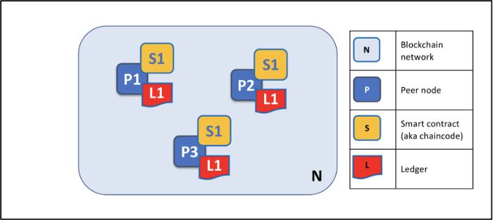

# Hyperledger Fabric

---

[TOC]

---

## Hyperledger Fabric

하이퍼레저 패브릭(Hyperledger Fabric)은 분산 원장 솔루션을 제공하는 플랫폼으로, 기밀성, 탄력성, 유연성 및 확장성을 제공한다. 대표적인 프라이빗 블록체인 플랫폼이며, 다른 하이퍼레저 기술을 PnP 방식으로 지원하는 유연하고 탄력적인 아키텍처를 제공한다.

## 블록체인적 특징

- **프라이버시 & 기밀성**

  하이퍼레저 패브릭은 채널(Channel)이라고 불리는 제한된 메시지 경로를 제공하며, 이러한 채널은 네트워크의 특정 하위 노드 집합에게 트랜잭션 프라이버시와 기밀성을 보장해준다. 트랜잭션, 노드, 채널 정보와 같은 채널에 있는 모든 데이터는 채널 접근 권한이 없으면 열람할 수 없다. 이 특징을 통해 서로 다른 이해관계를 가진 기업들이 동일한 허가형 네트워크에서 공존할 수 있도록 한다.

- **효율적인 처리**

  네트워크에 동시성과 병렬성을 제공하기 위해, 트랜잭션 실행은 트랜잭션 정렬 및 커밋과 분리된다. 네트워크의 노드들은 노드 유형에 따라 이러한 액션을 수행하는 역할이 정해져있다. 이러한 동시적 실행은 각 노드의 처리 효율성을 높이고 트랜잭션 전달을 가속화한다.

- **체인코드**

  체인코드는 이더리움과 같은 분산 플랫폼에 있는 스마트 컨트랙트에 해당한다. 체인코드는 자산(현실 세계의 객체 표현)과 자산을 변경하기 위한 트랜잭션 명령(비즈니스 로직)을 인코딩하는데 사용한다.

- **모듈식 설계**

  모듈식 아키텍처를 구현하여 네트워크 설계자에게 기능적 선택권을 제공한다. 예르 들어, 식별, 정렬(합의), 암호화에 대한 특정 알고리즘을 모든 하이퍼레저 패브릭 네트워크에 연결할 수 있다.

## 주요 개념

### Peer

피어(Peer)는 원장과 스마트 컨트랙트를 호스팅하는 노드이다. 네트워크와의 상호작용의 시작점이며, 어플리케이션이 체인코드(스마트 컨트랙트)를 실행하여 쿼리를 하거나 원장을 업데이트하도록 한다.

네트워크의 각 피어에는 디지털 인증서가 할당되며, 디지털 인증서는 피어가 참여하는 채널에 해당 피어를 식별하도록 해준다. 이 방식으로 인해 피어는 각 채널에서 다양한 권한을 가지 수 있다.

모든 피어는 기본적으로 동일하지만, 네트워크에서 여러 역할을 수행할 수 있다.

- **커밋 피어(Committing Peer)**: 채널의 모든 피어 노드는 커밋 피어이며, 생성된 트랜잭션 블록을 수신하고 블록이 네트워크에 의해 검증되면 추가 작업을 통해 원장의 사본을 커밋한다.
- **보증 피어(Endorsing Peer)**: 스마트 컨트랙트를 체결한 모든 피어는 보증 피어가 될 수 있다. 보증 피어가 되기 위해서는 트랜잭션 보증 과정에 참여하는 디지털 서명된 트랜잭션 응답을 생성하는 어플리케이션에 의해 실행되어야 한다.

### Channel

하이퍼레저 패브릭 채널은 둘 이상의 특정 네트워크 노드 간의 통신을 위한 프라이빗 서브넷으로, 프라이빗 트랜잭션을 수행하기 위한 목적으로 사용된다.

채널은 멤버(Orgs), 공유 원장, 체인코드 어플리케이션 및 정렬 서비스 노드에 의해 정의된다. 네트워크의 모든 트랜잭션은 **채널에서 실행**되며, 각 당사자는 해당 채널에서 트랜잭션을 수행하기 위해 **인증**을 거쳐야한다. 채널에 참여하는 각 피어는 MSP(Membership Service Provider)가 제공하는 고유한 식별자를 가지며, 각 피어를 해당 채널과 서비스에 인증한다.

## 스마트 컨트랜트 & 체인코드

- **스마트 컨트랙트**: 전역 상태에 포함된 비즈니스 객체의 상태를 변경시키는 **트랜잭션 로직**을 정의
- **체인코드**: 블록체인 네트ㅝ크에 배포하기 위해 피키징된 **스마트 컨트랙트의 집합**

스마트 컨트랙트는 트랜잭션을 관리하며, 체인코드는 스마트 컨트랙트를 배포하기 위해 패키징하여 관리한다.

체인코드를 통해 아키텍트나 개발자가 하나의 블록체인 네트워크 안에 있는 서로 다른 조직 간 공유되어야 하는 데이터와 비즈니스 프로세스를 정의한다.

**보증(Endorsement)**

모든 체인코드에는 모든 스마트 컨트랙트에 적용되는 관련 보증 정책이 있다. 이 정책은 트랜잭션의 유효성을 위해 트랜잭션에 서명을 해얗는 블록체인 네트워크 내 조직들을 의미한다.

**유효한 트랜잭션**

스마트 컨트랙트는 블록체인 네트워크 내 조직이 소유한 피어 노드에서 실행된다. 이 스마트 컨트랙트들은 트랜잭션 제안서(Transaction Proposal)라고 불리는 입력 파라미터의 집합을 취하여 스마트 컨트랙트의 프로그램 로직과 함께 사용하여 원장을 읽고 쓴다. 전역 상태의 변화는 읽은 상태와 트랜잭션이 유효할 경우 기록될 새로운 상태르 모두 포함하는 읽기-쓰기 집합으로 구성된 트랜잭션 제안 응답으로 캡쳐된다. 전역 상태는 스마트 컨트랙트가 실행될 때 변하지 않고, 트랜잭션이 최종적으로 유효해지면 업데이트된다.

네트워크의 모든 피어 노드에 배포되는 트랜잭션은 두 단계에 걸쳐 검증된다.

1. 보증 정책에 따라 지정된 조직에서 서명된 거래인지 확인한다.
2. 전역 상태의 현재 값이 보증 피어 노드에 의해 서명되었을 때의 트랜잭션의 읽기 집합과 일치하는지 확인한다.

위 두 과정을 모두 통과하면 유효한 트랜잭션이 된다. 트랜잭션은 유효성 여부에 관계 없이 모두 블록체인 이력에 추가되지만, 유요한 트랜잭션만이 전역 상태를 업데이트한다.

***Copyright* © 2022 Song_Artish**