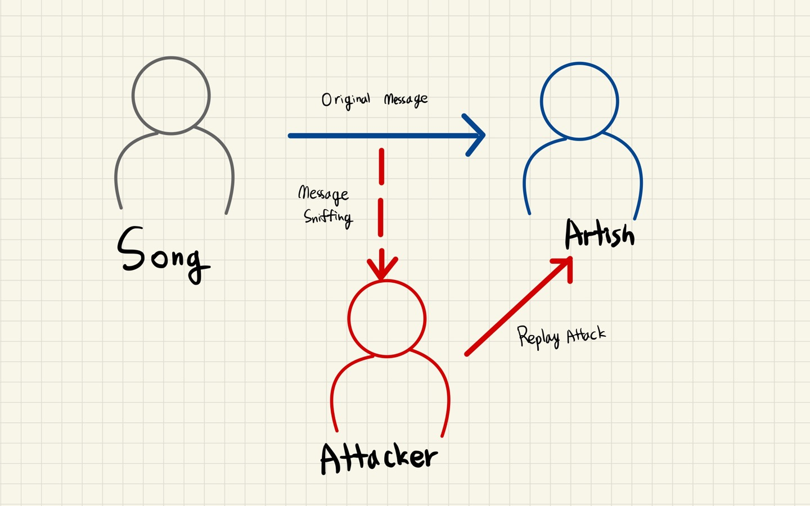

# 블록체인 보안

---

[TOC]

---

## 블록체인의 보안적 특징

1. 데이터 무결성
   - 데이터베이스가 데이터의 정확성과 일관성을 유지하는 것을 의미
   - 합의 알고리즘은 네트워크 상에 존재하는 신뢰할 수 없는 노드들이 절차에 맞게 상호 검증하여 네트워크 전체의 무결성을 보장하는 알고리즘이다.
2. 거래 투명성
   - 거래 기록에 누구나 공개적으로 접근할 수 있기 때문에, 송금 과정을 투명하게 하기 위한 규제 비용도 절감할 수 있다.
3. 감시 가능성
   - 블록이 체인에 올라가면 블록에 담겨있는 트랜잭션이나 데이터는 수정할 수 없다.
   - 해기 알고리즘과 이전 해시 값 참조를 통해, 연결된 모든 블록의 무결성을 검증한다.
   - 만약 트랜잭션에 변경이 일어나면 머클 해시 값이 변경되므로, 블록체인에 대한 위변조 시도를 바로 발견할 수 있다.

## 이중지불 문제

**이중지불(Double Spending)** 이란 디지털 현금 시스템에서 경제적 이익을 얻기 위해 동일한 자금을 여러 번 사용하는 것이다. 즉, 동일한 하나의 자산이 두 명의 수신자에게 동시에 전송되는 문제를 말한다.

- 중앙화된 접근법: 시스템을 관리하는 감독이 자산의 발행/분배를 관장한다. 대표적인 예시로는 David Chaum의 eCash가 있다.
- 탈중앙화된 접근법: 블록체인에서는 트랜잭션이 포함된 블록이 체인에 추가되었을 때 유효하다고 간주되며, 이후에도 해당 블록 뒤에 블록이 일정 갯수(컨펌 횟수) 이상 연결된 시점에야 비로소 트랜잭션 수정이 불가능하고 온전히 완료되었다고 할 수 있다.

**비트코인 이중 지불**

이중 지불을 수반한 세 가지 공격 방법이 있다.

1. 51% 공격
   단일 주체나 조직이 50% 이상의 해시 레이트를 가지게 될 경우, 이들은 원치 않는 트랜잭션을 배제하거나 트랜잭션 순서를 조작할 수 있게 된다.
2. Race Attacks
   동일한 자금을 사용하는 두 개의 충돌하는 트랜잭션이 연속으로 전소되지만, 하나의 트랜잭션만 승이되는 것이다.
3. Finney Attacks
   공격자는 네트워크에 즉각적으로 트랜잭션을 전송하지 않고, 코인을 자신의 다른 지갑으로 전송하는 트랜잭션을 미리 생성해두고, 블록을 미리 채굴해두어 해당 블록에 기록한다.

## 51% 공격

네트워크 **전체 해시 파워의 절반(50%) 이상**을 확보하여 네트워크를 교란시키는 공격법이다. 해시 파워가 높으면 더 빠른 속도로 블록을 생성할 수 있기 때문에, 공격자가 자신이 만든 체인을 정상 네트워크에 전파하게 되면 채택되게 된다.

> **체인 재구성**
블록체인에서 체인이 두 개로 나눠졌을 경우, 더 긴 체인을 선택하고 나머지 체인을 취소한다. 이 과정을 체인 재구성이라고 하며, 이렇게 취소된 체인의 블록을 고아 블록(orphan blocks)이라고 한다.

### 대안

1. 컴펌 횟수 증가
   51% 공격은 블록체인 해시파워의 과반수 이상을 확보하여 이중 지불 형태로 입금한 후 빼가는 것이다. 따라서, 이중 지불 여부를 확인할 때까지 거래 확정을 늦춘다면 예방이 가능하다. 하지만, 거래 확정을 늦추기 위해 컨펌 횟수를 상향하면, 안전성을 보장할 수는 있지만 거래 처리 속도가 느려져 사용성이 떨어진다는 단점이 있다.
2. 지연 기능
   블록체인 트랜잭션을 공증하는 공증 노드를 따로 둠으로써 전체 불변성을 보장하고 트랜잭션에 보안의 두 번째 계층을 제공한다.

### 사례

- Verge
- Monacoin
- Bitcoin Gold
- ZEN Cash

## 리플레이 공격

**리플레이 공격(Replay Attack)** 이란 공격자가 보안 네트워크 통신을 가로채고, 해당 통신의 수신자로 하여금 공격자가 원하는 일을 수행하도록 하기 위해 통신을 지연시키거나 재전송하는 방식이다.

### 예시

암호화폐에서 리플레이 공격이 위험한 이유는 바로 "하드포크"와 같은 상황이다. 하드 포크 이후 생겨난 B 체인에서 처리한 트랜잭션은, 이론적으로 A 체인에서도 유효하게 사용할 수 있다. 다음은 예시의 시나리오이다.

1. 비트코인에서 비트코인과 비트코인 캐시로 하드 포크가 일어난다.
2. Alice는 Bob에게 100 BCH를 보낸다.
3. Bob은 악의적인 사용자이기 때문에, 'Alice가 Bob에게 100 BCH를 보냄'이라는 트랜잭션을 비트코인 네트워크에 브로드캐스팅한다.
4. 비트코인 네트워크에서도 비트코인 캐시의 트랜잭션을 유효하게 처리할 수 있으며, 이 체인에서는 아직 트랜잭션이 처리되지 않았기 때문에 트랜잭션이 블록에 들어가 처리된다.
5. Alice의 지갑에서는 100 BCH만 빠져나간게 아니라, 100 BTC도 빠져나가네 된다.
   100 BCH를 보내는 트랜잭션이 리플레이 되어, 비트코인 체인에서도 해당 트랜잭션이 실행되어 비트코인 네트워크에서 사용하는 100 BTC를 전송한 것이기 때문이다.

### 대안

1. 세션 식별자 추가
   통신 당사자 간 일회용 토큰을 해싱한 값을 공유하여 리플레이 어택을 피한다.
2. 일회용 비밀번호
   아주 짧은 세션 시간을 가진 비밀번호를 두 통신 당사자가 공유하여, 공격자가 가로채 재사용하지 못하도록 한다.
3. 타임 스탬프
   Alice가 네트워크에 시간을 MAC와 함께 브로드캐스트한다. Bob은 Alice에게 통신을 요청할 때, 자신의 통신 메시지에 Alice가 브로드캐스트한 시간을 기준으로 예상 시간을 포함시켜 인증을 진행한다. Alice는 타임 스탬프가 예상 시간 범위 내에 있는 메시지만 수락한다.

## 이클립스 공격

**이클립스 공격(Eclipse Attack)** 은 공격자가 네트워크 상의 노드를 방해하기 위한 공격으로, 정교한 공격을 준비하기 위해 네트워크 혼란을 야기시킬 때 주로 사용한다.

### 공격 방식

블록체인에서 노드들이 데이터를 공유하는 경우 제한된 인접 노드들에게 브로드캐스트 하는 방식을 사용한다. 공격자는 공격 대상의 이웃 노드들을 자신의 노드로 구성하여, 공격 대상 노드가 가짜 트랜잭션이 담긴 블록을 받도록 한다. 이를 통해 다음과 같은 공격 효과가 발생한다.

- Engineering Block Races
  블록 레이스는 채굴 노드들이 가장 먼저 유효한 논스 값을 찾아 블록을 생성하는 경쟁을 의미한다. 이클립스 공격에서는 이클립스 공격 대상 노드와 공격자의 노드가 동시에 블록을 생성한 경우, 공격 대상 노드가 생성한 블록을 숨김으로써 해당 블록은 고아 블록이 되고, 자신의 블록이 네트워크에 올라갈 수 있도록 한다.
- Splitting Mining Power
  공격자가 51% 공격을 하기 위해 네트워크의 전체 채굴 파워를 쪼갤 수도 있다. 이러한 방식으로 공격자의 채굴 파워가 네트워크의 쪼개진 채굴 파워보다 커지게 되면 쉽게 51% 공격을 개시할 수 있다.
- N-Confirmation Double Spending
  이클립스 공격자에 의해 여러 채굴 노드들이 공격 대상이 되어 격리된 경우, 공격자는 자신의 트랜잭션을 이클립스 공격 대상인 채굴 노드에게 제공하여 블록체인에 추가하도록 한다. 이 노드들은 이후에도 블록을 계속 생성하면서 공격자의트랜잭션이 든 블록이 컨펌되도록 한다.
  공격자와 거래한 대상자는 여러 번의 컨펌을 확인하고 거래를 완료하지만, 이후 공격자가 격리된 노드들이 만든 블록체인을 전체 네트워크에 공유하면, 해당 블록체인의 노드들은 고아 블록이 되면서 트랜잭션 자체가 취소되게 된다.
  
### 대처 방법

- 무작위 노드 선택(Random Node Selection)
  노드가 피어를 랜덤으로 선택하게 하여 공격자가 공격 대상 노드를 정하기 어렵도록 만들 수 있다.
- 정보 저장
  노드가 다른 노드에 대한 정보를 기억하도록 하면, 해당 노드가 네트워크를 떠났다가 재접속 했을 때 이전에 연결했던 정직한 노드와 연결하여 정직한 피어 관계를 지속할 수 있다.
- 연결 수 늘리기
  하나의 노드에 연결된 피어의 개수를 늘리면, 노드가 정직한 노드에게 연결될 가능성 역시 높아진다.

## 악의적인 공격자에 의한 보안적 이슈

### 크립토재킹

크립토재킹(Cryptojacking)은 감염된 피해자의 장치를 사용해 암호화폐를 채굴하는 것을 의미한다. 공격자는 악성 채굴 프로그램을 사용하도록 유도하여, 해당 프로그램을 실행하면 악성 프로그램에 감염되어 눈치채지 못할 만큼 시스템 자원을 이용해 채굴을 하게 된다.

크립토재킹은 랜섬웨어 등과 같이 컴퓨터 내 데이터를 손상시키지는 않는다. 다만 컴퓨터로 채굴을 하기 때문에 CPU의 성능을 저하시킨다.

현재는 대부분의 악성 채굴 프로그램은 웹 사이트 스크립트를 통해 실행된다. 이러한 **웹 기반 크립토재킹**은 웹 사이트 내에서 실행되는 스크립트를 통해 악성 채굴 프로그램을 실행하며, 사용자가 웹 사이트에 머물러 있는 동안 브라우저를 통해 자동으로 채굴을 하도록 한다. 웹 기반 크립토재킹은 보통 모네로(Monero)를 많이 채굴한다. 모네로는 채굴을 위한 많은 해시 파워가 필요하지 않으며, 프라이버시와 익명성 수준이 높아 거래를 추적하기 어렵기 때문이다.

**코인하이브**

코인하이브(CoinHive)는 웹 기반 크립토재킹을 최초로 구현하였으며, 자바스크립트로 채굴을 할 수 있도록 구성되어 있다. 초창기 목적은 악성 채굴 프로그램이 아닌, 웹사이트 소유자들이 광고가 아닌 채굴을 통해 수익을 얻을 수 있도록 하는 것이었다.

코인하이브는 대부분의 브라우저와 호환이 되며, 배포 역시 쉽다. 코인하이브를 사용하면 채굴 수익의 30%를 가져간다.

### 더스팅 공격

더스팅 공격(Dusting Attack)은 해커들이 아주 적은 양의 코인을 사용자의 지갑에 전송하여 사용자의 신원을 파악하는 악성 공격이다. 여기서 더스트(dust)는 아주 적은 양의 코인이나 토큰을 의미한다.

해커들은 일반 사용자들이 더스트 수준(ex. 비트코인에서는 1 사토시; 0.00000001 BTC)의 작은 금액에는 관심을 두지 않는다는 것을 악용한다. 먼저 일반 사용자들의 주소로 더스트 수준의 적은 금액을 보내 많은 주소를 "더스팅(Dusting)"한다. 그리고 나서 해당 송금 트랜잭션과 더스팅된 지갑들의 트랜잭션을 추적한다. 이 트랜잭션을 추적하다보면, 결국 지갑을 소유한 개인이 누구인지 알 수 있다.

블록체인은 탈중앙화 되어 있고 주소 기반이기 때문에 익명성이 보장된다. 그러나 대부분의 사람들은 거래소를 이용하며, 개인 지갑과 거래소 지갑을 연결시킨다. 따라서 거래소 지갑에 있는 사용자의 개인 정보가 개인 지갑에도 연결되게 된다. 이러한 방식으로 해커들은 익명 사용자의 개인 정보를 파악한다.

2018년 10월, Bitcoin Samurai 지갑 개발자들은 일부 사용자들이 더스팅 공격을 받고 있다고 발표했다. 비트코인 사무라이는 더스팅 추적을 실시간으로 알려주는 등 더스팅 공격을 받고 있음을 인지시켜 사용자가 의심스러운 자금을 걸러내 트랜잭션에 더스트 자금을 사용하지 않을 수 있도록 지원했다.

### 시빌 공격

시빌 공격은 한 개인이 네트워크의 여러 노드를 장악하려는 악성 공격이다. 공격자는 충분한 수의 가짜 노드를 생성하여, 기존의 신뢰할 수 있는 노드를 네트워크에서 제외시킨다. 이를 통해 블록을 수신하거나 전송하는 것을 거부하거나, 다른 노드들을 네트워크에서 차단할 수도 있다. 공격자가 네트워크 전체의 해시 파워를 넘는 대규모 시빌 공격을 하는 경우에는 51% 공격도 함께 발생할 수 있다.

**대응**

많은 블록체인은 다양한 합의 알고리즘을 이용해 시빌 공격을 방어한다. 그러나 합의 알고리즘은 시빌 공격을 원천적으로 봉쇄하기보다는, 시빌 공격에 대한 비용 대비 수익보다 정상적인 채굴을 통한 비용 대비 수익을 더 크게 만들어, 시빌 공격 자체를 비효율적인 것으로 만든다.

## 블록체인 자체 문제로 인한 보안적 이슈

### The DAO 사건

The Dao 해킹 사건

### 패리티 멀티시그 지갑 동결 사건

> **패리티 멀티시그 지갑**
> 패리티 사의 주요 소프트웨어인 **패리티**는 이더리움 노드 소프트웨어를 위한 웹 인터페이스를 제공하는 이더리움 클라이언트이다. 패리티에서 사용자는 일반적인 이더 및 기타 토큰 지갑을 사용할 수도 있으며, 이더리움 블록체인에 구축된 스마트 컨트랙트와도 상호작용 할 수 있다. 패리티 지갑은 이더 전송을 관리하고, 모든 표준 토큰과 완벽하게 통합되도록 설게되었다.

멀티시그는 스마트 컨트랙트 소스코드의 형태로 사용자에게 배포된다. 누군가가 이 스마트 컨트랙트를 가지고 싶을 때는 repository에서 최신 코드를 가져와 이더리움 블록체인에 해당 컨트랙트를 배포하고, 다음 소유자를 설정하고, 자금을 배치하는 방식이다. 각 지갑은 이 소스코드의 개별 인스턴스가 된다.

패리티의 경우, 자금을 인출할 수 있는 인출 함수 등과 같은 스마트 컨트랙트의 필수적인 로직들은 WalletLibrary라는 이름의 라이브러리에 있다. 이 라이브러리는 패리티 멀티시그가 사용하는 스마트 컨트랙트에 기본으로 들어가 있다. 라이브러리를 사용한 코드 분리는 가스 수수료를 절감하는 등의 장점도 있지만, 라이브러리에 결함이 있다면, 해당 라이브러리를 사용하는 모든 컨트랙트에 영향을 미치게 된다.

2017년 11월 6일 한 공격자가 라이브러리를 지갑화하여 해당 지갑을 파괴하는 공격이 벌어졌다. 이 공격으로 인해 라이브러리 그 자체를 하나의 지갑으로 초기화하는 것이 가능하고, 지갑화된 라이브러리의 소유자는 해당 지갑을 파괴할(Kill) 권한을 가지게 된다는 것이 밝혀졌다. 악의적인 공격자가 라이브러리를 지갑으로 만든 후 파괴하면서, 라이브러리를 사용하는 모든 컨트랙트가 무용지물이 되어버렸다.

WalletLibrary가 배포된 이후 생성된 멀티시그 지갑들은 동결되었다. 이 지갑들은 총 587개이며, 총 513,774.16 ETH(오늘 날 한화 약 2조 7천억 원)가 동결되었다. 이로 인해 패리티 멀티시그 지갑을 사용해 ICO 자금을 보관하던 폴카닷(Polkadot) 같은 회사들의 자금 역시 동결되었다.

***Copyright* © 2022 Song_Artish**