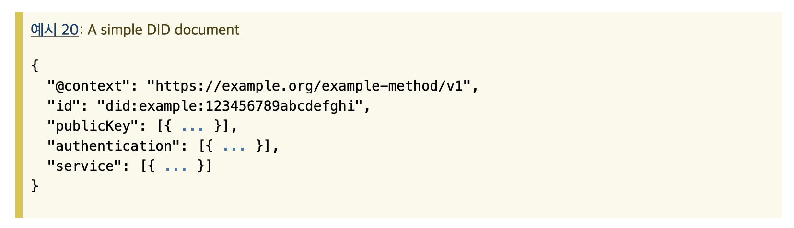
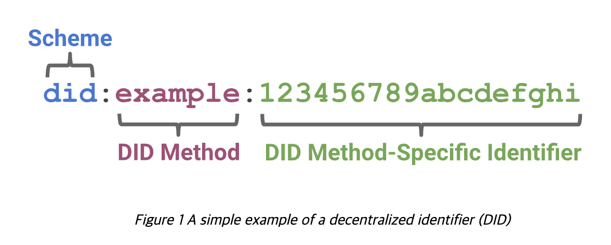
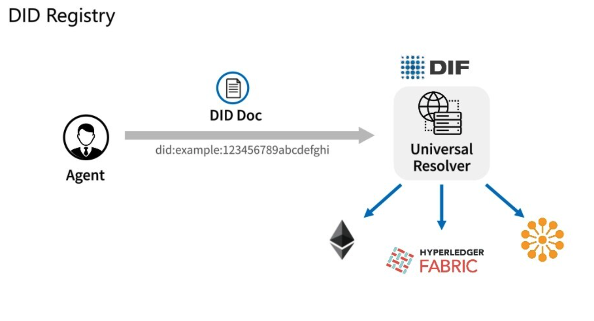
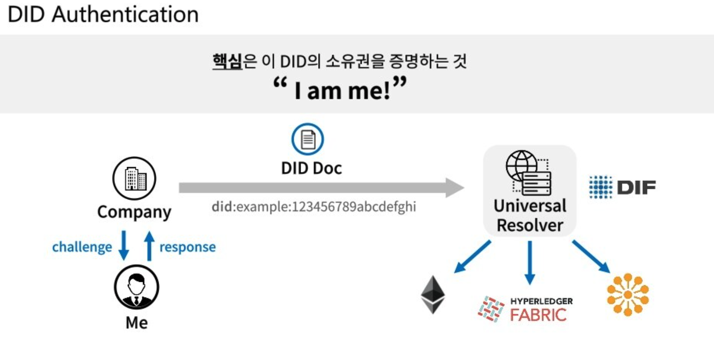

# DID

---

[TOC]

---

## Overview

> Decentralized Identity, 탈중앙 신원증명

**데이터의 주권이 개개인에게 있고, 개개인의 데이터를 중앙화된 시스템을 거치지 않고 증명할 수 있는 기술**이다. DID는 분산원장기술(Distributed Ledger Technology, DLT)를 기반으로 사용자의 데이터를 저장하여 안전하고 편리하게 인증할 수 있도록 한다. 따라서 DID는 **데이터 저장소(Registry), 데이터 제공자(Provider), 인증기관(Certificate Authorities)를 분리**하고, **탈중앙화 방식**으로 동작할 수 있도록 설게한다.

SSI의 개념을 탈중앙화 방식의 신원증명을 통해 구현한 것이 DID이다.

> **SSI(Self-Sovereign Identity)**
자기 자신이 신원 증명에 대한 권한을 갖도록 하는 개념으로, 탁주앙화된 자기주권형 신원증명 기술이다. (자세한 내용은 [SSI TIL](../IT/SSI.md) 참고)

## 배경

데이터 주권이 사용자 자신이 아닌 플랫폼 기업에게 종속되는 현상이 발생하면서, 이에 대한 문제 의식을 느끼고 W3C에서 탈중앙 운동을 전개한다. 탈중앙 생태계를 만들기 위해서는 플랫폼 기업이 독점적으로 보유하고 있는 데이터를 **서비스 간 데이터 연동**으로 내보내는 것이 중요하다.

> **W3C(World Wide Web Consortium, 축약형은 WWW 또는 W3)**
월드 와이드 웹을 위한 표준을 개발하고 장려하는 조직으로 팀 버너스 리를 중심으로 1994년 10월에 설립되었다.

## W3C 표준화 - DIDs

> Decentralized Identifiers, 탈중앙화 식별자

DIDs는 검증가능하고 탈중앙화된 디지털 신원을 위한 새로운 형식의 식별자이다. 누구나 DID 메소드로 자신의 주소를 만들 수 있으며, 마스터키를 활용하여 만들 수 있다.

DIDs의 구성 요소는 다음과 같다.
- Identity: 사용자를 구별하는 고유값
- DID Document: 특정 DID를 어떻게 사용하는지 설명한 문서(인증정보, 사용처 등)
- DID Method: DID 문서에 대한 CRUD 작업

### Identity

식별자(Identity)는 **개인 혹은 단체(법인) 등을 구별할 수 있는 고유값**이다. 

### DID Document

DID 문서는 **특정 DID를 어떻게 사용하는지에 대해 설명해 놓은 간단한 문서**로, DID 식별자와 주체가 상호 작용하기 위한 서비스 엔드포인트들을 포함한다. DID 문서에서 가장 중요한 점은 DID 인증정보가 들어간다는 것이다. DID 인증정보는 해당 DID의 제어권과 소유권을 증명할 수 있는 공개키와 각종 메타데이터르 의미한다.

DID 문서의 핵심적인 정보는 id의 제어권, 소유권 등을 증명할 수 있는 공개키와 인증정보이다.

- id: 이 did 문서를 설명하고 있는 아이디이다.
- 공개키: 이 아이디와 관련된 공개키 리스트이다.
- 인증정보: 이 아이디의 소유권을 증명하기 위한 정보이다.
- 서비스: 이 아이디와 상호작용이 가능한 서비스들의 리스트이다.

☑️ 중요한 것은 어떤개인 정보도 저장하지 않는다는 점이다.

### DID Method

DID  메소드는 특정 분산 원장 또는 네트워크에서 **DID와 관련된 DID 문서들을 생성, 읽기, 갱신, 그리고 비활성화 하는 메커니즘**이다. (DID 문서에 대한 CRUD 작업)

## DID 형식

- URL Scheme Identifier: 이 주소가 did schema에 따른 것임을 나타내며, 항상 did로 시작한다.
- Identifer for the DID Method: did 메소드의 이름으로, did는 메소드별로 다르게 처리된다.
- DID method-specific Identifier: DID 메소드 안에서 사용되는 고유 아이디이다

did ID가 주는 가장 중요한 정보는 "DID 문서가 어디에 있는지"이며, ID와 관련된 정보는 did 문서에 담겨 있다.

## DID Registry

`(출처: 심재훈 이더리움 연구회 발표 자료)`

W3C 공식문서 DID Registry 파트에는 서로 다른 DID 메소드와 블록체인 플랫폼에서 DID Document를 가져오는 상황에 대한 내용을 담고 있다.

## DIF 글로벌 조직

> Decentralized Identity Foundation

DIF는 전 세계의 사용자들이 DID를 보다 쉽게 사용할 수 있도록 지원하기 위해 만든 조직이다. 주요 가입 회사로는 Sovrin, uport, Civic, MS, IBM, Master Card 등이 있다.

DID 소유자는 agent일 때, DID로 Universal Resolver에서 DID Document를 뽑아낼 수 있다. DIF는 DID 표준을 만들며 DID를 활용하는 소프퉤어를 만드는 중요한 역할을 하고 있다.

> DIF Universal Resolver는 DID 드라이버 컬렉션을 사용하여 구현 및 분산된 시스템에서 DID를 조회하고 사용하는 표준 방법을 제공하고 있다. DID와 연결된 DPKI 메타데이터를 캡슐화하는 DID Document Object(DDO)를 반환하는 서버이다.

## DID Authentication

DID 인증 절차는 다음과 같다.

1. 회사(company)에서 DID 소유권자에게 DID의 유무를 확인하기 위해 소유권자에게 challenge를 신청한다.
2. 소유자인 나는 회사에게 응답으로 인증정보가 포함된 DID를 전달한다.
3. 회사는 응답받은 DID로 Universal Resolver에서 DID document를 가져온다.
4. DID document 안에 기록되어 있는 인증정보로 소유자에게 받았던 response를 검사하여 확인한다.
5. response 검사를 통해 응답한 소유자가 DID를 가지고 있는지 확인한다.

## DID 사례

### 주요 서비스 모델

#### 인증

DID 기술의 가장 대표적인 서비스는 블록체인 기반으로 사용자를 인증하는 분야이다. DID는 기존 방식과 다르게 특정 서비스 제공자가 사용자의 정보를 독점적으로 소유하지 않도록 할 수 있으며, 대규모 정보 유출을 막을 수 있고, 사용자 자신의 정보를 자신이 원하는 장소에 개별적으로 보관할 수 있다.

#### 전자증명서

DID 기반의 전자증명서를 발급하면, 문서로 발급해야하는 번거로움과 위변조를 막을 수 있다.

#### 출입통제

기업과 정부기관에서는 DID 기술을 활용한 건물 출입통제 서비스를 사용하기도 한다.

- 직원은 기업을 통해 자신의 DID를 발급하여 블록체인에 저장하고 출입시 자신의 DID 번호가 담긴 스마트폰을 통해 출입한다.
- 기업은 DID의 유효성 여부만을 체크하면 되기 때문에, 별도의 서버를 운영할 필요가 없으며, 동시에 안전하게 출입을 통제할 수 있다.

---

### 국내 DID 시장

국내에서는 다양한 방식의 신원 모델이 혼용되고 있는 상황이다. 공인인증서 대체를 위한 DID 컨소시엄이 출범하였고, 다양한 사업이 진행되고 있다.

| | 이니셜 DID 어소시에이션 | DID 얼라이언스 | 마이아이디 얼라이언스 | 마이키핀 얼라이언스 |
|---|---|---|---|---|
|주요참여사| 통신3사, 코스콤, KEB하나은행, 삼성전자 등|라온시큐어, BC카드, 삼성SDS 등| 아이콘루프, 신한은행, IBK기업은행 등|코인플러그, 매직에코, PSI컨설팅 등|
|특징|정부24 연계 공공제증명 서비스 예정|DID 네트워크 간 기술 및 서비스 모델의 상호 호환성 마련|금융권 중심 전자증명|국내외 게임, 미디어, 정부/비정부 조직 등|
|예시|블록체인 기술 결합한 PASS|공무원증, 모바일 운전면허증|NH농협은행 금융실명인증|무인편의점 출입에 마이키핀 DID 활용|

**국내 DID 시장 한계**

블로코 보고서에 따르면 ,신원정보는 크게 3가지로 구분(세계경제포럼, WEF 인용)된다.

- 태생적속성(Inherent Attributes): 나이, 생일, 지문 등
- 축적된 속성(Accumulated Attributes): 건강기록, 신용정보 등
- 부여된 속성(Assigned Attributes): 주민번호, 여권번호 등

SSI의 핵심가치는 데이터의 주권을 특정 기관이나 기업에서 개인에게 이동하는데 있는데, 그 가치를 실현하기 위한 수단인 DID는 검증되는 데이터 종류로 한정된 개인 정보만을 가지고 '로그인 방식 중 하나'로 불편함과 보안 책임을 떠넘기는 방식으로 진행되는 것에 대한 우려를 표했다. (by 블로코)

***Copyright* © 2022 Song_Artish**