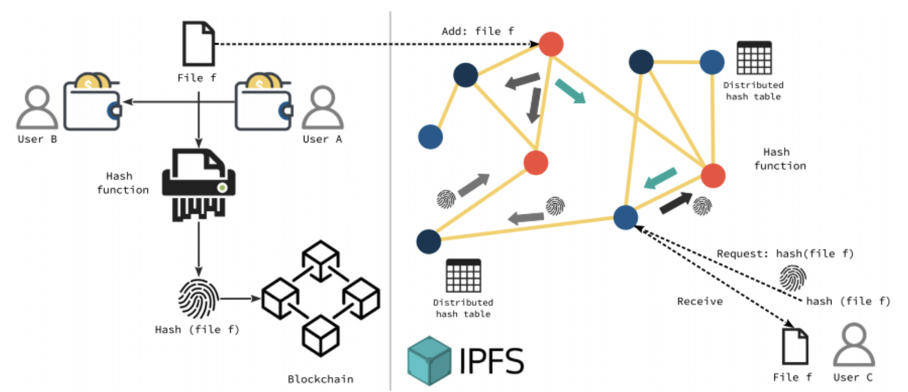

# InterPlanetary File System

---

[TOC]

---

## Overview

IPFS(InterPlanetary File System)은 분산형 파일 시스템에 데이터를 저장하고 인터넷으로 공유하기 위한 프로토콜로, P2P 네트워크이다.

> 기존의 HTTP 프로토콜 방식은 데이터가 위치한 곳의 주소를 찾아가서 요청한 컨텐츠를 한 번에 가져오는 방식이었지만, IPFS는 전세계 여러 컴퓨터에 분산 저장된 각 데이터 조각으로 잘게 나눠서 가져온 후 하나로 합쳐서 보여주는 방식으로 동작한다.

- github repository: https://github.com/ipfs/ipfs
- 문서: https://docs.ipfs.io/
- 포럼: https://discuss.ipfs.io/

## 개념

IPFS는 프로토콜이자 파일 시스템, 웹, 모듈러, 암호화, P2P, CDN, 네임서비스 모든 것을 아우른다.

`(출처: IPFS)`

IPFS를 사용하게 되면 해당 컴퓨터는 필요한 파일들을 다운받는 것과 동시에 파일들을 나누어주는 역할을 하게 된다.

## 특징

IPFS의 대표적인 특징은 아래와 같다.

- 분산화(Decentralization)
- 컨텐츠 어드레싱(Content-addressing)
- 참여(Participation)

### Decentralization

IPFS는 중앙 서버가 아닌 분산된 환경의 여러 peer로부터 파일을 다운로드 받을 수 있다.

- **안정된 인터넷 지원**: 중앙 서버에 오류가 생기면 파일 다운로드가 불가능한 기존의 구조 대비, 다른 곳에서 동일한 웹페이지를 얻을 수 있다.
- **콘텐츠 검열을 어렵게 함**: 파일이, 분산된 환경에서 전달된다는 특성으로 인해 위와 같이 특정 정보에 접근하는 것을 막거나 검열하는 것을 어렵게 한다.
- **웹 속도 향상**: 요청하는 컴퓨터가 멀리 떨어져 있거나 인터넷이 연결되지 않은 상황에서도 주변의 가까운 피어에서 빠르게 파일을 받아올 수 있다.

### Content-addressing

`/ipfs/QmXoypizjW3WknFi...6uco/wiki/SongArtish.html`

컨텐츠 어드레싱은 **컨텐츠를 주소 기반으로 표현**한다는 것이다. IPFS 컨텐츠의 URL을 위와 같은 형태인데, `/ipfs/` 다음의 문자열을 컨텐츠 내용의 해시값으로, 컨텐츠 식별자(CID, Content Identifier)라고 하며,  이를 통해 여러 peer로부터 컨텐츠를 가져올 수 있다.

> 전통적인 URL 또는 파일 경로는 해당 `위치`를 기반으로 파일을 식별하는 반면, IPFS는 파일에 포함된 `내용`을 기준으로 파일의 주소를 식별한다.

컨텐츠 식별자가 해시값이기 때문에, 원본 컨텐츠가 1bit라도 변경되면 완전히 새로운 값을 가지게 되는데, 매번 컨텐츠가 업데이트될 때마다 링크가 변경되는 것은 비효율적이며, 이는 [IPNS](https://docs.ipfs.io/concepts/ipns/)(InterPlanetary Name System), [MFS](https://docs.ipfs.io/concepts/file-systems/#mutable-file-system-mfs)(Mutable File System), [DNSLink](https://docs.ipfs.io/concepts/dnslink/) 등을 통해 보완이 가능하다.

### Participation

IPFS는 **소유와 참여**를 기반으로 동작하며, 많은 사람이 서로의 파일을 소유하고 사용 가능하게 만드는데 초점을 두기 때문에, 사람들이 적극적으로 참여한다는 가정하에만 정상 작동한다.

> 오늘날의 웹(www)은 **소유권과 액세스**를 기반으로 구성되어 있어서, 파일을 소유한 사람이 액세스 권한을 부여하기로 한 경우메나 파일을 받을 수 있다.

## 동작 방식

1. 컨텐츠 어드레싱(Content-addressing)을 통한 **고유 식별**

   IPFS는 파일의 내용을 해시화하여 컨텐츠 식별자(CID)를 생성한다. 하지만, 이러한 시스템의 기본 데이터 구조는 상호 운용 가능하지 않고 서로 연동되지 못하기도 하는데, 이를 해결하기 위해 [IPLD](https://ipld.io/)라는 프로젝트가 시작되었다.

   - IPLD: a data model of the content-addressable web, for interoperable protocols. 해시 연결 데이터 구조 사이를 변환하여 분산 시스템 전반에 걸쳐 데이터를 통합할 수 있도록 한다.

2. 방향성 비순환 그래프(DAG)를 통한 **컨텐츠 연결**

   IPFS는 디렉터리와 파일을 나타내는 것에 최적화된 Merkle DAG를 사용하는데, 이때 다양한 방법으로 Merkle DAG를 구성할 수 있다. (Git은 그 안에 여러 가지 버전을 가진 Merkle DAG를 사용한다.)

   컨텐츠를 하나의 Merkle DAG로 만들기 위해서는 먼저 컨텐츠를 블록 단위로 분할하며, 두 개의 유사한 파일이 있는 경우 Merkle DAG의 일부를 공유할 수 있게 된다. 즉, 다른 Merkle DAG의 일부가 동일한 데이터 하위 집합을 참조할 수 있다. 이렇게 하면 매번 완전히 새로운 파일을 만드는 대신 새롭거나 변경된 부분만 전송받을 수 있다. (BitTorrent처럼)

   Merkle DAG에서 모든 것(폴더 자체, 폴더 내 파일들, 해당 파일 블록)은 CID가 있다. 요약하면, **IPFS는 컨텐츠에 CID를 부여하고 Merkle DAG를 통해 해당 컨텐츠를 함께 연결할 수 있다.**

3. 분산 해시 테이블(DHT)을 통한 **컨텐츠 검색**

   어떤 peer가 컨텐츠를 호스팅하고 있는지 탐색하기 위해 IPFS는 DHT를 사용한다. 컨텐츠를 탐색하기 위해서는 peer들에게 질의를 하게 되며, IPFS는 DHT를 제공하고 서로 연결하고 소통하는 peer를 처리하기 위해 [libp2p](https://libp2p.io/)라는 프로젝트를 제공한다.

   > 검색을 위해서는 총 2번의 쿼리가 필요하다.
   >
   > 1. 피어의 현재 위치 찾기
   > 2. 컨텐츠 내용 찾기

   다른 peer에게 블록을 요청하고 블록을 보내기 위해서는 [Bitswap](https://github.com/ipfs/specs/blob/main/BITSWAP.md)이라는 모듈을 사용한다. `Bitswap`을 사용하면 원하는 컨텐츠를 가지고 있는 peer에 연결하고 원하는 목록(관심 있는 모든 블록 목록)을 보내고 요청한 블록을 받을 수 있다. 요청한 블록이 도착하면 컨텐츠를 해시하여 CID를 얻고 이를 요청한 CID와 비교함으로써 정확한 데이터를 받았는지 검증할 수 있다.

***Copyright* © 2022 Song_Artish**