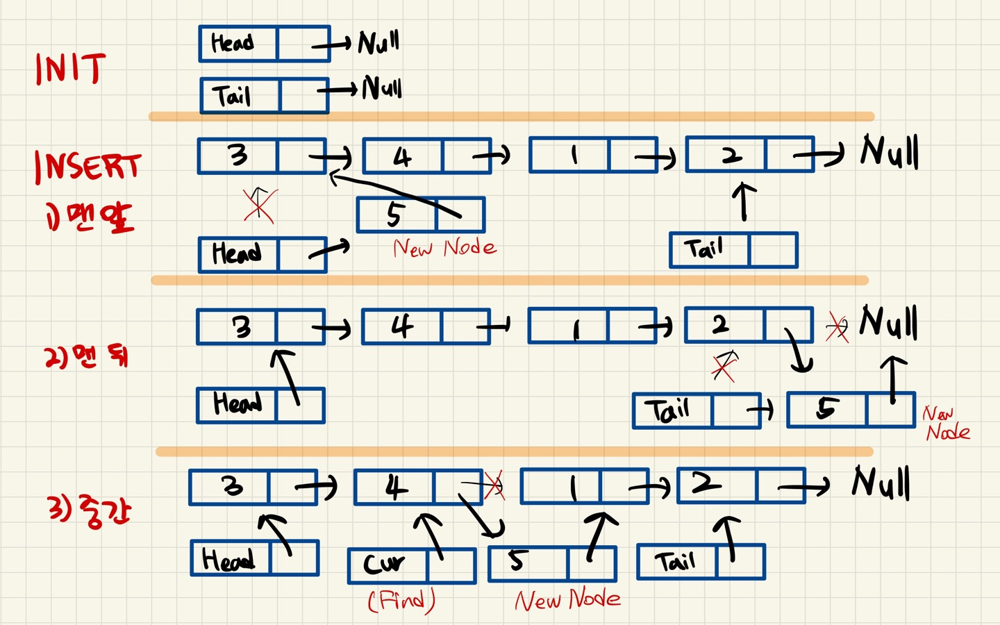
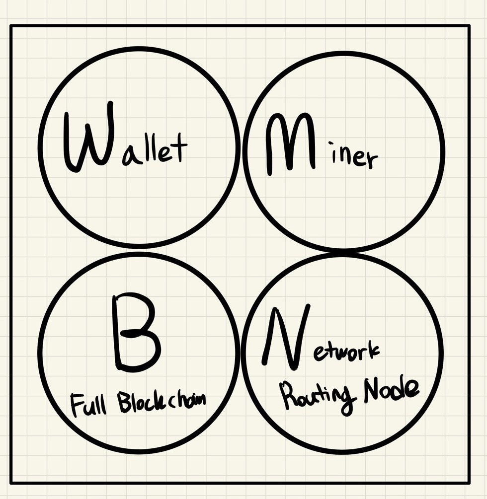
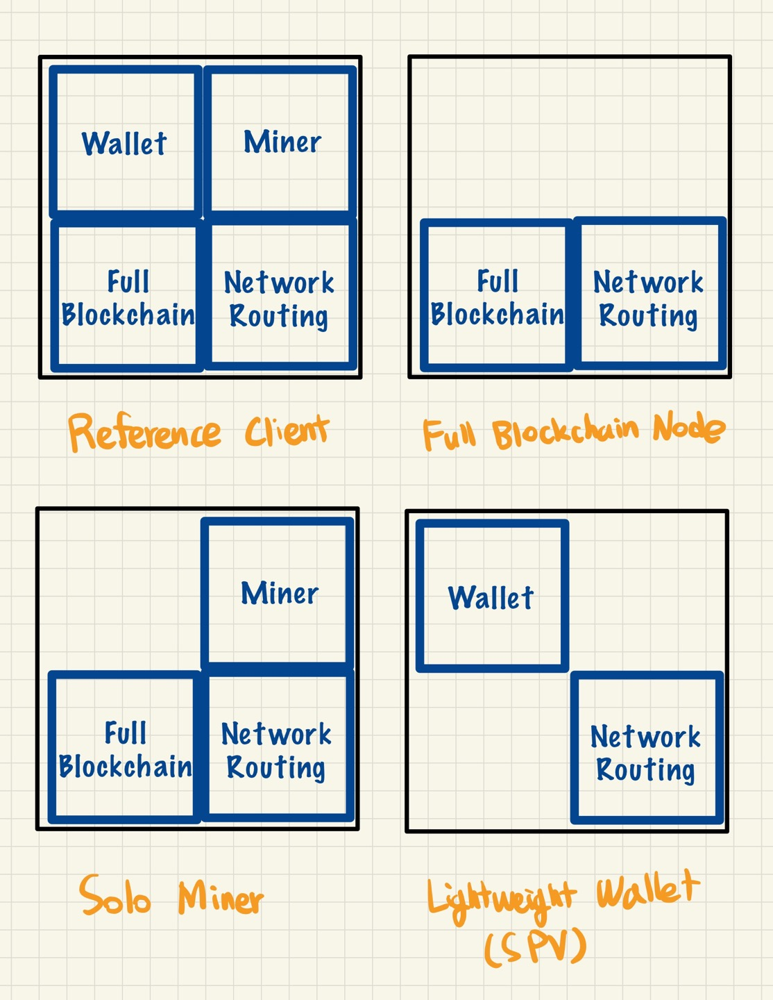

# Node

---

[TOC]

---


## 자료구조에서의 노드

### 노드(Node)

노드(Node)는 하나의 단위로, 연결리스트를 이루는 객체이다. 노드는 다음과 같이 구성되어 있다.

- 데이터를 저장할 공간
- 다음 주소를 가리킬 공간

노드가 가리키는 다음 주소가 NULL이면 이 노드는 마지막 노드라고 할 수 있다.

### 연결리스트(Linked List)

연결리스트(Linked List)는 순서를 가지는 자료들의 저장과 탐색을 위해 각 데이터에 이전 데이터나 이후 데이터의 참조를 추가로 기록하여 자료들을 연결하는 자료구조이다. 연결리스트를 구현하기 위해서는 다음의 세 함수를 구현해야 한다.

- **초기화(Init)**: 노드를 생성하는 과정

  노드 접근을 위해서는 **맨 처음 노드의 주소를 가리킬 노드**가 필요한데, 이를 Head라고 표현한다. 그리고 맨 마지막 노드를 가리키는 노드는 Tail이라고 표현한다. 초기화하는 과정에서 다음 주소를 가리키는 포인터는 **NULL**로 설정한다. Null은 `가리키는 노드가 없음`을 의미한다.

- **삽입(Insert)**: 새로운 노드를 추가하는 과정

  ```markdown
  3가지 구현 방법
  1) 맨 앞에 삽입하는 방법
  - 새로 추가되는 노드의 다음 주소 -> 현재 Head가 가리키는 주소
  - Head가 가리키는 주소 -> 새로 추가된 노드
  2) 맨 마지막에 삽입하는 방법
  - 새로 추가되는 노드의 다음 주소 -> NULL
  - Tail이 기존에 가리키는 노드의 다음 주소 -> 새로 추가되는 노드
  - Tail이 가리키는 주소 -> 새로 추가된 노드
  3) 원하는 위치에 삽입하는 방법
  ```

  

- **삭제(Remove)**: 기존 노드를 삭제하는 과정

  노드 삭제는 `원하는 자리에 삽입`하는 과정과 유사하다. 하지만 **삭제할 노드의 전**과 **삭제하 노드의 후**를 연결해줘야하므로 또 하나의 노드가 필요한데, 이를 `pre`라고 표현한다.

  1. 탐색을 통해 삭제할 노드를 cur이 가리키게 하고, 삭제할 노드의 바로 전 노드를 pre가 가리키게 한다.
  2. pre가 가리키는 노드의 다음 주소가 cur이 가리키는 다음 주소를 가리키게 한다.
  3. cur이 가리키는 노드는 노드의 메모리 주소를 비워준다.


## 블록체인에서의 노드

블록체인에서는 전 세계적으로 수십만 개 이상 존재하는 서버들을 노드(Node)라고 하며, 이들은 트리 구조로 되어 있다. 노드는 기능과 필요에 따라 종류와 형태가 구별되고, 자신이 맡은 역할에 따라 다양한 기능을 수행한다.

- **트랜잭션을 제안하고 검증**할 수 있다.

- **합의**를 이룬다.

- 블록체인을 보호하기 위해 **채굴(Mining)**을 수행하기도 한다.

- 계정 역할도 한다.

  Private Blockchain 또는 **하이퍼레저 패브릭의 멤버십 서비스** 같은 폐쇄형 블록체인 네트워크에서는 계정 역할의 노드가 꼭 필요하다.

> **하이퍼레저 패브랙의 멤버십 서비스**: CA(인증 기관), MSP(Membership Service Provider, 권한 부여), Identity Mixer(서명 증명) 등을 이용해 패브릭 네트워크 사용자의 접근을 제어하는 기능을 제공한다.


## 노드의 종류

### 풀 노드(Full Node)

풀 노드는 블록체인에서 이뤄진 모든 거래 정보를 전부 저장하는 노드이다. **제네시스 블록(Genesis Block)**부터 현재 블록까지 모든 블록체인 정보를 수집, 저장한다. 풀 노드는 자신의 PC에 모든 블록체인 내용을 가지고 있기 때문에 다른 노드의 도움 없이 스스로 거래 검증이 가능하다. 하지만 용량이 너무 커서 다운로드를 받는 데 시간이 오래 걸리고 하드디스크의 용량을 많이 차지한다는 단점이 있다.

### 라이트 노드(Light Node)

라이트 노드(Light Node)는 블록체인에 참여하여 거래를 수행하는 노드로, **내용 검증이 필요할 때마다** 풀 노드에 거래 데이터를 요청하여 개별 거래를 검증하는 기능을 수행한다. 풀 노드의 단점을 해결하기 위해 나온 것으로, 일종의 요약본, 즉 블록헤더에 있는 중요한 데이터만 보유하고 있게 된다.

### SPV(Simple Payment Verification)

SPV 노드는 라이트웨이트(Lightweight) 노드와 동일한 개념으로, **단순 지불 검증 노드**로서 전체 블록체인을 저장하지 않아도 특정 거래를 확인할 수 있는 노드이다. 거래를 **확인**할 수는 있지만, **직접 검증**은 할 수 없다. 해당 노드는 거래가 담긴 블록의 깊이와 높이를 참고하여 단순 검증(안전하게 보관되었다는 검증)은 할 수 있지만, 거래 전부에 대한 기록이 없기에 직접 검증(거래 자체가 적합한지)은 불가능하다. UTXO의 소비 여부 또한 검증할 수 없다.

SPV 노드는 이웃 노드들에게 지불 검증을 위해 필요한 데이터를 요청하게 된다. 하지만 이러한 과정에서 SPV 노드는 자연스레 프라이버시를 노출하게 된다. 즉, 필요한 데이터가 무엇인지 그대로 전달해야 하는데, 이를 보완하기 위해 '블룸필터(Bloom Filter)'를 사용하여 원하는 데이터를 얻으면서 프라이버시를 유지할 수 있게 된다.

### 마스터 노드(Master Node)

마스터 노드(Master Node)는 풀 노드 중에서 권한과 보상을 받는 노드로 주인 혹은 상위 노드로 표현된다. 블록체인 데이터를 전부 저장해 네트워크에 기여하는 의무를 갖고 있고, 풀 노드의 의무를 수행하면서 블록 생성에 대한 보상(투표 실시)을 받고, 트랜잭션의 추가 기능(익명, 즉시 전송)을 수행한다.

### 채굴 노드(Mining Node)

채굴 노드(Mining Node)의 역할은 새로운 블록을 가능한 빠르게 채굴하는 것이다. 채굴 노드는 작업증명(PoW) 방식을 채택한 블록체인에만 존재하는데, 채굴을 실질적으로 작업증명 방식에서 퍼즐을 푸는 일이기 때문이다.

### 랜덤 노드(Random Node)

랜덤 노드(Random Node)는 전체 블록체인의 무결성을 유지하기 위해 임의로 선택된 노드로서, 선출된 마스터 노드와 함께 블록을 생성한다.

### 엔트포인트 노드(Endpoint Node)

엔드포인트 노드(Endpoint Node, (구) Ranger Node)는 카카오 자회사인 그라운드X가 개발한 플랫폼인 클레이튼에 적용된 노드이다. 엔드포인트 노드는 정기적으로 다른 엔드포인트들과 통신하며 후술하 합의 노드에서 새롭게 생성된 블록을 다운로드하고 블록체인의 사본을 저장하는 식으로 블록을 이중으로 확인하는 노드이다. 누구나 엔드포인트 노드로 네트워크에 기여할 수 있으며, 참여자는 대가로 클레이 보상을 받을 수 있다.

### 합의 노드(Consensus Node)

합의 노드(CN; Consensus Node)는 트랜잭션을 새로운 블록으로 배치하고, 비잔틴 장애 허용(BFT) 합의 알고리즘을 사용해 블록들을 확인하는 작업을 담당하는 합의 ㅔ트워크를 형성하는 노드이다. 블록체인에서 블록을 생성하는 노드로 블록체인을 유지하기 위해서는 합의 노드가 존재해야 하며 스마트 계약 실행이나 거래 확인은 합의 노드에서 수행하게 된다.

### 슈퍼 노드(Super Node) / 대표 노드(Representative Node)

슈퍼 노드/대표 노드는 블록체인 네트워크의 노드들을 대표해 블록을 생성하고 그에 대한 보상을 받는 노드로, 위임지분증명(DPoS) 합의 알고리즘을 채택하고 있는 블록체인에서 특징적으로 볼 수 있는 시스템이다.

### 베이킹 노드(Baking Node)

베이킹 노드(Baking Node)는 테조스(Tezos) 블록체인에서 사용하는 용어로, 코인 소유자로부터 위임받은 코인으로 베이킹(Baking)하는 노드이다. 베이킹(Baking)은 테조스 블록체인에서 블록을 생성하고 블록을 입증하는 방법으로, 채굴과 동일한 의미를 가진다.

### 히스토리 노드(History Node)

히스토리 노드(History Node)는 블록에 있는 데이터를 찾을 수 있는 노드이다. 이더리움 API 서비스 제공 업체인 [인퓨라(Infura)](https://infura.io/)는 이 히스토리 노드의 데이터를 이용한 새로운 BM을 운영하기도 한다.


## 노드의 기능

블록체인에서 어떤 기능을 담당하는 노드가 될 건지는 본인의 자유이다. 노드의 기본적인 4가지 기능 모두를 가지고 있는 노드는 많지 않다.



### 지갑(Wallet)

소유한 비트코인 송수신 및 잔고를 확인하며 사용자의 개인키와 공개키를 관리하고 거래에 사용되는 주소를 생성한다.

### 채굴(Miner)

작업증명 방식을 사용하여 새로운 블록을 위해 경쟁하고 블록 생성시 코인을 보상으로 받는다.

### 블록체인 데이터베이스(Full Blokchain)

온전한 최신 블록체인 복사본을 유지하여 외부 참조 없이 독자적으로 거래 검증이 가능하다. 모든 블록을 다 가지고 있기 때문에 상당한 용량을 차지한다.

### 네트워크 라우팅(Network Routing)

거래와 블록을 검증하고 전파하며, 이웃 노드들과의 연결을 유지한다. 모든 노드 유형에 필요하다.

> 노드는 블록체인 상의 P2P 네트워크 전송 기능을 담당한다. 다음과 같은 4가지 기능의 조합으로 다양한 형태로 노드가 형성된다. (모든 노드는 Network Routing 기능을 포함하고 있다.)



### 1. Reference Client

모든 노드 기능을 포함한 완전한 네트워크의 형태이다. Bitcoin Core가 여기에 해당한다.

### 2. Full Blockchain Node

네트워크라우팅 기능과 모든 블록체인 데이터를 가진 형태이다.

### 3. Solo Miner

지갑 기능을 제외하고 채굴에 특화된 형태의 노드이다.

### 4. Lightweight Wallet(SPV)

지갑 기능과 네트워크 라우팅 기능만 포함된 노드로, 전체 블록체인 데이터는 없이 단순히 거래와 유효성 검증만 가능한 스마트폰에 설치된 지갑 등과 같은 노드이다.


***Copyright* © 2022 Song_Artish**