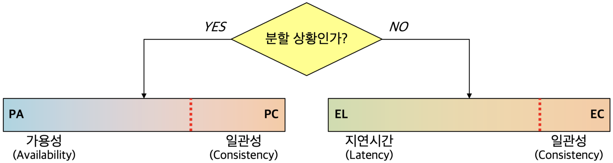
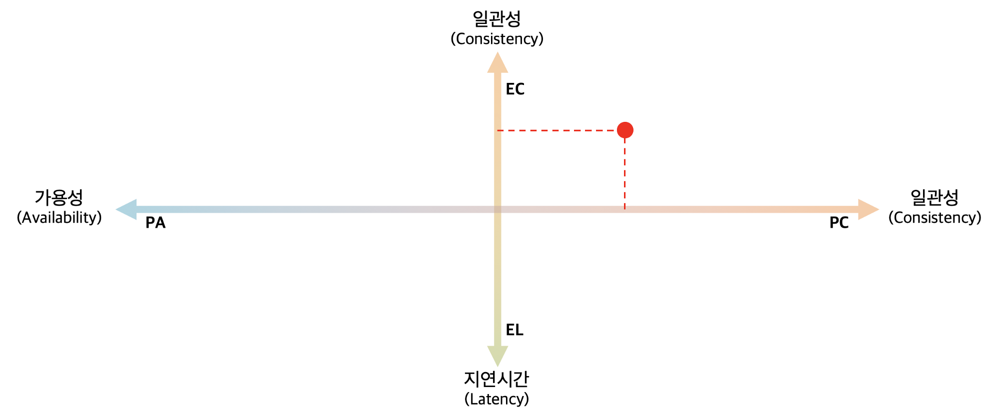
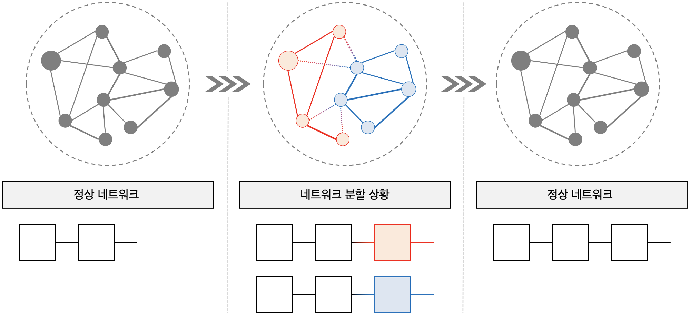

# PACELC 이론

---

[TOC]

---

## Background

CAP 이론에 따르면 일관성과 가용성은 완전한 대립 관계에 있지만, 사실 **완벽한(perfect) CP 시스템과 AP 시스템은 쓸모가 없으며, 또한 완벽한 CA 시스템은 가질 수 없다.**

- 완벽한 CP: 완벽한 일관성을 갖는 분산 시스템에서는 하나의 트랜잭션에 대한 복사본을 모든 노드가 가져야 한다. 시스템의 전체 성능은 네트어크에서 가장 낮은 성능의 노드에 종속되며, 만일 단 하나의 노드라도 문제가 발생하면 트랜잭션 처리는 실패한다. 또한, 노드의 수가 많아질수록 지연시간이 길어진다.
- 완벽한 AP: 완벽한 가용성을 갖는 분산 시스템은 네트워크 분할로 인해 고립된 노드가 발생하더라도 서비스를 제공한다. 고립된 노드는 업데이트를 반영하지 못해 일관성이 결여된 잘못된 정보를 가지고 있지만, 완벽한 AP 시스템에서는 어쨌거나 가용하다. 사용자는 잘못된 정보를 받고 활용하게 된다.
- 완벽한 CA: 완벽한 CA 시스템을 위해선 절대로 장애가 발생하지 않는 네트워크를 구성해야 한다. 이는 불가능하다.

## Overview

실제로는 일관성과 가용성의 절충안에 해당하는 연속적인 중간 영역이 존재한다. 이러한 중간 영역을 고려하고 네트워크의 정상 상황과 분할 상황을 모두 담아낼 수 있는 표현법으로 Daniel Abadi가 제시한 **PACELC 이론**이 있다.

(설명) 네트워크 상황을 중심으로 한 PACELC 이론의 다이어그램: 붉은색 선은 시스템의 정도를 나타낸 것이다.

(설명) 중간 영역 표현을 중심으로 한 PACELC 이론의 다이어그램: x축은 네트워크 분할 상황에서의 trade-off를, y축은 정상 상황에서의 trade-off를 의미한다. 붉은색 점은 현재 시스템의 정도를 연속된 공간 상에서 나타낸 것이다.

PACELC은 분할(Partition)이 발생했다면 가용성(Availability)과 일관성(Consistency) 사이의 trade-off가, 그렇지 않다면 지연시간(Latency)과 일관성(Consistency) 사이의 trade-off가 있음을 의미한다.

- **네트워크 분할 상황**: 분할 상황(P)에서는 단절된 노드에 접근할 수 없기 때문에 일관성을 포기하고 가용성을 제공할지(PA), 가용성을 포기하고 일관성을 유지할지(PC)의 정도를 결정해야 한다.
- **네트워크 정상 상황**: 정상 상황(E)에서는 모든 노드에 업데이트를 반영해 일관성을 유지하기 위한 긴 대기 및 응답시간을 가질지(EC), 일관성을 포기하고 짧은 지연시간을 가질지(EL)의 정도를 결정해야 한다.

(설명) 분기에 의한 블록체인의 논리적 분할과 포크 선택 규칙에 의한 합의: 서로 다른 블록을 수용함으로써 하나의 네트워크가 두 네트워크(red & blue)로 양분된다.

## 정리

### CAP 관점에서의 블록체인

CAP 관점에서 보면 블록체인은 가용성과 분할 허용을 충족하는 AP 시스템이다. 그러나 통상의 AP 시스템은 고성능을 위하지만 블록체인 시스템은 자가 제한을 통해 성능을 제한한다는 점이 특이한 점이다. 대신 이를 통해 과거 블록의 위/변조를 어렵게 만들고 궁극적 일관성을 확보했다. 이런한 특징은 **블록체인 트렐리마**로 이어진다.

### PACELC 관점에서의 블록체인

한편 PACELC 관점에서 보면 블록체인은 일관성보다는 가용성과 지연시간을 중시한 분산 시스템이다. 그러나 마찬가지로 시간이 지남에 따라 과거의 블록 및 트랜잭션에 대한 궁극적 일관성을 확보한다.

- 네트워크 분할 상황: 분할 상황에서 블록체인은 일관성보다는 가용성에 초점을 둔다. 채굴자가 자신이 참조하고 있는 블록이 네트워크에서 아직 합의를 이루지 못했다 하더라도 이전 블록으로 삼아 채굴을 이어간다.
- 네트워크 정상 상황: 정상 상황에서 블록체인은 일관성보다는 짧은 지연시간에 초점을 둔다. 블록체인에서는 채굴된 새 블록 혹은 더 무거운 체인 등을 통해 원장의 업데이트가 제안되는데, 모든 노드가 이를 따를 필요는 없다.

### 결론

정리하자만 블록체인은 가용성과 지연시간을 중시하지만 충분한 완결성이 부여된 블록에 대해서는 높은 확률로 일관성을 보장하는 분산 시스템이다. 블록은 상태와도 같으므로, 현재 상태에 대해서는 가용성과 지연시간을 중시하고 과거 상태에 대해서는 일관성을 중시하는 분산 시스템이라고도 말할 수 있다.

***Copyright* © 2022 Song_Artish**