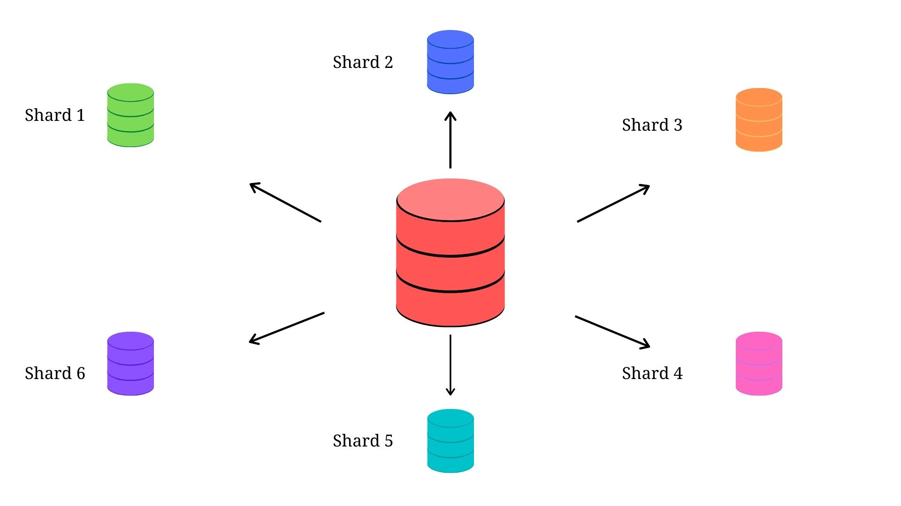

# 샤딩(Sharding)

---

[TOC]

---

## Overview

샤딩(Sharding)이란 하나의 거대한 데이터베이스나 네트워크 시스템을 여러 개의 작은 조각으로 나누어 분산 저장하여 관리하는 것을 말한다. 샤딩을 통해 나누어진 블록들의 구간(Epoch)을 샤드(Shard)라고 부른다. 데이터를 단일의 데이터베이스에 저장하기 너무 클 때 사용하며, 이를 통해 노드에 무겁게 가지고 있던 데이터를 빠르게 검증할 수 있어 트랜잭션 속도를 높일 수 있다.

`(출처: Blockchain Files)`

블록체인에서는 전체 네트워크를 분할한 뒤 트랜잭션을 영역별로 저장한다. 그리고 이를 병렬적으로 처리하여 블록체인의 확장성을 부여하는 온체인 솔루션으로 데이터를 샤드라는 단위로 나눠서 저장 및 처리한다.

## Background

샤딩은 블록체인 시스템의 확장성(Scalability) 문제를 해결하기 위한 방법의 하나이다. 시간이 지남에 따라 블록체인 기반 서비스는 대체로 사용자 수가 증가하는데, 기존 비트코인과 이더리움의 경우 확장성 문제가 심각하여 TPS를 획기적으로 증가시키기 위한 다양한 방법이 고안되고 있으며, 그 중 대표적인 것이 샤딩이다.

샤딩은 플라즈마, 라이덴 네트워크 등과 마찬가지로 확장성 문제를 해결하기 위해 제안된 솔루션이다. 플라즈마, 라이덴 네트워크는 오프체인 솔루션이지만 샤딩은 on-chain 솔루션이며, on-chain 솔루션이란 메인체인 자체의 프로토콜을 변경시켜서 메인체인의 성능을 향상하는 방법을 말한다. On-chain 솔루션을 적용하기 위해서는 메인 네트워크의 하드 포크가 필수적으로, 이더리움이 PoS(지분 증명) 합의 알고리즘으로 전환할 것을 기반으로 설계되었다. (Off-chain 솔루션은 메인체인 바깥에 다른 시스템을 추가하여 해결하기 때문에 하드 포크가 필요 없다.)

## 특징

샤딩은 관계형 데이터베이스에서 대량의 데이터를 처리하기 위해서 데이터를 파티셔닝하는 기술이다. 파티셔닝은 데이터베이스 자체를 분할하는 방식으로, DBMS 레벨에서 데이터를 나누는 것이 아니며 애플리케이션 레벨에서 구현해야 한다.

샤딩을 하면 각각의 노드가 트랜잭션의 일부만을 처리하게 되고, 네트워크 상에서 데이터를 병렬적으로 처리할 수 있기 때문에, 네트워크가 커질수록 점점 더 많은 트랜잭션 처리가 가능하게 되는 속성을 가진다. 이 속성을 **병렬식 확장(Horizontal Scaling)**이라고도 하며, 따라서 빠른 트랜잭션 속도를 가질 수 있다.

### 수평 분할(Horizontal Partitioning)

스키마(Schema)가 같은 데이터를 두 개 이상의 테이블에 나누어 저장하는 디자인을 말한다.

### 장점

- 필요한 데이터만 빠르게 조회할 수 있기 때문에 쿼리 자체가 가볍다.
- 오래되어 조회가 안 되는 데이터를 클라우드에 올리거나 별도의 디스크에 저장해서 운영 상의 스토리지 이득을 볼 수 있다.

### 문제점

- 샤딩을 적용할 경우 한 샤드 내에서의 전송이 아닌 여러 샤드 간의 전송은 절차가 훨씬 복잡하고 느려진다.
  각 샤드는 자기 샤드의 데이터만 있기 때문에, 샤드 간 데이터를 어떻게 참조할 것인지, 어떻게 검증할 것인지 문제가 생겨서 알고리즘이 복잡해진다. 만약 이 단계에서 거래결과가 뒤집어지면(비확정적합의) 상황은 더욱 복잡해지기 때문에 확정합의가 거의 필수이다.

- 샤딩이 들어가게 되면 전체의 안정성은 보장이 된더라도 시간이 지나면 샤드 간 불균형이 일어나 일부 샤드의 안정성이 취약해지는 문제가 발생할 수 있다.
  
- 확장성 문제 해결을 위해 나왔음에도, 중앙화의 문제와 보안성의 문제를 가지게 될 수 있다. (1% Attack 등)

## 데이터베이스를 나누는 방법

- **Vertical Partitioning**: 테이블 별로 서버를 나누는 방식
  - 장점: 구현이 간단하고 전체 시스템에 큰 변화가 필요 없다.
  - 단점: 각 서버의 데이터가 점점 거대해지면 추가 샤딩이 필요하다.
- **Range Based Partitioning**: 하나의 feature가 점점 거대해지는 경우 서버를 분리하는 방식
  유저 별로 서버를 분리하거나 ,일정 데이터라면 연도 별로 분리, 거래 정보라면 우편번호를 이용하고 주의 사항으로는 데이터를 나누는 방법이 예측 가능해야 한다.
- **Key or Hash Based Partitioning**: 엔티티를 해시함수에 넣어 나오는 값을 이용해서 서버를 정하는 방식으로, 해시결과 데이터가 균등하게 분포되도록 해시 함수를 정하는 게 중요하다.
  - 단점: 서버의 수를 늘리기 위해 해시함수를 변경하는 작업이 정말 비싼 작업이다.
- **Directory Based Partitioning**: 파티셔닝 메커니즘을 제공하는 추상화된 서비스를 만드는 것으로, 샤드 키를 lock-up할 수 있으면되므로, 구현은 DB와 CACM을 적절히 조합해서 만든다.

## 샤딩 체인 동작 방식

- Proposer가 되고 싶은 네트워크 참여자는 SMC를 통해 Balance를 예치한다.
- Collator가 되고 싶은 네트워크 참여자는 SMC를 통해 Deposit을 예치한다.
- Collator들은 주기적으로 SMC Status를 확인해서, 자신이 Collator에 선정되었는지 여부를 확인한다.
- Collator들은 SMC에 의해 각 샤드 체인에 Pseudo-Random하게 배정되고, Look Ahead Period 동안에 해당 샤드의 이전 기록들을 다운받으면 선택된 Proposal을 제안한 Proposer로부터 Proposal Bid를받는다.
- Proposer는 트랜잭션을 담은 Proposal을 Collator에게 제출하는데, Proposal은 아직 검증되지 않은 Collation을 의미하며, 선택된 Proposal을 제출한 Proposer는 트랜잭션 발송자로부터 트랜잭션 Fee를 받는다.
- Collator들은 해당 Proposal에 속한 트랜잭션들이 Valid한지를 검증하는 투표를 한다. 투표에서 2/3 이상의 Collator들이 Proposal에 포함된 트랜잭션이 Valid하다고 찬성할 경우, 해당 Proposal은 유효한 Collation이 된다.

**주요 용어**

- Collation: 샤드 체인에서 메인 체인의 블록과 같은 역할을 하며, 크게 Collation Header와 트랜잭션 목록으로 구성된다.
  - Collation Header: Collation을 구성하는 정보를 담고 있으며, Proposer의 Sign을 거쳐 메인 체인에 제출하고, 트랜잭션 목록은 Collation에 담긴 트랜잭션들의 목록이다.
- Proposer: 제안자라는 뜻으로 트랜잭션들을 모아 Proposal을 만들고 Collator에게 제출하며, Proposal은 검증되지 않은 Collation이다.
- Collator: Proposer가 제출한 Proposal을 검증한다. Period마다 한 샤드에는 여러 Collator들이 배정되는데 이들은 해당 Period에 진입하기 일정 기간 이전에 무작위로 선정된다.
- Executor(샤딩 Phase 3에 등장): Collation header를 메인체인의 SMC(Sharding Manager Contract)에 전달하고, 샤드 체인의 실제 statㄷ가 변경된다.
- Period: 메인 체인에서 샤드 체인의 Collation Header를 제출받는 주기이며, 단위는 메인 체인에서의 블록의 개수로 `PERIOD_LENGTH =5`라면 5개의 블록에 생성되는 것이 1 Period이다.
- Look Ahead Period: Collator는 샤드 체인에서 Collation을 검증하기 이전에 SMC에 의해 Pseudo-Random하게 배정되는데, 'Look Ahead Period'는 Collator가 몇 Period에 앞서서 어떤 샤드 체인에 배정되는지를 나타내고, `LOOKAHEAD_PERIODS = 4`이면 4 Period 이전에 Collator는 샤드 체인에 배정되므로 Collator는 사전에 자신이 배정된 샤드 체인의 state 정보를 다운받는 시간을 확보할 수 있다.
- SMC(Sharding Manager Contract): SMC는 샤드 체인에서 가장 중요한 역할을 하는 스마트 컨트랙트로 SMC는 메인 체인과 샤드 체인을 연결하며, Collator, Proposer, Collation Tree를 관리하며, 샤드 체인에 메인체인에 참여하기 위해선ㄴ SMC의 역할이 필수적이다.

## 이더리움에서의 샤딩

이더리움 샤딩은 메인 체인이 처리해야 할 블록들을 조각내어 샤드(shard)라고 불리는 off-chain에 할당하는데, 오프체인들은 주어진 조각에 대해서만 유효성을 검증한다. 샤드들이 각자 할당된 조각들의 검증을 모두 끝내면 다시 묶어 이러한 개념을 통해 블록을 검증하는데 걸리는 시간을 단축한다. 샤드별로 Merkle Patricia Tree를 만들고 그 샤드의 root들로 만들어진 Merkel Patricia Tree의 root만을 블록체인에 올리는 것으로, 모든 miner가 모든 트랜잭션을 실행할 필요 없이 샤드별로 miner를 분산시켜 실행할 수 있기 때문에 전체 실행 속도가 올라간다.

**문제점**

- 난수 생성: 난수를 사용하여 검증자를 샤드에 배정하는데, 공격자가 난수를 예측하거나 조작할 수 있어 샤딩 보안에 문제가 생긴다.
- 빠른 샤드 전환: 샤드에 대한 공격 성공 가능성을 줄이려면 검증자를 빠르게 전환해야 하는데, 이전부터 Look Ahead Time을 두어 검증자가 자신의 맡을 샤드블록을 미리 동기화시키고, 미리 동기화하기 위해서는 동기화할 자료를 줄여서 빠르게 검증자를 준비할 수 있는 Stateless Client를 제안한다. Stateless Client는 블록 헤더만을 저장하지만 블록헤더만을 저장하기 때문에 거래에 대한 검증은 불가능하여 거래 검증을 하려면 거래를 만들 때, 검증에 필요한 witness를 첨부해야 한다.
- 자료 가용성(Data Availability): 모두가 Stateless Client라면 블록의 내용을 손실할 수 있기 때문에 누군가는 state를 저장하고 있도록 적절한 보상과 검증(Proof of Custody)가 필요하다. Fisherman 딜레마는 Erasure Coding으로 해결됐다.
- 검증자간 효율적인 통신: 샤드 배정이 자주 바뀌는 상황에서 샤드 검증자들끼리의 효율적인 P2P 통신은 필수적이며, libs 2p의 Flood Sub와 Gossip Sub이 사용된다.
- 샤드 간 비동기 통신: 거래 당사자나 스마트 계약이 여러 샤드에 나누어져 있다면 샤드 간의 통신(Cross-Shard Communication)이 필요하지만 여러 단계를 거치게 되어 시간이 오래 걸리므로 결국 메인 체인에 무리를 주게 되고 이렇게 샤드 간 통신이 너무 자주 일어난다면 샤딩의 장점은 사라진다. 이에 이더리움은 Cross Link를 가지고 메인체인의 무리를 덜고, Yanking으로 필요한 스마트 계약을 현재 샤드로 가져와 샤드 간의 토신을 줄이고자 현재 지연상태 전이(Delayed State Transition)를 통한 샤드 간의 비동기 통신도 구상 중이다.

## 샤딩의 활용

**암호화폐 질리카(Zilliqa)**

질리카는 Network Sharding, Transaction Sharding, Computational Sharding과 같은 다양한 형태로 샤딩 기술을 구성하여 트랜잭션 처리 속도를 획기적으로 향상시켰다. 그 중 가장 중요한 것은 Network Sharding인데, 질리카 채굴 네트워크를 샤드(Shard)라는 작은 노드 그룹으로 나눌 수 있는 메커니즘이다.

## 샤딩 관련 키워드

- 샤드
- 데이터베이스 샤딩
- 네트워크 샤딩
- 스테이트 샤딩
- 동적 샤딩
- 알고리즘 샤딩
- 적응형 상태 샤딩
- 체인샤딩
- 트랜잭션 샤딩

***Copyright* © 2022 Song_Artish**