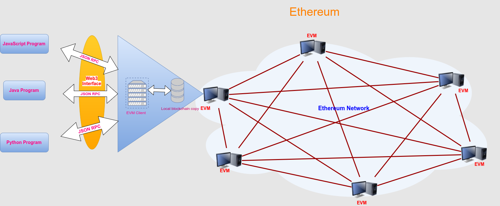

# web3.js

---

[TOC]

---


## Overview

Web3.js는 다른 계정으로 이더를 전송하거나, 스마트 컨트랙트에서 데이터를 읽고 쓰거나, 스마트 컨트랙트를 만드는 등 다양한 액션을 수행할 수 있게 해주는 라이브러리 집합이다. 이더리움 블록체인과 상호작용하는 클라이언트를 개발하는데 사용한다.


## 상호작용 방식

클라이언트가 이더리움과 상호작용하는 방식은 다음 그림으로 설명할 수 있다.



`(출처: https://iotbl.blogspot.com/2017/03/ethereum-and-blockchain-2.html)`

Web3.js는 이더리움 블록체인과 **JSON RPC**를 사용하여 소통한다. 여러 노드로 구성된 P2P 네트워크에 있는 데이터를 읽거나 써야 할 때 JSON RPC를 사용해 하나의 이더리움 노드에게 요청을 보낸다. 이더리움에서는 클라이언트가 JSON RPC라는 정해진 형식에 맞춰서 이더리움 노드에 데이터를 요청한다.

> RPC: Remote Procedure Call 프로토콜의 약자


## Modules

Web3.js에는 다음과 같은 다양한 모듈이 있다.

- `web3-eth`: 이더리움 블록체인과 스마트 컨트랙트 모듈
- `web3-shh`: P2P 커뮤니케이션과 브로드캐스트를 위한 위스퍼 프로토콜 모듈
- `web3-bzz`: 탈중앙화 파일 스토리지를 위한 스웜 프로토콜 모듈
- `web3-utils`: dApp 개발자를 위한 유용한 헬퍼 함수들을 모아둔 모듈

> - Whisper Protocol: Gossip 기반의 메시지 및 임시적으로 값을 저장하는 프로토콜
> - Swarm Protocol: 분산 저장된 데이터의 동기화를 실현하는 프로토콜


## window.ethereum - 공급자 객체

EIP-1139를 통해 메타마스크와 같은 지갑 소프트웨어는 웹 페이지에 자바스크립트 객체 형태로 자신의 API를 노출한다. 이 객체를 공급자(Provider)라고 한다.

EIP-1139는 이더리움 공급자 API를 통일하여 지갑 간 상호 운용이 가능하도록 하였다. EIP-1139에서 지정한 이더리움 공급자 객체는 브라우저 내에서 `window.ethereum`으로 지정되어 있다.


## 시작하기

먼저 폴더를 생성하고(여기서는 `web3js_practice`), 해당 디렉토리에서 npm으로 초기화한다.

```bash
npm init
```

Web3.js를 사용하기 위해서는 npm에서 web3.js 라이브러리를 설치해야 한다.

```bash
npm install web3
```

간단하게 현재 내 지갑 주소에 있는 이더 잔액을 조회하는 코드를 작성해본다.

`webjs_practice` 폴더 아래 `getBalance.js` 파일을 생성한다. web3 객체를 사용하기 위해서 다음과 같이 작성한다. Web3를 사용해 이더리움 노드와 연결하기 위해서는 `new Web3()`로 이더리움 노드의 공급자를 인자로 주어야한다.

```javascript
// getBalance.js

const Web3 = require('web3')
const rpcURL = "https://ropsten.infura.io/v3/PROJECT_ID"    // 원격 이더리움 노드에 접속할 수 있는 주소

const web3 = new Web3(rpcURL)   // web3 객체 생성
```

`web3.eth.getBalance()`는 특정 주소의 잔액을 조회한다. `getBalance()`의 인자로는 트랜잭션의 주소가 들어가며, Promise 객체를 반환하며, 이 Promise 객체는 주소의 잔액을 반환한다. `getBalance()`를 사용하기 위해 다음과 같이 작성한다.

```javascript
// getBalance.js

const Web3 = require('web3')
const rpcURL = "https://ropsten.infura.io/v3/PROJECT_ID"

const web3 = new Web3(rpcURL)

const account = "자신의_지갑_주소"

web3.eth.getBalance(account)
    .then((bal) => {
        console.log(`지갑 ${account}의 잔액은... ${bal}입니다.`)
    })
```

터미널에서 아래의 명령어를 실행하면, 정상적으로 주소의 잔액을 가져오는 것을 확인할 수 있다.

```bash
node getBalance.js
```

`web3.eth.getBalance()` 함수는 화폐의 단위가 wei이다. `web3.utils.fromWei()`를 활용해 화폐 단위를 변환해줄 수 있다.

```javascript
// ...
web3.eth.getBalance(account)
    .then((bal) => {
        console.log(`지갑 ${account}의 잔액은... ${bal} wei입니다.`)
        return web3.utils.fromWei(bal, "ether")    // web3.utils.fromWei를 사용해 ether 단위로 변경
    })
    .then((eth) => {
        console.log(`이더 단위로는 ${eth} ETH입니다.`)
    })
```


## 조회하기

### 트랜잭션 조회 - `getTransaction`, `getTransactionReceipt`

`web3.eth.getTransaction`은 트랜잭션 해시를 인자로 받고, 해당 트랜잭션에 대한 정보를 Promise 형태로 리턴한다.

`getTransaction.js` 파일을 생성하고 담음의 코드를 작성한다.

```javascript
// getTransaction.js

const Web3 = require('web3')
const rpcURL = "https://ropsten.infura.io/v3/PROJECT_ID"

const web3 = new Web3(rpcURL)

const txId = "자신이_만든_트랜잭션의_해시값"

web3.eth.getTransaction(txId)
    .then((obj) => {
        console.log(obj)
    })
```

터미널에 아래 명령어를 입력하여 코드를 실행하면, 트랜잭션에 대한 정보가 객체 형태로 출력되는 것을 확인할 수 있다.

```bash
node getTransaction.js
```

이외에도 다음과 같은 함수가 있다.

- `web3.eth.getTransactionReceipt()`: Returns the receipt of a transaction by transaction hash.
    The receipt is not available for pending transactions and returns `null`.
- `web3.eth.getPendingTransactions()`: Returns a list of pending transactions.
- `web3.eth.getTransactionFromBlock()`: Returns a transaction based on a block hash or number and the transaction’s index position.


### 블록 조회 - `getBlock`

`web3.eth.getBlock()`은 블록숫자를 인자로 받고, 블록에 대한 정보를 Promise 형태로 반환한다.

`getBlock.js` 파일을 생성하고, 다음과 같이 코드를 작성한다.

```javascript
// getBlock.js

const Web3 = require('web3')
const rpcURL = "https://ropsten.infura.io/v3/PROJECT_ID"

const web3 = new Web3(rpcURL)

const blockNum = "11479475"

web3.eth.getBlock(blockNum)
    .then((obj) => {
        console.log(obj)
    })
```

`blockNum` 변수에는 자신이 검색하고 싶은 블록의 숫자를 입력한다. 터미널에 `node getBlock.js`를 입력하여 코드를 실행하면, 블록에 대한 정보가 객체 형태로 출력되는 것을 확인할 수 있다.

### 특정 주소 조회

`getTransactionsByAccount()` 함수를 사용하면 특정 주소의 거래내역을 확인할 수 있다. `getTransactionsByAccount()` 함수는 다음의 기능을 가지고 있다.

- 계정 주소값과 블록 범위(ex. 11,300,000번째 블록부터 11,400,000번째 블록까지)를 입력하면 해당 블록 범위에 있는 블록에 기록된 트랜잭션 중 해당 계정이 참여한 트랜잭션만 추출한다.
- 인자로 주소값 `account`와 블록 숫자로 이루어진 블록 범위값 `startBlock`, `endBlock`을 인자로 가진다.
- 해당 블록 범위 내에 송신 또는 수신자로 참여한 트랜잭션들로 구성된 배열을 반환한다.


***Copyright* © 2022 Song_Artish**