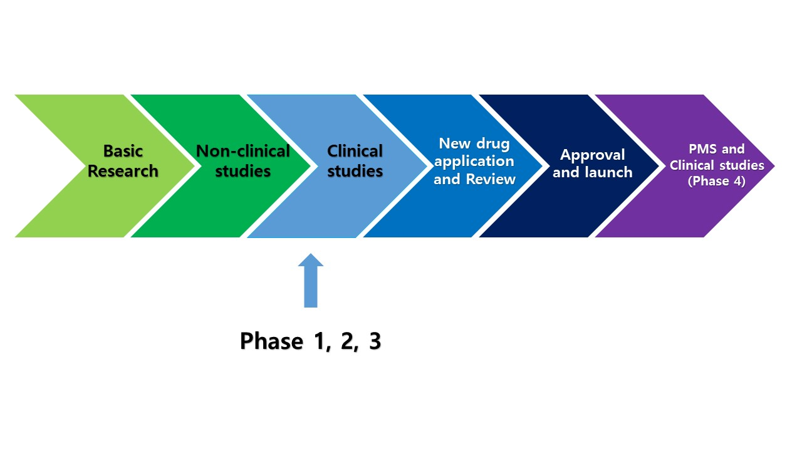
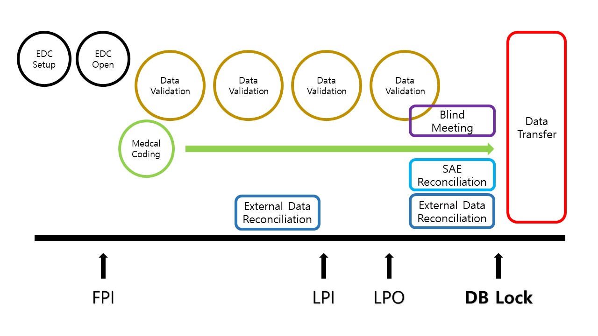

# Introduction to Clinical Trial & Data Management

2021.07.05

---

[TOC]

---


## Clinical Trials

> **시장에서 시판/판매**를 위해 **규제당국의 승인을 받는 과정**

```markdown
임상시험용의약품의 **안정성**과 **유효성**을 증명할 목적으로 해당약물의 약동/약력/약리/임상적 효과를 확인하고 **이상반응을 조사**하기 위하여 사람을 대상으로 실시하는 시험 또는 연구 `(출처: 의약품안전나라)`
```

### 신약 개발



1. Discovery / Screening (후보 뭃질 탐색)
   - 신약으로 개발될 가능성이 있는 물질 탐색 및 기초적인 평가 수행
2. Nonclinical Research (비임상연구)
   - In vitro/in vivo 실험 등을 통해 후보물질의 약리/독성학적 특성 등을 평가
   - 인체 투여를 위한 후보물질을 **최적화(optimization)**
3. Clinical Studies (임상시험)
   - 사람을 대상으로 후보물질의 약리학적 특성 및 안정성을 평가
   - 일반적으로 1, 2, 3상으로 구분
4. NDA reviewers (신약 승인 심사)
   - 후보물질에 대해 확보된 주요 정보를 토대로 시판 허가 여부를 심사
5. PMS (Post-marketing processes, 시판 후 과정)
   - 일반적으로 광범위하게 사용되는 상황 하에서의 안전성 정보를 추가 파악
   - 의도한 적응증 이외의 새로운 적응증을 발견

### 임상시험 주요과정

1. **IND** (Investigational New Drug)
   - 규제당국에 **임상시험 신청**
2. **Clinical Trial** (1~3단계)
   - Phase 1: **흡수/배출**, 안전성 (건강한 사람들)
   - Phase 2: **3상을 위한** 최적의 용량 확인
     - :arrow_right: 보통 이 단계에서부터 blind 시행
   - Phase 3: 의약품의 최종 확증 연구 (주로 **대조군-기존약을 설정하여 비교**하는 식으로 검증)
3. **NDA** (New Drug Application)
   - 임상시험결과를 규제당국에 제출하면서 **판매를 위한 승인 요청**
4. **Post Marketing(시판 후) 연구**
   - Phase 4
   - PMS (Post Marketing  Surveillance, 시판 후 조사)
   - OS (Observational  Surveillance, 관찰연구)

- 각 임상시험의 단계
  - **CSR** (Clinical Study Report): 통계에 반영하는 결과물
  - Statistical Analysis
  - Data Management (DM) + Monitoring (CRA)
  - Protocol: Clinical Trial의 planning 규칙


### Role


`(출처: 의약품안전나라)`

- Sponsor에서 CRO (Contract Research Organization)에게 계약에 의해 외주를 준다.

:ballot_box_with_check: **절차**

1. 임상시험의뢰자는 `임상시험계획서`를 작성하여 식품의약품 안전처와 실시기관 내 임상시험심사위원회(IRB)에 **승인신청**을 한다.
2. 식품의약품안전처와 실사기관 내 임상시험심사위원회(IRB)에서는 임상시험계획서를 세밀히 검토 후 **승인여부를 결정**한다.
3. 임상시험의뢰자는 신약후보물질에 대한 **안전성과 유효성을 검증**하기 위해 시험책임자에게 **임상시험 실시를 요청**한다.
4. 시험책임자는 피험자에게 임상시험에 대해 충분히 설명한 후 동의서를 받으며, 임상시험계획서에 따라 **과학적이고 윤리적인 임상시험을 진행**한다.
5. 임상시험과 관련하여 식품의약품안전처는 임상시험 실시기관, 임상시험의뢰자 시험책임자 등에 대한 **실태조사를 실시**할 수 있다.
6. 식품의약안전처의 신약후보물질의 안전성과 **유효성을 평가**하여 **신약허가 여부를 결정**하고, 신약허가를 받은 후 **판매**할 수 있다.


## DM Process

> Data Management Process



|                  용어                  |                             설명                             |
| :------------------------------------: | :----------------------------------------------------------: |
|  **DMP**<br />(Data Management Plan)   |                                                              |
|    **CRF**<br />(Case Report Form)     |        - 참여 환자로부터 데이터를 수집하기 위해 사용         |
|           **FPI, LPI, LPO**            | - 비용/수익 문제 때문에 빠르게 완료하는 것이 중요<br />- 따라서, FPI, LPI, LPO가 시간적인 측면에서 중요 |
|          **Data Validation**           | - 입력된 데이터의 적절성 확인<br />- Real Time Validation 및 Batch Review 방식으로 진행 |
| **EDC**<br />(Electronic Data Capture) | - USR 관련 문서 생성<br />- CRF for EDC, ECS, Role & Priv. 등등 |
|           **Medical Coding**           |   - text data의 categorization (분석을 위한 데이터로 변환)   |
|    **External Data Reconciliation**    |        - External Data: CDMS 외부에서 수집되는 데이터        |
|           **Blind Meeting**            |                                                              |
|           **Data Transfer**            |           - DB lock 완료 후, 저장된 데이터를 이관            |


## ID Naming Convention

### Cycle & Visit

> Cycle은 유사한 형태의 visit의 집합이다.

| ID category |            Explanation             |     Example     |                           Comment                            |
| :---------: | :--------------------------------: | :-------------: | :----------------------------------------------------------: |
|    Cycle    |          **Normal Visit**          |       NV        |                계획서의 일반적인 방문의 집합                 |
|             |       **Unscheduled visit**        |       UV        | 계획서에서 정의하지 않은 방문의 집합<br />site person이 임의로 추가하여 입력할 수 있음 |
|             |          Follow Up visit           |       FV        | UV와 내용상 동일<br /><u>but</u> 여러 방문을 묶어서 임의로 추가 가능 (항암제에서 많이 사용) |
|             |                SAE                 |       SAE       |                   CRF가 아닌 SAE에서 사용                    |
|    Visit    |    일반적으로 `Vn` 숫자로 표기     |   V1, V2, V3    |           Visit ID 외에 Visit Code를 입력하여야 함           |
|             | 그 외 계획서 특성에 맞게 변경 가능 | W0, W4, W8, ... |                   Visit ID는 ECS에서 사용                    |
|             |                                    |   V10 V11 V20   | Visit Code는 Data Export에서 Visit을 정의할 때 사용<br />(Visit Code는 의미있는 숫자로 정의) |

### CRF GROUP ~ QST

|      ID Category      |                         Explanation                          |              Example              |                           Comment                            |
| :-------------------: | :----------------------------------------------------------: | :-------------------------------: | :----------------------------------------------------------: |
|     **CRF_GROUP**     | `DB SPEC > Table list`에 정의된대로 사용<br />(SDTM 표준 지향) |                LB                 |                   아래 DOMAIN 테이블 참조                    |
|       **PAGE**        |                    CRF_GROUP_ID와 동일함                     |                LB                 |                                                              |
|        **CRF**        | IF No. of CRF=1 THEN PAGE_ID ELSE IF No. of CRF >= 2 THEN [PAGE_ID, PAGE_ID01, PAGE_ID02…] |          LB, LB01, LB02           | CRF가 1개이면 PAGE_ID와 동일2개 이상이면 01, 02, 03을 순차적으로 부여함 |
|    **QST_NORMAL**     |                    Equal to First ITEM_ID                    |               LBDTC               | ITEM ID와 동일하게 함. 단 한 Normal QST에 2개의 이상의 Item이 있을 경우 1번째 ITEM ID로 함#Static Table 하위의 Normal QST는 별도의 Rule을 따르므로 주의 |
|     **QST_TABLE**     | IF No. of QST_TABLE=1 in CRF THEN CRF_ID_TB ELSE IF No. of QST_TABLE >= 2 in CRF THEN [CRF_ID_TB, CRF_ID_TB01, CRF_ID_TB02…] | LB_TB, LB_TB01 LB01_TB, LB01_TB01 | CRF ID에 _TB를 추가하고 한 CRF에 2개이상의 QST가 있을 경우 순차적으로 01, 02를 부여함 |
|    **QST_STATIC**     | IF No. of QST_STATIC=1 in CRF THEN CRF_ID_ST ELSE IF No. of QST_STATIC >= 2 in CRF THEN [CRF_ID_ST, CRF_ID_ST01, CRF_ID_ST02…] | LB_ST, LB_ST01LB01_ST, LB01_ST01  |                                                              |
| **QST_STATIC_NORMAL** |              Table_DOMAIN+Sequence no. EX)LB01               |     LB01, LB02, LB03, LB04...     |                                                              |
|    **QST_PAGING**     | IF No. of QST_TABLE=1 in CRF THEN CRF_ID_PG ELSE IF No. of QST_TABLE >= 2 in CRF THEN [CRF_ID_PG, CRF_ID_PG01, CRF_ID_PG02…] | LB_PG, LB_PG01 LB01_PG, LB01_PG01 |                                                              |
|   **QST_CATEGORY**    | IF No. of QST_TABLE=1 in CRF THEN CRF_ID_CT ELSE IF No. of QST_TABLE >= 2 in CRF THEN [CRF_ID_CT, CRF_ID_CT01, CRF_ID_CT02…] | LB_CT, LB_CT01 LB01_CT, LB01_CT01 |                                                              |
|    **QST_HIDDEN**     | IF No. of QST_TABLE=1 in CRF THEN CRF_ID_HD ELSE IF No. of QST_TABLE >= 2 in CRF THEN [CRF_ID_HD, CRF_ID_HD01, CRF_ID_HD02…] | LB_HD, LB_HD01 LB01_HD, LB01_HD01 |       SUBITEM이 없는 HIDDEN ITEM의 QST에만 적용합니다.       |

### Domain

> Domain은 SubITEM으로, 여기서는 CDISC( Clinical Data Interchange Standards Consortium, 국제임상데이터표준컨소시엄)의 SDTM(Study Data Tabulation Model) 용어를 우선적으로 사용한다.

| No   | SDTM | Domain | Explanation_K              | Explanation_E                | PAGE Type                     | PURPOSE                                                      |
| ---- | ---- | ------ | -------------------------- | ---------------------------- | ----------------------------- | ------------------------------------------------------------ |
| 1    |      |        |                            |                              |                               | 임상시험에 따라 각 DOMAIN이 Primary Endpoint가 될 수 있음... 그 외의 수집 목적을 기술 |
| 2    |      | EN     | 등록                       | Enrollment                   | Registration Page Type에 사용 | Subject 등록Version Control의 기준                           |
| 3    | Y    | SV     | 방문일                     | Subject Visit                |                               | 방문기간이 적절한지 확인복약순응도, Primary Endpoint와 관련이 있음 |
| 4    | Y    | DM     | 기초정보                   | Demographics                 |                               | Baseline Comparability확인즉 비교군간 대상자의 기본 특성의 차이여부를 확인 하기 위함 |
| 5    | Y    | MH     | 병력                       | Medical History              |                               | 임상시험 참여에 문제가 있는 병력여부를 확인함                |
| 6    | Y    | PE     | 신체검진                   | Physical Examination         |                               | 임상시험 참여에 문제가 있는 병력을 체크하기 위한 과정임상시험 참여후(IP투여후) AE(Adverse Event) 여부를 체크하기 위한 과정 |
| 7    | Y    | VS     | 활력징후                   | Vital Sign                   |                               | 병력, AE각 방문/기관별 Trend Analysis                        |
| 8    | Y    | EG     | 심전도                     | ElectrocardioGraphy          |                               | 병력, AE각 방문/기관별 Trend Analysis                        |
| 9    | Y    | LB     | 실험실검사                 | LaBoratory test              | LAB Page Type에 사용          | 병력, AE각 방문/기관별 Trend Analysis                        |
| 10   | Y    | IE     | 선정제외기준               | Inclusion Exclusion criteria |                               | **Baseline Data를 기반으로 임상시험 참여의 적합여부 확인**   |
| 11   |      | RN     | 무작위 배정                | RaNdomization                |                               | IE 통과 후 임상시험 참여시 IWRS의 무작위 배정으로 특정 군에 배정 |
| 12   |      | IP     | IP처방                     | Investigational Product      |                               | RN에서 배정된 특정군에 해당하는 IP처방/할당                  |
| 13   | Y    | DA     | 복약순응도                 | Drug Accountability          |                               | 일정 수준의 약물을 복용해야 효과를 기대할 수 있음처방된 IP를 실제로 어느정도 복약했는지 확인복용한 약물을 count 한다는 의미 |
| 14   | Y    | EX     | 임상시험용 의약품_투약기간 | Exposure                     |                               | Efficacy & Safety 가 임상시험의 목적임Safety는 PE, VS, EG, LB등의 방식으로 확인==>AE에 모두 기재하도록 되어 있음AE의 경우 원칙적으로 IP 투여 후 발현된 증상임.또한 IP최종 투여 후 일정 기간까지 발현된 증상임즉 AE수집 기간을 확인하기 위해 IP의 투여기간이 절대적으로 필요함 |
| 15   | Y    | CM     | 선행/병용약물              | Concomitant Medication       |                               | 임상시험 전/중 IP와 선행/병용투여하지 말하야 할 약(금기약물=Prohibited Medication) 확인AE로 인해 투약된 약물을 확인함으로 써 AE double Check |
| 16   | Y    | AE     | 이상반응                   | Adverse Event                | AE Page Type에 사용           | 임상시험의 목적 중 하나임즉 IP의 Safety를 조사하여 안전성을 확보해야 함 |
| 17   | Y    | DS     | 임상시험 종료              | DiSposition                  |                               | IE, RN등과 같이 임상시험의 절차에 대한 내용임임상시험 완료여부, 탈락사유를 조사함 |
| 18   |      | SN     | 시험책임자 서명            | SigNature                    |                               | PI의 확인!                                                   |

Page - 전체

CRF - 페이지의 부분된 영역

Question(OST) - CRF의 행 단위 영역\

- QST의 유형이 여러개 있는데, 이 유형을 아는 것이 중요하다.

Item - 모든 항목

layout - item의 입력 유형


- DOMAIN=SubITEM: CDISC의 SDTM 용어를 우선적으로 사용함
  - 한글 ->: 영어, 약어 외우기
  - 순서대로 외우기
  - 등등

VS -> [체온, 맥박, 호흡, 혈압 및 산소포화도](https://nurserumi.tistory.com/11)


LB순서는 LB, LB01, LB02, ...

- 이런식으로 순서를 매긴다. 즉, 4번째는 LB03
- LB는 CRF의 id

page id와 qst id를 외워야함

ND - not done -> 카테고리

DM Domain, VS Domain은 예외 -> 앞에 domain약자를 붙이지 않는다.

- item id는 8자는 넘기지 않는다.


study treatment -> IP를 의미

:ballot_box_with_check: AE related item 약어와 뜻(comment)를 외워야함

congenital 선천적인

AE related item은 term에 대한 것

LB reltated item은 test에 대한 것

- 하지머ㅏㄴ 사실, test 는 LB 밖에 없다

CS ->clinical significance


## RDB: Relational Data Base

mother table - 해당 테이블을 입력하지 않으면, 하위 테이블을 입력할 수 없다.


여기서 pk는 subject, visit, sequence만 쓴다!


***Copyright* © 2021 Song_Artish**