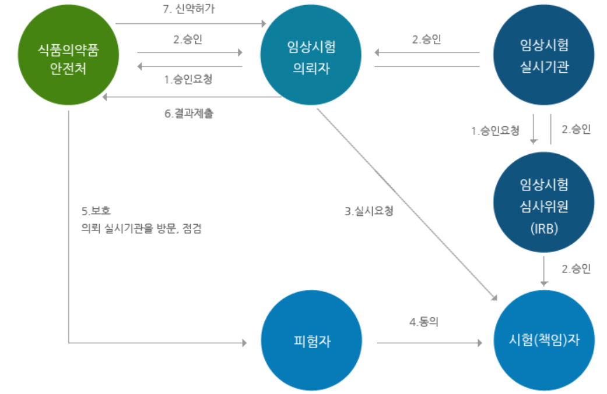

# Clinical Trial & Data Management Intro

2021.07.05

---

[TOC]

---


## 신약 개발


1. Discovery / Screening (후보 뭃질 탐색)
   - 신약으로 개발될 가능성이 있는 물질 탐색 및 기초적인 평가 수행
2. Nonclinical Research (비임상연구)
   - In vitro/in vivo 실험 등을 통해 후보물질의 약리/독성학적 특성 등을 평가
   - 인체 투여를 위한 후보물질을 **최적화(optimization)**
3. Clinical Studies (임상시험)
   - 사람을 대상으로 후보물질의 약리학적 특성 및 안정성을 평가
   - 일반적으로 1, 2, 3상으로 구분
4. NDA reviewers (신약 승인 심사)
   - 후보물질에 대해 확보된 주요 정보를 토대로 시판 허가 여부를 심사
5. PMS (Post-marketing processes, 시판 후 과정)
   - 일반적으로 광범위하게 사용되는 상황 하에서의 안전성 정보를 추가 파악
   - 의도한 적응증 이외의 새로운 적응증을 발견


## 임상시험

> **시장에서 시판/판매**를 위해 **규제당국의 승인을 받는 과정**

```markdown
임상시험용의약품의 **안정성**과 **유효성**을 증명할 목적으로 해당약물의 약동/약력/약리/임상적 효과를 확인하고 **이상반응을 조사**하기 위하여 사람을 대상으로 실시하는 시험 또는 연구 `(출처: 의약품안전나라)`
```

### 주요과정

1. **IND** (Investigational New Drug)
   - 규제당국에 **임상시험 신청**
2. **Clinical Trial** (1~3단계)
   - Phase 1: **흡수/배출**, 안전성 (건강한 사람들)
   - Phase 2: **3상을 위한** 최적의 용량 확인
     - :arrow_right: 보통 이 단계에서부터 blind 시행
   - Phase 3: 의약품의 최종 확증 연구 (주로 **대조군-기존약을 설정하여 비교**하는 식으로 검증)
3. **NDA** (New Drug Application)
   - 임상시험결과를 규제당국에 제출하면서 **판매를 위한 승인 요청**
4. **Post Marketing(시판 후) 연구**
   - Phase 4
   - PMS (Post Marketing  Surveillance, 시판 후 조사)
   - OS (Observational  Surveillance, 관찰연구)

- 각 임상시험의 단계
  - **CSR** (Clinical Study Report): 통계에 반영하는 결과물
  - Statistical Analysis
  - Data Management (DM) + Monitoring (CRA)
  - Protocol: Clinical Trial의 planning 규칙


### Role



`(출처: 의약품안전나라)`

- Sponsor에서 CRO (Contract Research Organization)에게 계약에 의해 외주를 준다.
- PV(Pharmacovigilance)이라는 역할도 있다.


## DM Process

> Data Management Process


|               용어               |                             설명                             |
| :------------------------------: | :----------------------------------------------------------: |
|             **DMP**              |                     Data Management Plan                     |
|             **CRF**              |         참여 환자로부터 데이터를 수집하기 위해 사용          |
|        **FPI, LPI, LPO**         | - 비용/수익 문제 때문에 빠르게 완료하는 것이 중요<br />- 따라서, FPI, LPI, LPO가 시간적인 측면에서 중요 |
|       **Data Validation**        |                 입력된 데이터의 적절성 확인                  |
|             **EDC**              |                      USR 관련 문서 생성                      |
|        **Medical Coding**        |    text data의 categorization (분석을 위한 데이터로 변환)    |
| **External Data Reconciliation** |              CDMS 외부에서 수집되는 데이터 조정              |
|        **Blind Meeting**         |                                                              |
|        **Data Transfer**         |            DB lock 완료 후, 저장된 데이터를 이관             |


***Copyright* © 2021 Song_Artish**