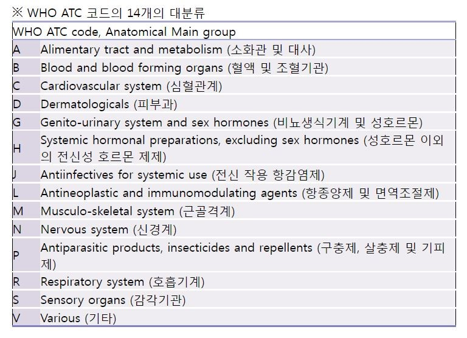

# Coding

> **Medical Coding**은 금지약물 혹은 위험병용약물 복용여부 등 **계약서 위반을 검증**하기 위해서 하는 과정으로, 연구자가 입력한 병력/약력에 대해서 DM이 다시 코딩을 하는 기능이다.

2021.07.19

---

[TOC]

---

## Dictionary

|          |       Dictionary       |
| :------: | :--------------------: |
| **TERM** |         MedDRA         |
| **TRT**  | WHODRUG (상품명 + ATC) |

- MedDRA: Medical Dictionary for Regulatory Activities Terminology
- ATC: Anatomical Therapeutic Chemical Classification System

## MedDRA

> MedDRA 용어는 5개 level로 구성된다.

| Level |                         |                 |
| :---: | :---------------------: | :-------------: |
|  LLT  |   Lowest Level Terms    |                 |
|  PT   |     Preferred Terms     |                 |
|  HLT  |    High Level Terms     |                 |
| HLGT  | Hight Level Group Terms |                 |
|  SOC  |   System Organ Class    | 27개의 의학용어 |

- 연구자가 입력한 용어를 MedDRA의 용어(5개 level)로 다시 입력하는 것을 `medical coding`이라고 한다.

## ATC

> ATC도 5개의 level로 구성된다.

| Level | 예시 (C01BX01) |
| :---: | :------------: |
|  L1   |       C        |
|  L2   |      C01       |
|  L3   |      C01B      |
|  L4   |     C01BX      |
|  L5   |    C01BX01     |

## Function

> 여기서 `INV`는 investigator를 의미한다.
>
> - `MCI`: Medical Coding Investigator
> - `MCD`: Medical Coding DM

### MedDra 관련

| Function  |            Return             |
| :-------: | :---------------------------: |
| **MCICD** | INV가 입력한 MedDra Code 반환 |
| **MCITM** | INV가 입력한 MedDra Term 반환 |
| **MCDCD** | DM이 입력한 MedDra Code 반환  |
| **MCDTM** | DM이 입력한 MedDra Term 반환  |

### ATC 관련

|   Function   |           Return           |
| :----------: | :------------------------: |
| **MCIATCCD** | INV가 입력한 ATC Code 반환 |
| **MCDATCCD** | DM이 입력한 ATC Code 반환  |

### KIMS 관련

- 연구자가 입력한 결과이므로 `MCI`이다.

|  Function   |                   설명                    |
| :---------: | :---------------------------------------: |
| **MCIGEN**  |                                           |
| **MCIEGEN** | 여기서 E가 붙으면 영어 성분명을 가져온다. |

***Copyright* © 2021 Song_Artish**