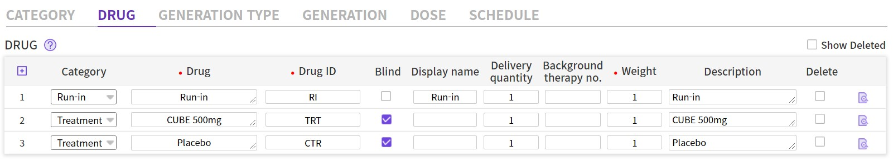
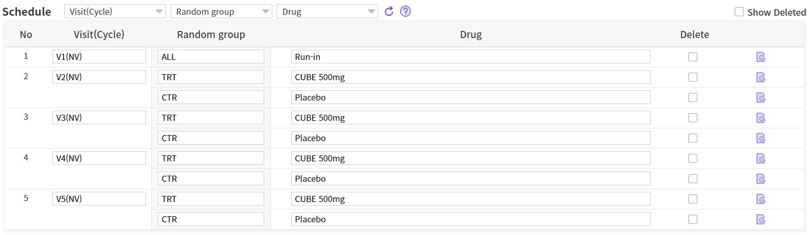

# IWRS Setup

---

[TOC]

---


## 1. Study > Property 설정

### 1.1 EDC

> `Builder > Study > Property > EDC`로 접속한다.

- 이전에 `Study > Property`에서 `IWRSFULL_GL` 라이브러리를 import해왔기 때문에 IWRS 관련 설정된 부분만 다시 확인하고 넘어간다.
- `Enrollemnt number`가 `{RC}`, `Investigator Blind function classification`이 `Not do immediate unblinding`으로 잘 설정되어 있는지 확인한다.

|                                            |                             설명                             |
| :----------------------------------------: | :----------------------------------------------------------: |
|             Enrollment number              |        무작위 배정 번호에 대한 입력규칙을 설정하는 곳        |
|                   `{RC}`                   | 뒤에서 나올 IWRS Random code 업로드를 통해 설정된 무작위 배정번호를 그대로 EDC 화면상에 출력한다는 의미 |
| Investigator Blind function classification |        응급상황이 발생하였을 떄 눈가림 해제 방법 선택        |
|       `Not do immediate unblinding`        |                스폰서 확인 후 해제 (default)                 |

### 1.2 IWRS > Property > Random

> Property 설정에 앞서 IWRS 무작위 배정 및 임상시험용의약품 배정에 대한 구조를 확인한다.

- `Builder > IWRS > Property > Random`으로 접속한다.
- 아래와 같이 `Random Property` 값을 설정해준다.

|    Random Property    | 설정값 |
| :-------------------: | :----: |
| Randomization method  | 업로드 |
| No. of randomization  |  1회   |
|         Site          |  ALL   |
| No. of stratification |   2    |
|     No. of group      |   2    |

- :ballot_box_with_check: 거의 대부분의 과제가 randomization을 1번 진행한다.
- `Stratification Label`은 아래와 같이 입력하고 저장한다.

|       Property       |  입력값   |
| :------------------: | :-------: |
| Stratification label |   1과 2   |
|     Random group     | TRT와 CTR |

- :ballot_box_with_check: 층화군: 무작위 배정을 받는 사람을 특정 분류로 나누어 배정 (예: 남/여)
- :ballot_box_with_check: 무작위 배정군: 시험군(TRT), 대조군(CTR)
- 그리고 `IP` 탭으로 이동하여 설정 항목을 확인하고 넘어간다.
  - `IWRSFULL_GL` 라이브러리를 import해왔기 떄문에 자동으로 설정되어 있다.

### 1.3 IWRS > Random

> Random Property 설정 후에 무작위 배정코드표를 업로드한다.

- `IWRS > Random > Generation` 탭에서 `Test Code` template을 다운로드한다.

- 엑셀 파일의 `Data`  sheet를 참고하여 `Code` sheet의 표를 완성한다.

  - 실습에서의 `Random generation.xls` 파일을 참고한다.
  - 층화별로 seq를 구분하여야 한다.
  - 아래 표와 같은 형식이다.

  | Schema    | Team ID | Stratification | Sequence no. | Random group | Random ID | Block no. | Block seq. | Description |
  | --------- | ------- | -------------- | ------------ | ------------ | --------- | --------- | ---------- | ----------- |
  | Test code | ALL     | 1              | 1            | TRT          | R1001     | 0         | 0          | TRT         |
  | Test code | ALL     | 1              | 2            | CTR          | R1002     | 0         | 0          | CTR         |
  | Test code | ALL     | 1              | 3            | CTR          | R1003     | 0         | 0          | CTR         |
  | Test code | ALL     | 1              | 4            | TRT          | R1004     | 0         | 0          | TRT         |
  | Test code | ALL     | 1              | 5            | TRT          | R1005     | 0         | 0          | TRT         |
  | Test code | ALL     | 1              | 6            | CTR          | R1006     | 0         | 0          | CTR         |
  | Test code | ALL     | 1              | 7            | CTR          | R1007     | 0         | 0          | CTR         |
  | Test code | ALL     | 1              | 8            | TRT          | R1008     | 0         | 0          | TRT         |
  | Test code | ALL     | 1              | 9            | TRT          | R1009     | 0         | 0          | TRT         |
  | Test code | ALL     | 1              | 10           | CTR          | R1010     | 0         | 0          | CTR         |

- 파일을 저장하고 해당 파일을 업로드한다.

- `Schema > Test`를 선택하고 데이터가 정상적으로 업로드 된 것을 확인한다.

## 2. Random Page 설정

- 먼저 `Entry > CRF Page > RN` 페이지로 이동하여 page type이 `Enroll/Random Page`로 설정되어 있는 것을 확인한다.

### 2.1 Criteria

> 무작위 배정을 받기 위한 **`RANDOM.CRITERIA` 이벤트**를 설정한다.

- `RNYN` 아이템에서 `RANDOM>CRITERIA` 이벤트를 추가해준다.
- Value Type `Specify`, Value `1`로 설정한다.
- 이렇게 설정하면 `[1:Yes]` 값이 선택되었을 때, 무작위배정이 이루어지게 된다.

### 2.2 Strata

> 무작위 배정의 층화군을 설정한다. (**`IWRS_SUBJ.RAND_STRATA`**)

- `RNSTRATA` 아이템에서 `IWRS_SUBJ.RAND_STRATA` 이벤트를 추가한다.

### 2.3 Code

> 무작위 배정 번호가 입력되는 항목을 설정한다.

- Criteria에 맞는 조건을 선택하고 저장을 하게되면 자동으로 `Randomization No.`를 부여받는다.

- `RNNO` 아이템에서 아래의 이벤트를 추가해준다.

  |         이벤트         |                             기능                             |
  | :--------------------: | :----------------------------------------------------------: |
  | `INITIALIZE.RAND_CODE` |          무작위 배정 번호를 받은 후에는 초기화 불가          |
  |   `IWRS_CODE.RANDOM`   |              IWRS에 등록된 랜덤번호를 가지고 옴              |
  |  `SEND_MAIL.ENR_CODE`  |                  무작위 배정 메일 전송 조건                  |
  |   `SUBJECT.ENR_CODE`   | 해당 아이템을 과제 내에서 `ENR_CODE`(Enrollment Number)로 지정 |

  - :ballot_box_with_check: `SEND_MAIL.ENR_CODE`는 value type에 `Not Empty`를 적용해주어야 한다!
    - 무작위배정번호 item이 비어있지 않을 떄 메일 발송

- RNNO는 item_property `autofill`, default missing query `No`로 설정해주어야 한다.

- :white_check_mark: 또한 RNNO data type이 `number`가 아닌 `character`로 되어있는지도 확인해준다.

- 설정 완료 후 CDMS로 접속하여 EDC 화면에서 저굥ㅇ한 내용을 확인한다.

### 2.4 Validation

> 등록한 무작위 배정번호가 무작위배정표의 순서대로 입력되고 있는지 확인한다.

- CDMS에서 SPM으로 접속하여 `Admin > IWRS > Randomization` 메뉴로 이동한다.
- Builder에서 업로드한 무작위 배정번호와 실제 CDMS에서 배정받은 번호가 일치하는지 확인한다.
  - 배정번호는 순차적으로 배정
  - 업로드한 내용과 동일한군인지 확인
- `Validation` 탭에서는 순차적/정상적으로 배정되었는지 결과를 확인할 수 있다.


## 3. IP 배정 설정

### 3.1 IP 배정 페이지

- `Entry > CRF Page > IP` 페이지에서 `IPCODE` 아이템으로 이동한다.

- 아래의 property를 입력해준다.

  |    property     | 입력값 |        기능        |
  | :-------------: | :----: | :----------------: |
  |   `AUTOFILL`    |        |     자동 입력      |
  |  `BLIND_INIT`   |  TRUE  | IP배정될 항목 지정 |
  | `JSDATA_IMPORT` |  IWRS  |  IP배정 버튼 생성  |

- 그리고 IP CODE 설정을 위한 event를 설정한다.

  |         event         | 입력값  |            기능            |
  | :-------------------: | :-----: | :------------------------: |
  | `INITIALIZE.IP_CODE`  |    -    | IP 배정받은 후 초기화 금지 |
  |  `IWRS.MAIL.IP_CODE`  |    -    | IP 배정받은 후에 메일 발송 |
  | `IWRS.MAIL.RE_ASSIGN` |    -    |   IP 재배정 시 메일 발송   |
  | `IWRS_CODE.IP.VISIT`  | V1 ~ V5 | Bring IP Code through IWRS |

### 3.2 불출, 반납 CRA 서명 페이지

- `Entry > CRF Group`으로 이동한다.

- 불출, 반납, CRA 서명을 위한 CRF 그룹을 생성한다.

  | Group ID |     Label     |       Type        |
  | :------: | :-----------: | :---------------: |
  |   DIS    |   Dispense    | Crfgroup for IWRS |
  |   RTN    |    Return     | Crfgroup for IWRS |
  |  CSIGN   | CRA signature | Crfgroup for IWRS |

- 그리고 오른쪽 체크박스에서 `Lock`과 `Save`만 체크해준다.

- 다음으로 불출/반납은 약사만, CRA서명은 CRA만 실행하도록 권한 제한을 설정한다.

  - DIS는 34, 35번의 `READ/EDIT_DISPENSE_IRS`
  - RTN은 36, 36번의 `READ/EDIT_RETURN_IRS`
  - CSIGN은 38, 39번의 `READ?EDIT_CRA_ESIGN_IRS`
  - 위와 같이 체크하고 저장을 한다.

- 그리고 CRF Page에서 불출, 반납, CRA 서명 페이지를 구성한다.

  ```markdown
  DIS > IDS > DIS_ST > DIS01의 item
  - DISIP
  - DISIPDTC
  - DIS
  - DISDTC
  - DISCOM
  ```

  - IP Code, Date of prescription, Dispense count Dispense date, Comment

  ```markdown
  RTN >RTN > RTN_ST > RTN01의 item
  - RTNIPCODE
  - RTNIPDTC
  - RTN
  - RTNDTC
  - RTNCOM
  ```

  - IPCODE, Date of prescription Return count, Return date, Comment'

  ```markdown
  CSIGN > CSIGN > CSIGNIP의 item
  - CSIGNIP
  CSIGN > CSIGN > CSIGNDTC의 item
  - CSIGNDTC
  CSIGNCOM
  ```

  - IP code, CRA signature date, Comment

- :white_check_mark: 자세한 것은 문서를 참고한다.

### 3.3 CRF Schedule 등록

- `Entry > Schedule`로 이동한다.
- DIS, RTN, CSIGN을 V1~V5까지 일정 등록해준다.

### 3.4 Event

**DIS 페이지**

- `DISIP`에서 `IWRS.SYNC.ASSIGN_IP.01` 이벤트를 등록한다.
  - EDC에서 배정받은 IP를 자동으로 입력
- `DISIPDTC`에서 `IWRS.SYNC.ASSIGN_DATE.01` 이벤트를 등록한다.
  - IP 배정받은 날짜를 자동으로 입력
- `DISDTC`에서 `IWRS.DISPENSE.DATE.01` 이벤트를 등록한다.
  - 불출일자를 입력하면 추후에 수불기록 문서에 자동으로 반영되도록 설정함
- `DISCOM`에 `IWRS.DISPENSE.COMMENT.01`와 `SEND_MAIL.DISPENSE` 이벤트를 등록한다.
  - 메모를 입력하면 추후에 수불기록 문서에 자동으로 반영 및 불출 시 메일이 발송되도록 설정함

**RTN 페이지**

- DIS 페이지와 동일하게 RTNIPCODE, RTNIPDTC, RTNDTC에 이벤트를 등록한다.
  - dispense -> return인 이벤트를 등록한다.
- `RTNCOM`에는 `SEND_MAIL.DISPENSE` 이벤트를 등록한다.
  - 반납시 메일이 발송된다.

**CSIGN 페이지**

- `CSIGNIP`에 `IWRS.SYNC.ASSIGN_IP.01` 이벤트를 등록한다.
- `CSIGNDTC`에 `IWRS.VERIFY.DATE.01` 이벤트를 등록한다.
  - CRA 서명일을 입력하면 추후에 수불기록 문서에 자동으로 반영
- `CSIGNCOM`에 `SEND_MAIL.DISPENSE` 이벤트를 등록한다.

### 3.5 IP 배정 

- `IWRS > IP > Category`로 이동한다.

- IWRS Specification에 따라 아래와 같이 category를 입력한다.

  | Category  | Category id |
  | :-------: | :---------: |
  |  Run-in   |     RI      |
  | Treatment |     TR      |

- `DRUG` 탭으로 이동하여 아래와 같이 입력한다.

  

  - Blind 체크시 임상약 정보가 CDMS > IWRS 화면으로 노출되지 않는다.
  - 임상약 배정 비율은 각 drug별 1:1:1이다. (weight: 1)
  - Display Name을 설정하면 IP CODE 부여시 IP페이지의 IP코드가 `Run-in`으로 보여지게 된다.

- `Generation Type` 탭으로 이동하여 Run-in의 generation type을 `Create upon request`로 변경한다.

  - 시스템에서 요청된 개수에 따라 자동 생성하는 옵션이다.

- treatment는 앞의 무작위 배정번호와 같이 엑셀 문서를 통해서 업로드하기 위해 `Generation` 탭으로 이동한다.

- 템플릿을 `Test code`로 다운받은 후 문서를 업로드한다.

  - :white_check_mark: 엑셀 템플릿에서 `Nation code`는 바드시 cubeCDMS에 등록된 연구기관의 국가 정보에 따라 수정한다! :exclamation:

- 그리고 schema `Test code`로 선택한 후 데이터가 잘 업로드 되었는지 확인한다.

- 이후 `Schedule` 탭으로 이동하여 스케쥴을 아래 사진과 같이 등록한다.

  - V1 (Run-in), V2 ~ V5 (Treatment)

    

- :small_red_triangle: Schedule 탭에서 Visit(Cycle)이 표시되지 않는 문제

  - IPCODE에서 `IWRS_CODE.IP.VISIT` 이벤트를 추가해준다.


## 4. EDC 화면에서 IP 배정 여부 확인

### 4.1 IWRS IP 배송

- SPM으로 `CDMS > Admin > User > User`로 접속한다.

- IP 배송 권한이 있는 다음의 role을 지정해준다.

  ```markdown
  PM, IPM, PHARM, CRA
  ```

- PM으로 로그인 후 `CDMS > IWRS 탭 > Delivery`로 이동 후 좌측 아래의 `배송요청` 버튼을 클릭하여 배송 요청을 한다.
- 다음으로 IPM으로 로그인하여 `Delivery`로 이동하여 `Delivery Status`의 항목을 클릭하여 배송 확인을 해준다.
- 다음으로 PHARM으로 로그인하여 `Delivery Status`의 항목을 클릭하여 인수 확인을 해준다.

### 4.2 IP 배정 페이지에서 IP 배정


***Copyright* © 2021 Song_Artish**

