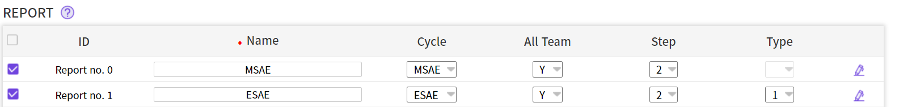
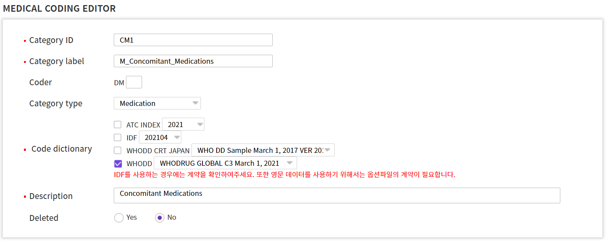
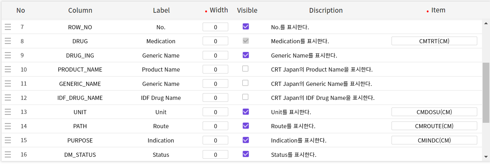
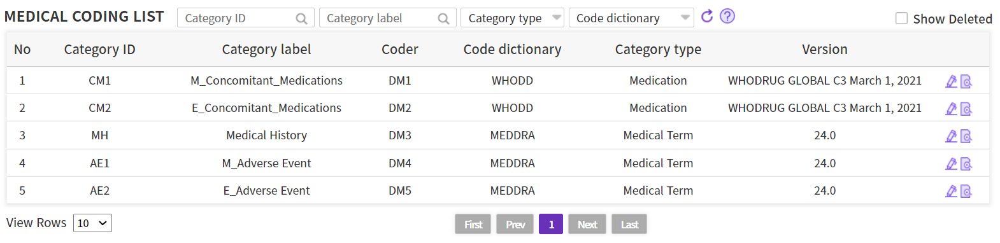

# Sample Study 5

---

[TOC]

---


## Visit E-Sign (Period)

> `EN ~ Main All` 방문에 대한 전자서명을 `Main All`에서 진행한다.

### 1. Role&Priv.

- `Builder > Role&Priv. > Privilege`로 이동하여 Category에서 `ESIGN`을 체크하고 모든 권한을 설정한다.
  - Visit별 전자서명을 사용하기 위해서는 role에게 `WRITE_ESIGN_VISIT` 권한을 설정
  - Status를 확인할 수 있도록 eSign 메뉴에 대한 접근권한(`ACCESS_ESIGN_MENU`) 설정
  - Subject, Visit 탭에 대한 조회권한(`READ_ESIGN_SUBJECT, READ_ESIGN_VISIT`) 설정

### 2. Entry

**2.1 Cycle & Visit**

- `Entry > Cycle&Visit`으로 이동한다.
- 중간 SN을 연결해주어야하므로, SN을 제외한 중간까지의 모든 visit에 `MAV, MSN` cycle ID와 visit ID를 지정해준다.

**2.2 Schedule**

- `Entry > Schedule`로 이동하여 전자서명을 진행할 방문에 서명 페이지를 추가한다.
  - `(SN, MSN)`에 스케줄을 추가

**2.3 CRF Page**

- `Entry > CRF Page > SNNAME` 아이템으로 이동한다.
- `SUPP_SUBJ.ESIGN_STATUS` 이벤트를 등록하고 visit id에 `SN`을 지정한다.
- `SUPP_VISIT.ESIGN_STATUS` 이벤트를 등록하고 visit id에 `MSN(MAV)`를 지정한다.
- 해당 아이템에 `Default Missing Check`와 `Autofill`도 추가해준다.
- 그리고 `SNDTC` 아이템으로 이동한다.
- `SUPP_SUBJ.ESIGN_TIME` 이벤트를 등록하고 `SN`을 지정한다.
- `SUPP_VISIT.ESIGN_TIME`를 등록하고 `MSN(MAV)`를 지정한다.
- 해당 아이템에도 역시 default missing check와 autofill을 추가해준다.


## Item map

> - 메인연구에서 AEOUT이 `Not recovered/Not resolved, Recovering/Resolving`에 선택된 경우 연장연구에 연동한다.
> - 메인연구에서 CMING가 체크된 경우 연장연구에 연동한다.

### 1. Entry

> Item map 기능을 사용하기 위해서는 1개의 CRF Group에 2개의 Page가 필요하다.

- `Builder > Entry > CRF Page`의 초기화면에서 `New Page` 버튼을 클릭한다.
- 여기서는 `AE02, CM02` 페이지를 추가해준다.
- `Schedule`로 이동하여 방금 생성한 페이지의 스케줄을 추가해준다.
  - `Schedule Editor`에서 페이지를 선택할 수 있다.

### 2. Item Map

- `ECS > ITEM MAP` 페이지로 이동하여 `Create` 버튼을 클릭하여 item map을 생성한다.

- 여기서는 2개의 item map을 생성한다.

  |    ID    | Condition Item |                         Description                          |
  | :------: | :------------: | :----------------------------------------------------------: |
  | AE_TO_AE |    Outcome     | AE1 => AE2 (if, Outcome=Not recovered/Not resolved, Recovering) |
  | CM_TO_CM |    Ongoing     |                CM1 => CM2 (if, Ongoing=Check)                |

  - :ballot_box_with_check: 여기서 condition item은 메인연구의 항목이다!

- 다음으로 각 항목의 오른쪽 `+` 버튼을 클릭한다.

- 나타나는 `Condition` 페이지에서 description에서와 적합한 `Condition value`를 체크하여준다.

- 그리고 아래의 `Target, Source`에서 `+` 버튼을 눌러 행 추가 후 연동할 item을 설정한다.

  - :ballot_box_with_check: 메인연구의 Data를 연장연구의 item으로 연동할 경우 연장연구가 target, 메인연구가 source가 된다.
  - :ballot_box_with_check: AE_TB의 모든 아이템을 연동해준다.

- CM도 마찬가지로 진행한다.


## Two SAE report

### 1. Study > Property > Property

> 메일 발송 시점을 설정한다.

- `Property`로 이동한다.

- `REPORT_0_MAIL_STEP`과 `REPORT_1_MAIL_STEP` property를 체크하고 value `2`를 입력 후에 저장한다.

  - Property를 import한 경우에는 `REPORT_0_MAIL_STEP`이 기본값으로 설정되어 있기 때문에 `saved` 체크박스를 클릭하여 확인한다.

- 추후에는 과제에 맞게 `REPORT_1_MAIL_STEP`의 value를 입력한다.

  ```markdown
  - value(1): 최초에 SAE로 등록된 경우에만 발송됩니다. 최초에 SAE로 등록되지 않은 경우 SAE로 수정하여도 메일이 발송되지 않습니다.
  
  - value(2): 최초 등록과 상관없이 SAE로 등록될때마다 메일이 발송됩니다.
  ```

### 2. Role & Priv.

> Report 메뉴의 권한일 필요한 role에 설정한다.

- :ballot_box_with_check: 여기서 설정하는 권한을 기본적으로 세팅되어 있기 때문에 확인만 하면 된다!

- `Role & Priv. > Role & Priv.`로 이동하여 category `REPORT`를 선택한다.

- 아래와 같이 권한을 부여한다.

  

  - `ACCESS_REPORT_MENU`: Report 메뉴 접근 권한
  - `EDIT_REPORT_PAGE`: 생성 된 REPORT를 수정할 수 있는 권한
  - `ESIGN_REPORT_PAGE`: 생성 된 Report를 전자서명 할 수 있는 권한
  - `READ_REPORT_PAGE`: 생성 된 REPORT를 조회할 수 있는 권한

- 다음으로 category에서 `MAIL`를 선택하고 아래와 같이 권한을 부여한다.

  

  - `REG_AE_MAIL`: SAE로 등록 된 AE가 발생할 경우에 메일이 전송되는 권한
  - `REG_SAE_MAIL`: SAE Report를 제출 시에 메일이 전송 되는 권한

### 3. Entry

**3.1 Cycle&Visit**

- `Entry > Cycle&Visit`에서 아래와 같이 cycle과 visit을 등록한다.

  

  

**3.2 CRF Group**

- 다음으로 `CRF Group > Group Copy` 버튼을 클릭하고 `SAE_CIOMS` 라이브러리를 검색한다.
- `SAE`를 클릭하여 import한다.
- Group ID 및 Page ID는 중복될 수 없기 떄문에 2번쨰 SAE report를 추가하기 전에 앞에서 복사한 Group/Page ID를 변경해준다.

**3.3 Schedule**

- 스케줄에 `SAE1, SAE2`를 알맞게 추가해준다.
- Visible은 `No`로 선택한 후 저장한다.

**3.4 CRF Page**

- 2개의 report를 설정하기 위해서는 2개의 page가 필요하므로, `AE Page` 2개의 page type을 `AE Page`로 지정한다.

- 다음으로 AE01의 `AETERM`에는 `REPORT_ITEM.0.NAME` 이벤트를, AE02의 `AETERM`에는 `REPORT_ITEM.1.NAME` 이벤트를 추가한다.

  - :white_check_mark: Report 관련 Event는 숫자 0부터 시작하기 때문에 첫번째 Report의 Event는 숫자 0을 선택한다.
  - :white_check_mark: 해당 항목에 입력된 Data는 `CDMS > Report > eCRF data` 항목에 표시됩니다. 

- `AESER` 아이템에 아래와 같이 이벤트를 추가해준다.

  

  

  - 자세히 보면 아래와 같이 입력한다.

    

- AE02 페이지에도 동일하게 진행한다.

**3.5 Report**

- `Entry > Report` 메뉴로 이동하여 report 개수만큼 설정한다.

  

- property 상세
  - Name: 사용할 Report의 이름을 지정한다.
  - Cycle: Report의 Cycle을 설정한다.
  - All Team : Y일 경우 전체 기관의 Report를 확인, N일 경우 소속된 기관의 Report만 확인할 수 있다.
  - Step : Report 작성 및 제출 절차를 설정한다.
    - 1: Report를 작성하고 저장과 동시에 제출된다.
    - 2: Report를 작성하고 먼저 저장을 하고 제출 됩니다. 제출 전에 입력 된 내용을 수정할 수 있다.
  - Type : PDF출력 화면을 지정한다.
    - Type1 : Entry 화면을 Report form으로 사용하고 여기에 머릿글과 바닥글을 적용하여 PDF로 출력할 수 있는 타입 (새로 개발 된 형태)
    - Type2 : CIOMS 양식, 또는 제약사, CRO form과 동일하게 html 작업 된 PDF로 출력하는 타입 (현재까지 가장 많이 사용 됨)
    - Type3 : Blank eCRF와 동일한 PDF로 출력할 수 있는 타입 (Entry만 설정하여 사용 가능함)
    - :white_check_mark: Type이 비어 있는 형태는 이 전에 CRScube에서 Type1 기능이 생기기 전에 Type2로 제작한 Report를 사용한 경우이다.
    - :white_check_mark: 2021년부터 Type1을 사용하면 된다.
- :exclamation: 이후의 report html 매핑과 관련된 부분은 [교재](https://wiki.crscube.io/display/cubeSolution/EDC%3A+Two+SAE+report)를 참고한다!


## WHODD

> WHO Drug Dictionary

- License

  ```markdown
  WHODD를 사용하여 Coding하기 위해서는 데이터에 접근 권한 있는 스폰서, CRO등이 WHODD 관리 단체인 UMC(Uppsala Monitoring Centre)하고 계약이 체결되어 있어야 합니다.
  CDMS에서 사용할 경우에는 CRScube 담당자에게 UMC License No.와 사용희망 Version을 기재하여 메일로 문의 부탁드립니다.
  ```

### 1. DCL > Medical Coding

- medical coding 메뉴로 이동하면 `New` 버튼을 클릭한다.

- 아래와 같이 입력한다.

  

- 하위 항목 중 Coding menu에서 사용할 항목을 선택하여 Visible에 체크한다.

- 아래와 같이 EDC에 Data가 입력되는 항목의 경우 Item의 입력란을 클릭하여 검색 및 선택한다.

  

- 나머지 medical coding 리스트도 작성한다.

  


### 2. Data Set > Data Set > Main

- `Data Set > Main > Create` 버튼을 클릭한다.
- Non CRF 항목을 `WHODD`로 선택하고 생성한다.
- Data Set 생성 후에는 `Entry Import`를 클릭하여 적용한다.


***Copyright* © 2021 Song_Artish**