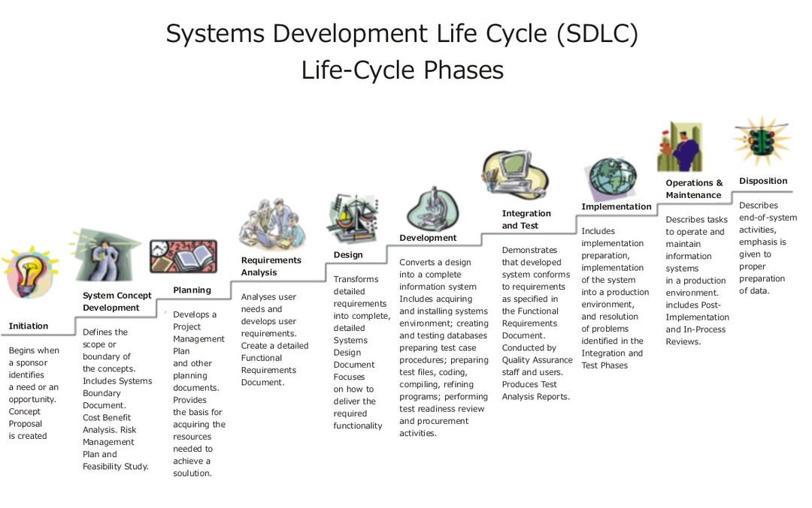
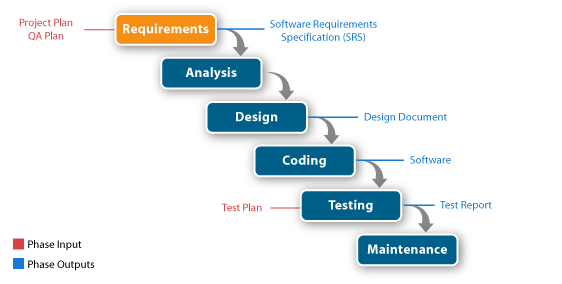
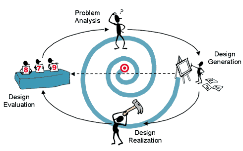
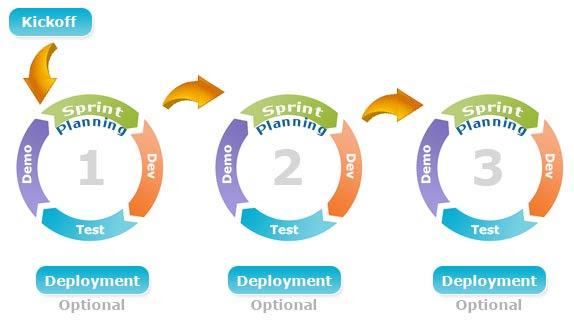

# 소프트웨어 공학

>Q1. 소프트웨어 위기에 대해서 설명하시오.
>Q2. 소프트웨어 공학이 필요한 이유는 무엇인지 설명하시오.
>Q3. 소프트웨어 개발 경험과 소프트웨어 개발 시 적용한 개발 방법론이 있다면 설명하시오.
>Q4. 소프트웨어 프로젝트 진행 경험에 대해서 설명하시오.
>
>- :ballot_box_with_check: `''무엇을 개발하였다''가 아닌 '어떻게 개발하였다'라고 이야기하는 것이 중요!`

2021.06.23

---

[TOC]

---

`(출처: 위키백과)`

## 1 소프트웨어 개발 프로세스

> 작업(task)순서의 집합 + 제약 조건(일정, 예산, 자원)을 포함하는 일련의 활동

### 1.1 정의

- 좁은 의미: 사용자의 요구사항을 SW로 구현하기 위한 절차, 과정
- 넓은 의미: 사용자의 목적을 이루기 위한 기획, 프로젝트 관리 등을 포함한 절차, 과정, 방법
- **소프트웨어 개발 7단계**: 계획 - 요구분석 - 설계- 구현 - 테스트 - 반영 - 유지보수

### 1.2 프로세스 모델

- 폭포수 모델

  

- 프로토타입 모델

- 나선형 모델

  

- 통합 프로세스 모델

- **애자일 프로세스 모델**

  

## 2. 소프트웨어 아키텍처

### 2.1 정의

- 소프트웨어에 대한 전체적인 구조
- 소프트웨어를 이루고 있는 여러 구성 요소(서브시스템, 컴포넌트)
- 구성 요소들의 인터페이스 간의 상호작용 정의
- 시스템 설계와 개발 시 적용되는 원칙과 지침

### 2.2 구성

- 구성 요소
- 구성 요소들 사이의 관계
- 구성 요소들이 외부에 드러내는 속성
- 구성 요소들과 주변 환경 사이의 관계
- 구성 요소들이 제공하는 인터페이스
- 구성 요소들의 협력 및 조립 방법

### 2.3 모델

> 필요에 따라 여러가지를 적합하게 적용해서 모델링을 할 수도 있다!

**데이터 중심형 모델**

- 주요 데이터가 repository에서 중앙 관리
- repository와 여기에 접근하는 서브시스템으로 구성
- 데이터가 한군데에 모여 있기 때문에 데이터를 모순되지 않고 일관성 있게 관리 가능
- 새로운 서브시스템의 추가 용이

**Client-Server 모델**

- 네트워크를 이용하는 분산 시스템 형태
- 데이터와 처리 기능을 클라이언트와 서버에 분할하여 사용
- 서버: 클라이언트에 서비스 제공
- 클라이언트: 서버가 제공하는 서비스를 요청(호출)하는 서브시스템

**Layering 모델**

- 기능을 몇 개의 계층으로 나누어 배치
- 구성
  - 하위 계층은 서버
  - 상위 계층은 클라이언트 역할

**MVC 모델**

- **Model-View-Controller**
- 같은 모델의 서브시스템에 대하여 여러 뷰 서브시스템을 필요로 하는 시스템에 적합

***Copyright* © 2021 Song_Artish**