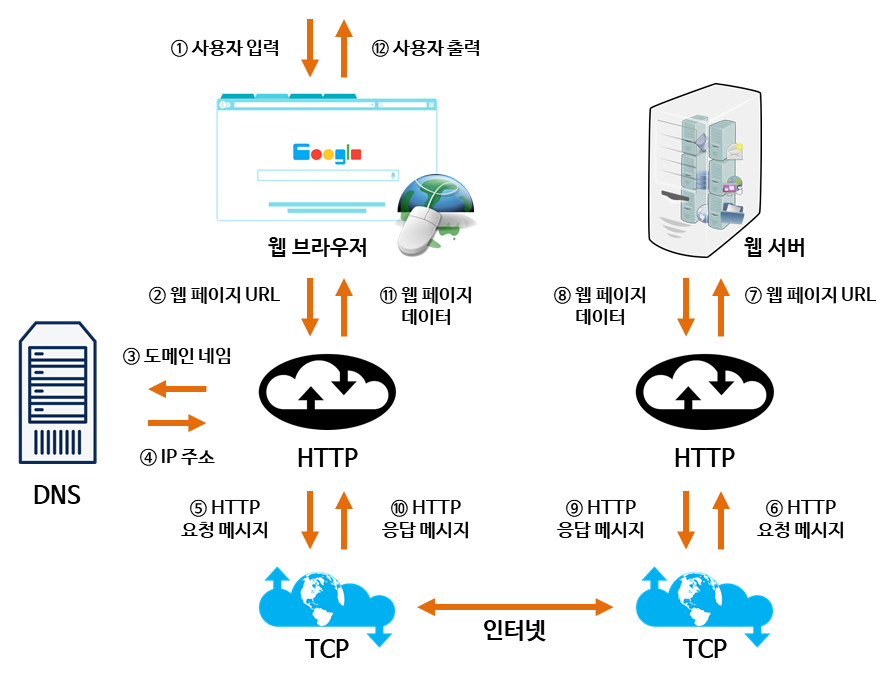
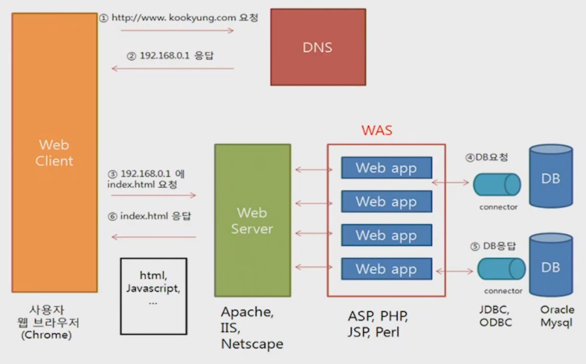
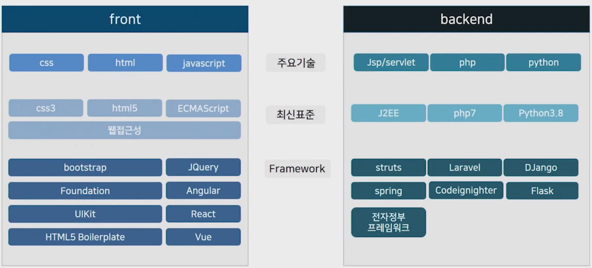

# 웹/모바일 서비스

> Q13. AJAX가 무엇인지 예를 들어서 설명하시오.
> Q14. 웹 브라우저 검색창에서 키워드를 입력하면 결과가 나오는 과정을 설명하시오.

2021.06.23

---

[TOC]

---


## 1. 웹 서비스

```markdown
**기존의 웹**
HTTP, HTML, URL과 같은 기술을 통해 인터넷에 분산되어 있는 정보 자원들에 대하여 표준화된 접근과 정보 표현 방법
```

- `XML`과 `인터넷 프로토콜`을 통해 표준화된 방식으로 상호작용
- 새로운 기술이라기보다는 컴포넌트, 인터넷, XML 등의 기술을 새로운 개념으로 적용하는 방법론
- 기본적인 표준 인프라가 구축되어 있는 경우에는 그것을 바탕으로 무궁무진한 활용이 가능

### 1.1 특징

- 플랫폼에 독립적
- 디바이스 및 위치에 독립적
- 동적인 기능
- 비용 효율적
- 기존 시스템(Legacy System)에 적용

### 1.2 동작 흐름



`(출처: velog)`

- 사용자가 입력을 하면 URL로 요청
- DNS에서 IP 주소 반환하여 HTTP에서 TCP를 거쳐서 웹 서버로
- 그리고 결과 데이터를 반환


## 2. 웹 서버

- 웹 서버의 동작




### 2.1 정적&동적 웹 페이지

**정적 웹 페이지**

- 컴퓨터에 저장된 텍스트 파일을 그대로 보는 것
- HTML(HyperText Markup Language)

**동적 웹 페이지**

- 저장된 내용을 다른 변수로 가공 처리하여 보는 것
- PHP(Personal Home Page), ASP(Active Server Page), JSP


### 2.2 Client & Server

**클라이언트 - 서버 모델 기반**

- 서버: 서비스 정보들을 보관하고 이를 제공해주는 컴퓨터
- 클라이언트: 사용자가 서버에서 제공하는 정보를 받는 컴퓨터

**서버 프로그램**

- 호스트 컴퓨터에 서버 역할을 수행
- Apache 또는 IIS 등 웹 서버 프로그램
- FTP 서비스의 경웅 FTP 서버 프로그램

**클라이언트 프로그램**

- 사용자가 서버에 접속하영 서비스 이용
- Chrome, Explorer와 같은 웹 브라우저 프로그램 / FTP 클라이언트 프로그램 필요


### 2.3 웹 서버의 종류

- Apache web server - the HTTP web server
- Apache Tomcat
- Nginx web server
  - 고성능, 안정성, 간단한 환경 설정과 낮은 리소스 사용
  - 리퀘스트를 스레드로 처리하지 않고, 확장성이 있는 이벤트 기반 설계로 적은 양의 예측 가능한 양의 메모리를 사용
- Lighttpad
- Jigsaw


### 2.4 웹 서버의 구성

**윈도우 서버 환경 구축 예시**

- Windows Server + IIS + ASP + (MS SQL SERVER)
- Windows Server + IIS + (PHP 모듈) + PHP + (MySQL)
- Windows Server + IIS + (TOMCAT CONNECTOR) + TOMCAT + JSP + (Oracle)
- Windows Server + TOMCAT + JSP + (Oracle)

**리눅스 서버 환경 구축 예시**

- 리눅스 Server + APACHE + TOMCAT + JSP + (MySQL)
- 리눅스 Server + APACHE + (PHP 모듈) + (MySQL)


## 3. 웹 기술




## 4. 모바일 서비스

**어플리케이션**

- 다운로드 어플리케이션
- 모바일 웹브라우저
- 내장 어플리케이션

**모바일 운영체제(OS)**

- 휴대폰에서 PC의 OS와 같은 역할 수행
- 스마트폰의 프로세서, 메모리, 화면 등의 하드웨어를 관리하고 운영
- 모바일 앱이 실행되는 소프트웨어 플랫폼 역할
- 오픈 모바일 운영체제가 대세 - 개발자들에게 API 및 개발도구를 무료로 제공해주는 공개전략 추진

### 앱의 종류

|           |                        모바일 앱                         |                       하이브리드 앱                       |                        모바일 웹(앱)                         |
| :-------: | :------------------------------------------------------: | :-------------------------------------------------------: | :----------------------------------------------------------: |
|   특징    |    - 디바이스에 최적화<br />- 플랫폼 전용언어로 개발     |  - 유지보수의 편의성<br />- 하이브리드앱 전용언어로 개발  | - 모바일 웹과 모바일 앱의 호환<br />- 유지보수의 편의성<br />- 모바일 웹을 앱으로 제작 |
| 개발 언어 | - 안드로이드: java / kotlin<br />- iOS: Object-C / Swift | - React Native<br />- Flutter<br />- XAMARIN<br />- IONIC |    - HTML5/CSS3 기반의 모바일 웹 개발 후 WebView에서 제공    |


***Copyright* © 2021 Song_Artish**