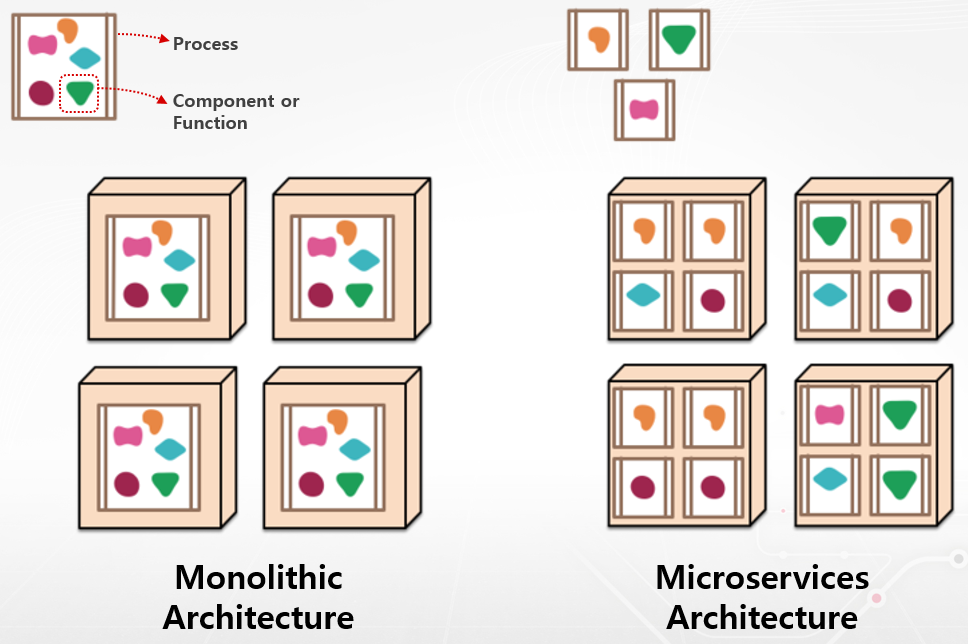

# Micro Service Architecture

---

[TOC]

---

## Overview

MSA는 Monolithic Architecture와 상반되는 개념이다.

- Monolithic Architecture: 하나의 큰 덩어리 형태의 서비스 구조
- MSA: 컴포넌트 형태로 서비스를 분리하는 형태의 구조

MSA는 API를 통해 상호작용하며, API 형태로 외부에 노출하고 세부 사항은 모두 추상화한다. SOA 스타일로 개발을 진행하여, 하나의 큰 서비스를 더 작은 여러 서비스로 분해하여 모듈성을 개선하고, 개발과 테스트를 작은 서비스 단위로 실행한다.

> SOA: Service Oriented Architecture, 서비스 지향 아키텍처

***Copyright* © 2022 Song_Artish**