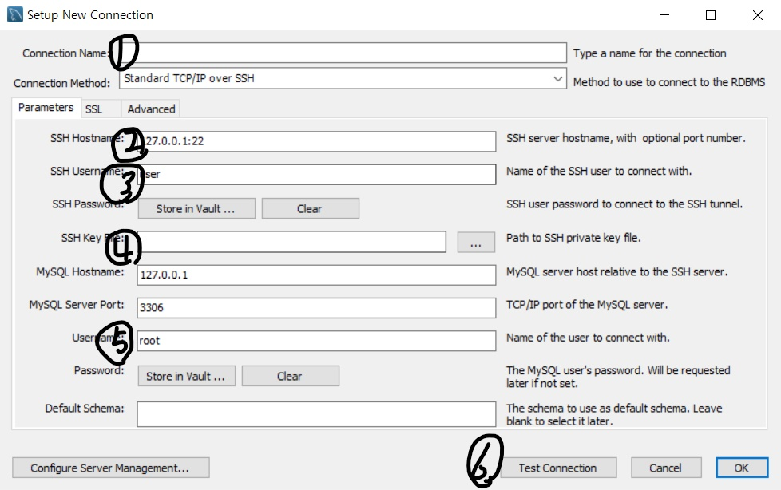

# MySQL 서버 구축

2021.01.21

> AWS로 만든 서버에 MySQL 서버 구축과 외부 접속을 허용해본다.

---

[TOC]

---


## 개요

[이 사이트](https://luji.tistory.com/7)를 참고해도 좋다.


## 1. MySQL 설치

> [사이트](https://dev.mysql.com/downloads/installer/)에서 MySQL을 설치한다.

- 운영체재에 맞는 설치 파일을 다운로드 받는다.
- `파일 다운로드`를 클릭하면 `로그인` 페이지가 나오는데, 특별하게 설치 파일을 보관할 목적이 아니라면 `No thanks, just start my download`라는 아래의 버튼을 클릭한다.


## 2. 서버 연결



- 1번에는 connection name을 사용자 정의대로 입력한다.
- 2번에는 발급받은 `host name`을 입력한다. (예시. `.io`)
- 3번에는 `ubuntu`라고 입력해주었다.
- 4번에는 발급받은 `key 파일`을 등록해준다.
- 5번에는 발급받아서 설정한 AWS 서버 아이디를 입력한다.
- 6번 `Test Connection`을 클릭하면 비밀번호를 입력해야 하는데, AWS 서버 비밀번호를 입력한다.
- 성공한 것을 확인하며 마지막으로 `OK` 버튼을 클릭한다.


## 3. 데이터 조회

- 연결한 서버에 접속해서 왼쪽 아래의 `Schemas` 탭을 클릭한다.

- 최상단의 `<Schema 이름>`을 더블클릭하여 활성화 시킨다.

- 우측 작업창에서 SQL 명령문을 입력하고 `번개모양 실행버튼`을 클릭한다.

  ```sql
  select * from store;
  ```


***Copyright* © 2021 Song_Artish**