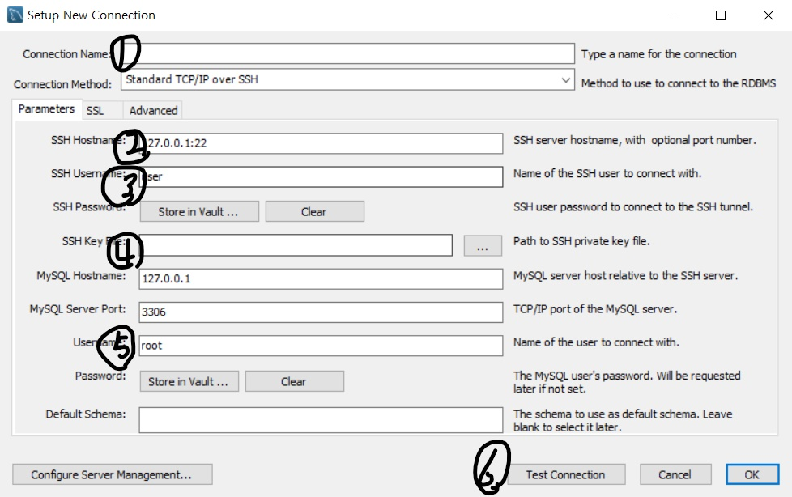
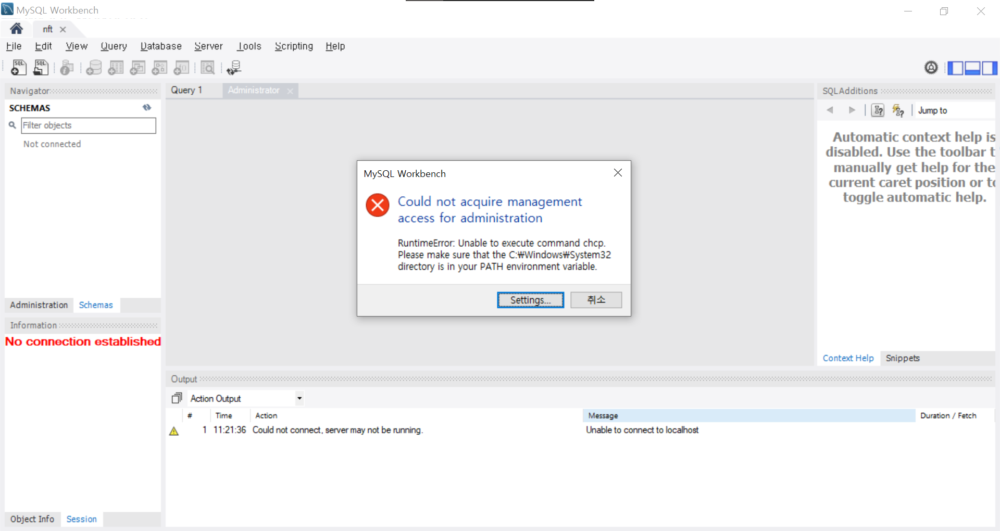
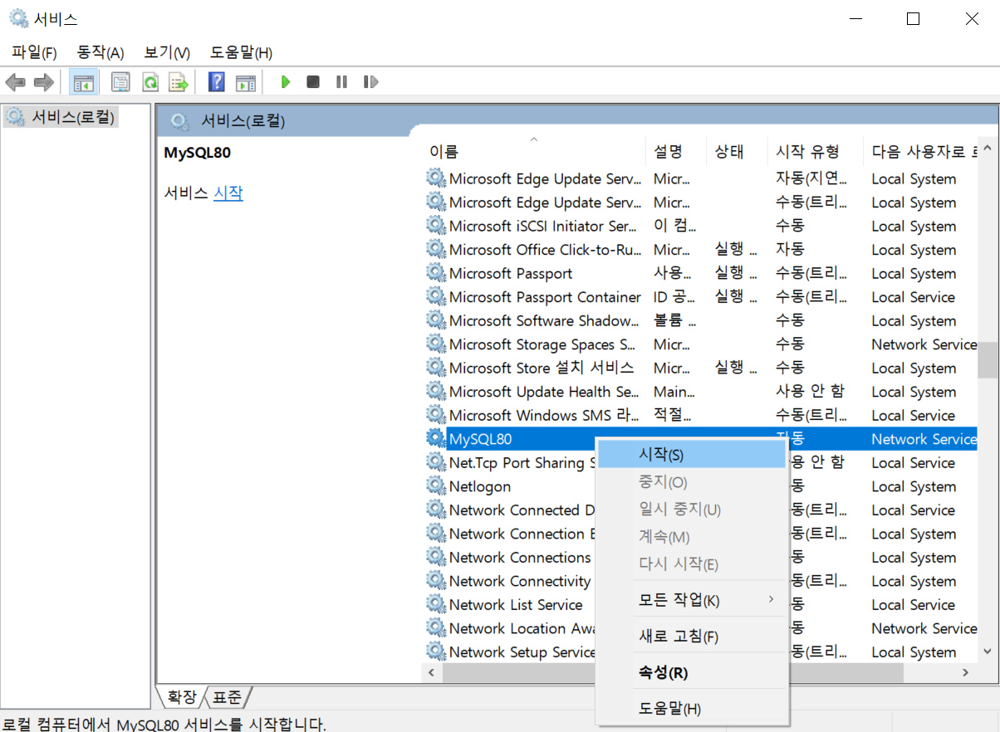

# MySQL

---

[TOC]

---


## Overview

가장 널리 사용되는 오픈 소스형 RDBMS다.


## 시작하기

### Windows 환경

대표적인 MySQL GUI Support Tool은 다음과 같다.

- MySQL Workbench
- Sequel Pro
- Table Plus
- DBeaver
- DataGrip

여기서는 [MySQL Workbench](https://dev.mysql.com/downloads/mysql/)를 설치해본다. 사이트 접속 후 운영체재에 맞는 설치 파일을 다운로드 받는다. `파일 다운로드`를 클릭하면 `로그인` 페이지가 나오는데, 특별하게 설치 파일을 보관할 목적이 아니라면 `No thanks, just start my download`라는 아래의 버튼을 클릭한다.

### Linux 환경

여기서는 linux 환경(ubuntu)에서 MySQL을 시작하는 방법에 대해서 다룬다. 먼저 패키지 매니저 `apt-get`을 이용해 MySQL을 설치한다.

```shell
sudo apt-get update
sudo apt-get install mysql-server
```

설치가 완료되면, MySQL 프로그램을 실행한다.

```shell
mysql --version
sudo systemctl start mysql
# 위 명령어가 실행되지 않을 경우, 아래 명령어로 시도한다.
sudo /etc/init.d/mysql start
```

다음의 명령어로 MySQL에 접속할 수 있다.

```shell
# mysql 접속
mysql - u root
# -u(계정 접근), -p(비밀번호)
mysql -u root -p
```

```sql
# MySQL에서 root 사용자 비밀번호를 'yourPassword'로 변경하는 명령어
ALTER USER 'root'@'localhost' IDENTIFIED WITH mysql_native_password BY 'yourPassword'
```


## 서버 구축하기

AWS로 만든 서버에 MySQL 서버 구축과 외부 접속을 허용해본다.



- 1번에는 connection name을 사용자 정의대로 입력한다.
- 2번에는 발급받은 `host name`을 입력한다. (예시. `.io`)
- 3번에는 `ubuntu`라고 입력해주었다.
  - 여기서 ubuntu는 서버 계정 이름이다.
- 4번에는 발급받은 `key 파일`을 등록해준다.
- 5번에는 발급받아서 설정한 ~~AWS 서버 아이디~~ local(root) 계정을 입력한다.
- 5, 6번 `Test Connection`을 클릭하면 비밀번호를 입력해야 하는데, ~~AWS 서버 계정~~local(root) 계정 비밀번호를 입력한다.
- 성공한 것을 확인하며 마지막으로 `OK` 버튼을 클릭한다.


## 데이터 조회하기

- 연결한 서버에 접속해서 왼쪽 아래의 `Schemas` 탭을 클릭한다.

- 최상단의 `<Schema 이름>`을 더블클릭하여 활성화 시킨다.

- 우측 작업창에서 SQL 명령문을 입력하고 `번개모양 실행버튼`을 클릭한다.

  ```sql
  select * from store;
  ```


## 외부 데이터 가져오기

여기서는 [공공데이터포털](https://www.data.go.kr/index.do)의 [상가(상권)정보](https://www.data.go.kr/data/15012005/fileData.do) 데이터(`csv 파일`)를 가져와본다.

### 1. 데이터 구분하기

- 먼저 빈 `엑셀 시트`를 열어 `데이터 > 텍스트`를 클릭한다.
- 가져오고자하는 파일을 선택한 후, 인코딩 형식을 `UTF-8`로 지정한다.
- 그리고 해당 파일 데이터를 구분하는 기호(여기서는 `|(파이프라인)`)로 구분하여 해당 시트에서 표시한다.
- 해당 파일을 `csv`로 저장한다.

### 2. 데이터 인코딩

> 데이터 인코딩은 `메모장` 프로그램을 이용한다.

- 위에서 저장한 `csv` 파일을 `연결프로그램 > 메모장`으로 실행한다.
- `메모장`에서  `다른 이름으로 저장`을 클릭한다.
- 인코딩 형식을 `UTF-8`로 지정한다.
- :ballot_box_with_check: 이후 **반드시** 해당 파일을 본래 파일과 덮어쓰기를 하여 `txt`가 아닌 `csv`파일로 저장한다.

### 3. MySQL에서 데이터 열기

> `MySQL Workbench`에서 아래의 과정을 진행한다.

- 먼저 MySQL의 Workbench를 실행하여 작업창으로 진입한다.
- `Open SQL Script` 버튼을 클릭 후 `All Files`를 찾을 수 있도록 변경한 후 가져올 `csv`파일을 선택한다.
- 해당 csv파일 데이터가 작업창에 표시되는 것을 확인할 수 있다.


## MySQL  Issues

### Could not acquire management access for administration



> 어느 날 MySQL Workbench에 접속하니 잘 연결되던 것이 연결할 수 없다는 오류 메시지가 표시되었다.

1. 실행(`cmd+r`)을 실행하고 `services.msc`를 입력한다.
2. 서비스에서 `MySQL80`을 항목을 우클릭하고 `시작`을 눌러준다.
   


***Copyright* © 2022 Song_Artish**