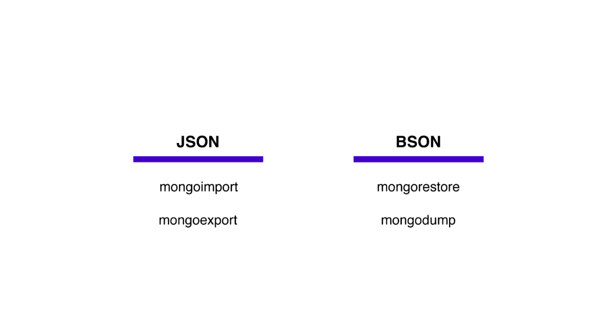

# MongoDB Document

---

[TOC]

---


## Document

도큐먼트는 객체와 같이 데이터를 `필드-값` 쌍(Field-Value pair)으로 저장하고 구성한다. 도큐먼트에서 필드는 데이터의 고유한 식별자이고, 값은 주어진 식별자와 관련된 데이터를 뜻한다.

```
{
	<field> : <value>,
	"name" : "songartish",
	"title" : "Chapter Lead",
	"age" : 27
}
```

위 예제에서 `name`이란 필드의 값은 `songartish`이다. 이러한 도큐먼트의 모음을 컬렉션이라고 한다. 그리고 데이터베이스는 여러 개의 컬렉션으로 구성된다.

- **Document (도큐먼트)**: 필드 - 값 쌍으로 저장된 데이터
- **Field (필드)**: 데이터 포인트를 위한 고유한 식별자
- **Value (값)**: 주어진 식별자와 연결된 데이터
- **Collection (컬렉션)**: MongoDB의 도큐먼트로 구성된 저장소이다. 일반적으로 도큐먼트 간의 공통 필드가 있다. 데이터베이스 당 많은 컬렉션이 있고, 컬렉션 당 많은 도큐먼트가 있을 수 있다.


## JSON

Shell을 이용하여 도큐먼트를 조회하거나 업데이트 할 때, 도큐먼트는 JSON 형식으로 출력된다. JSON 형식으로 도큐먼트를 작성하기 위해서는, 다음과 같은 조건을 모두 만족해야 한다.

- `{}` 중괄호로 도큐먼트가 시작하고 끝나야 한다.
- 필드와 값이 콜론(`:`)으로 분리되어야 하며, 필드와 값을 포함하는 쌍은 쉼표(`,`)로 구분된다.
- 문자열인 필드도 쌍따옴표(`""`)로 감싸야 한다.

다음은 JSON 형식으로 도큐먼트를 작성할 때의 올바른 예시이다.

```json
{
    "_id" : "408339803",
    "date" : ISODate("2019-02-04T05:00:00Z"),
    "listing_id" : "1038163",
    "reviewer_id" : "3600539",
    "reviewer_name" : "lbrahim",
    "comments" : "Tolles Apartment. Ca. 200m zur very good!"
}
```

JSON 형식은 읽기 쉽고 편리하기 때문에 데이터를 저장하는 좋은 방법 하나이다. 하지만 단점도 존재한다. JSON은 텍스트 형식이기 때문에 읽기는 쉽지만, 파싱이 느리고 메모리 사용이 비효율적이다. 그리고 JSON은 기본 데이터 타입만을 지원하기 때문에, 사용할 수 있는 데이터 타입에 제약이 있다. 이런 문제점을 해결하기 위한 방안으로 BSON(Binary JSON) 형식이 도입되었다.


## BSON

[BSON](https://bsonspec.org/), short for Bin­ary [JSON](http://json.org/), is a bin­ary-en­coded seri­al­iz­a­tion of JSON-like doc­u­ments.

BSON은 컴퓨터의 언어에 가까운 이진법에 기반을 둔 표현법이기 때문에 JSON보다 메모리 사용이 효율적이며, 빠르고 가볍고 유연하다. 또한, BSON의 사용으로 더 많은 데이터 타입을 사용할 수 있다.

MongoDB는 JSON 형식으로 작성된 것은 무엇이든 데이터베이스에 추가할 수 있고, 쉽게 조회할 수 있다. 그러나 내부에서는 속도, 효율성, 유연성의 장점이 있는 BSON으로 데이터를 저장 및 사용하고 있다.


`(출처: ResearchGate)`


## Importing & Exporting

MongoDB의 데이터는 BSON의 형태로 저장되고, 보통 읽기 쉬운 JSON의 형태로 출력된다. 하지만, 단순히 백업 저장을 하기 위해서라면 가볍고 빠른 BSON 형태를 사용하는 것이 좋고, 데이터를 내보낸 후 조회/출력해야 한다면 사람이 읽기 쉬운 JSON 형식이 바람직하다. 그래서 조건에 따라, 가져오거나 내보낼 때 사용할 수 있는 명령어가 각각 존재한다.

명령어는 크게 2가지고 나뉜다. 먼저 JSON 형식으로 데이터를 가져오고 내보내기 위한 명령어인 `mongoimport`와 `mongoexport`가 있고, BSON 형식으로 가져오고 내보내기 위한 명령어인 `mongorestore`와 `mongodump`가 있다.




***Copyright* © 2022 Song_Artish**