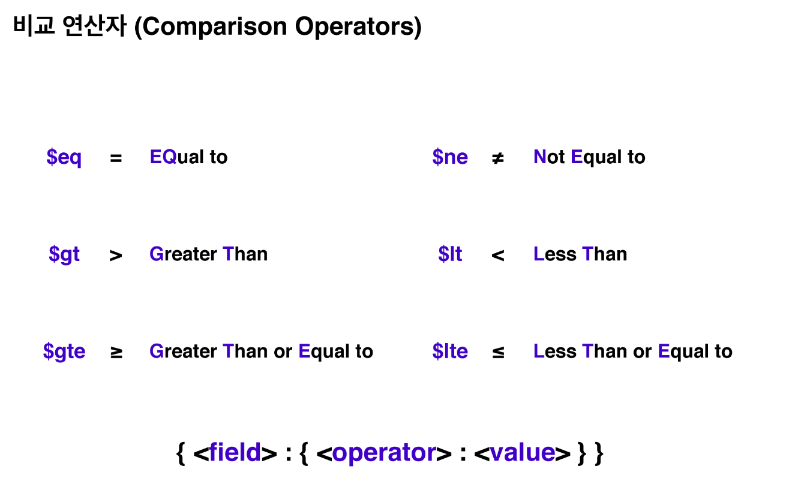

# MQL

---

[TOC]

---


## Overview

MongoDB Query Language는 쿼리 연산자를 활용하여 데이터베이스 내에서 데이터를 찾는 다양한 방법을 제공한다.


## 비교 연산자

비교 연산자를 이용해 **특정한 범위 내의 데이터**를 찾을 수 있다.



GUI에서 사용하는 경우, 아래와 같은 문법으로 작성하여 사용한다.

```shell
{<field>: {<operator>: <value}}
```

CLI에서 사용하는 경우에는 FIND 안에 위의 문법을 넣어서 사용해주면 된다.

````shell
db.trips.find({"tripduration": {"$lte": 70}, "usertype": {"$ne": "Subscruber"}})
````

$eq는 연산자가 지정되어 있지 않은 경우에 기본 연산자로 사용된다.


## 논리 연산자

논리 연산자를 사용하면 데이터 검색을 보다 세분화 할 수 있다. 논리 연산자는 4가지 종류가 있다.

- **$and**: 지정된 모든 쿼리절을 충족하는 도큐먼트를 반환
- **$or**: 쿼리절 중 하나라도 일치하는 도큐먼트가 있다면 해당 도큐먼트를 반환
- **$nor**: 모든 절과 일치하지 않는 도큐먼트를 반환
- **$not**: (단일) 조건을 만족하지 않는 모든 도큐먼트를 반환

$and, $or, $nor은 연산자가 작동할 절의 배열 앞에 위치한다. $not은 배열 구문이 필요하지 않는다.

```shell
# $and, $or, $nor
{<operator>: [{statement1}, {statement2}, ...]}
# $not
{$not: {statement}}
```

```shell
{$nor: [{result: "No Violation Issued"}, {result: "Violation Issued"}]}	# 예시
```

> $and 연산자는 기본적으로 쿼리에 함축되어서 작동된다.

아래의 쿼리면은 각각 동일한 의미를 가진다.

```shell
{"$and": [{total_amount: {"$gt": 25}}, {total_amount: {"$lt": 100}}]}
{total_amount: {"$gt": 25}, total_amount: {"$lt": 100}}
{total_amound: {"$gt": 25, "$lt": 100}}
```

$and 연산자는 **동일한 연산자를 두 번 이상 포함해야 할 때** 명시적으로 사용한다.

```shell
{"$and": [{"$or": [{dst_airport: "ICN"}, {src_airport: "ICN"}]}, {"$or": [{airplane: "SH3"}, {airplane: "A20"}]}]}
```


## 표현 연산자

표현 연산자(Expressive Query Operator)는 $expr를 사용하여 다양한 작업을 수행할 수 있다.

- $expr를 사용하여 쿼리 내에서 집계 표현식(Aggregation Expression)을 사용할 수 있다.

  ```shell
  {$expr: {<expression>}}
  ```

- $expr를 이용해 변수와 조건문을 사용할 수 있다.

- $expr을 사용하여 같은 도큐먼트 내의 필드들을 서로 비교할 수 있다.

다음의 쿼리문은 start와 end station id가 동일한 데이터를 필터한다. $expr를 사용하면 해당 값이 어떤 필드와 같아야 하는지 지정하지 않고도 자체적으로 동일한 도큐먼트 내에서 start station id 값과 end station id 값을 직접 비교할 수 있다.

```shell
{"$expr": {"$eq": ["$start station id", "$end station id"]}}	# GUI에서 작성
```

> **$의 역할?**

$는 MQL에서 2가지 역할을 한다.

- 연산자를 사용할 때 앞에 붙인다.
- 필드 이름 자체가 아닌, 해당 **필드의 값을 참조**할 수 있다. (변수처럼 사용)

위에서는 start station id와 end station id의 값을 바로 가져오기 위해서 사용하고 있다.


## 배열 연산자

- **$push**: 배열의 마지막 위치에 엘리먼트를 넣는다. 배열이 아닌 필드에 사용했을 경우, 필드의 타입을 배열로 바꾼다.
- **$all**: **배열 요소의 순서와 상관 없이** 지정된 요소가 포함된 모든 도큐먼트를 찾을 수 있다.

```shell
{<ARRAY_FIELD>: {"$all": <ARRAY>}}
{"amenities": {"$all": ["Wifi", "Internet", "Kitchen", ...]}} 	# 예시
```

- **$size**: 지정된 배열 필드가 주어진 길이와 정확히 일치하는 모든 도큐먼트들이 있는 커서를 반환한다.

```shell
{<ARRAY_FIELD>: {"$size": <NUMBER>}}
# 예시 - 정확히 amenities 개수가 20개인 도큐먼트만 반환
{"amenities": {"$size": 20, "$all": ["Wifi", "Internet", "Kitchen", ...]}}
```

배열 필드를 배열 연산자를 쓰지 않고 쿼리하는 경우, 다음과 같이 사용할 수 있다.

```shell
# 지정된 배열 필드에 요소와 "순서가 정확히 일치하는" 배열을 가진 도큐먼트를 찾는다.
{<ARRAY_FIELD>: <ARRAY>}
# 지정된 배열 필드에 문자열로 주어진 요소가 포함된 모든 도큐먼트를 찾는다.
{<ARRAY_FIELD>: <STRING>}
```

### Projection

Projection을 사용하면 **원하는 필드만 가져올 수 있다.** find 쿼리의 첫 번째 인자에 찾으려는 도큐먼트의 조건이 오고, 두 번째 인자가 찾는 필드를 구체적으로 설명하는 projection이다.

```shell
db.listingsAndReviews.find(
{"amenities": {"$size": 20, "$all": ["Internet", "Wifi", ...]}},
{"price": 1, "address": 1}	# projection
).pretty()
```

project을 할 때, 지정된 필드 뒤의 값은, 지정된 필드의 포함 여부를 나타낸다.

```shell
db.<COLLECTION>.find({<QUERY>}, {<PROJECTION>})
-> db.<COLLECTION>.find({<QUERY>}, {<FIELD>: 1, <FIELD>: 1, ...})	# 지정된 필드를 포함
-> db.<COLLECTION>.find({<QUERY>}, {<FIELD>: 0}, <FIELD>: 0, ...)	# 지정된 필드를 제외
```

단, projection을 사용할 때는 0과 1을 혼합할 수 없는데, 디폴트로 포함되는 `_id`의 경우에는 예외적으로 0과 1을 혼용하여 사용할 수 있다.

```shell
# 잘못된 예시
db.<COLLECTION>.find({<QUERY>}, {<FIELD>: 0, <FIELD>: 1, ...})
# 올바른 예시
db.<COLLECTION>.find({<QUERY>}, {<FIELD>: 1, <FIELD>: 1, ...})
db.<COLLECTION>.find({<QUERY>}, {"_id": 0, <FIELD>: 1, ...})
```

### $elemMatch

$elemMatch를 **(1) projection 부분에 사용**하여 배열 필드의 서브 도큐먼트 필드가 쿼리와 일치하는 문서를 찾는다. $elemMatch는 지정된 배열 필드가 도큐먼트에 존재하고 조건에 맞는 요소가 있는 경우에만 해당 필드를 결과에 포함시킨다.

```shell
db.grades.find({"class_id": 431}, {"scores": {"$elemMatch": {"score": {"$gt": 85}}}})
# scores 배열 내의 score 필드를 가져옴
```

$elemMatch를 **(2) find 명령의 쿼리부분에서 사용**하여 지정된 기준과 일치하는 요소가 하나 이상 있는 배열 요소만 프로젝션할 수 있다.

```shell
db.grades.find({"socres": {"$elemMatch": {"type": "extra credit"}}}).pretty()
# 배열에 있는 도큐먼트 요소의 type 필드의 값이 extra credit인 도큐먼트를 찾는다.
# 또한 쿼리에 프로젝션이 없기 때문에 결과에 각 도큐먼트의 모든 필드가 포함된다.
```

### 서브 도큐먼트 쿼리하기

서브 도큐먼트는 도큐먼트 안에 또 다른 도큐먼트 데이터가 포함되어 있는 형태이다. 서브 도큐먼트는 **Dot Notation**을 사용하여 접근할 수 있다.

```shell
{
	"_id": ObjectId("572bb8374f04kd21"),
	"light": {
		"type": "bulb",
		"color": "blue"
	}
}
# --> light.type, light.color로 접근할 수 있다.
```

**배열의 서브 도큐먼트**는 다음과 같이 쿼리할 수 있다. 배열에서는 Dot Notation을 사용하려면 **요소의 위치**를 지정해야 한다.

```shell
db.companies.find(
	{"relationships.0.person.last_name": "Zuckerburg"},
	{"name": 1}	# projection - 결과에 name 필드만 포함하도록
).pretty()
# 0: 배열이ㅡ 첫 번째 요소의 위치
# person: 중첩된 객체를 값으로 가지고 있는 필드
# last_name: 서브 도큐먼트 person의 필드
# "Zuckerbery": 찾고 있는 값
```

아래 <u>예시</u>에서는 각 도큐먼트에서 relationships 배열의 첫 번째 요소이며, 이름이 Mark인 CEO를 찾는다.

```shell
db.companies.find(
	{
		"relationships.0.person.first_name": "Mark",
		"relationships.0.title": {"$regex": "CEO"}	# $regex로 일치시키려는 문자열 지정
	},
	{"name": 1}
).pretty()
```

**$regex**는 정규식 연산자로, 일치시키려는 문자열을 지정할 수 있다.


***Copyright* © 2022 Song_Artish**