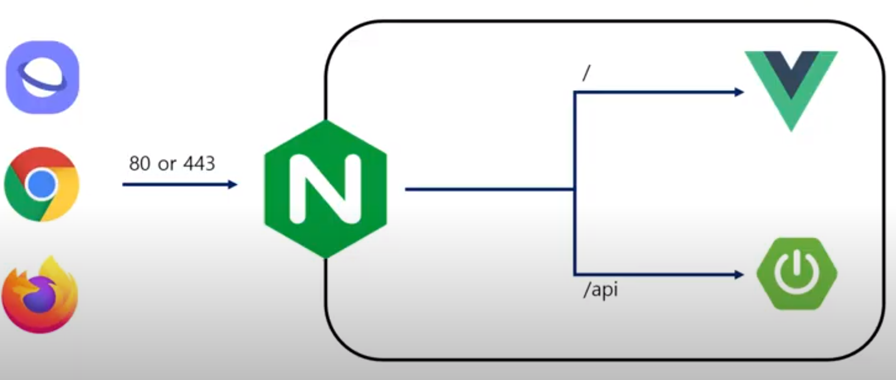

# 배포 기본

2021.02.08

---

[TOC]

---


## 1. 배포 구조

### NGINX

- 고성능 load balancer, 웹 서버, API 게이트웨이 & reverse proxy
- 비동기 방식이기 때문에 매우 높은 성능
- 정적인 파일(주로 프론트엔드 파일들)을 서비스할 때 뛰어난 성능(vs 톰캣)
- load balancer나 API gateway 용도로도 사용 가능



`(출처: 이상현 컨설턴트님 강의 자료)`

> `80`과 `443` 포트는 각각 HTTP, HTTPS에 사용되는 포트이다.

### FE/BE 분기

- `/`로 들어오는 요청은 프론트엔드의 라우터로
- `/api`로 들어오는 요청은 백엔드로 보낸다
- Webserver로서의 역할과 API gateway로서의 역할을 수행한다.

:point_down: FE와 BE 분기를 위한 NGINX 설정 파일의 모습이다.

```nginx
server {
	listen 80 default_server;
	listen [::]:80 dafault-_server;
	
	# Frontend 설정
	root /var/www/html/dist;	# front 필드 파일 위치
	index index.html index.htm ;	# index 파일명
	server_name _;	# 서버 도메인
	
	location / {
		try_files $url $url/ /index.html;
	}
	
    
	# Backend proxy 설정
	location /api {
		proxy_pass http://localhost:8399/api/;
		proxy_redirect off;
		charset utf-8;
		
		proxy_set_header X-Real-IP $remote_addr;
		proxy_set_header X-Forwarded-For $proxy_add_x_forwarded_for;
		proxy_set_header X-Forwarded-Proto $scheme;
		proxy_set_header X-NginX-Proxy true;
	}
}
```


## 2. Docker를 이용한 배포

### 이용방법

1. 프론트엔드 이미지 내부에 NGINX를 추가로 설정해놓는 방법
2. 프론트엔드 볼륨으로 mout하는 방법

### 특징

- 빠르게 필요한 서버를 증설할 수 있다.
- 기존에는 VM을 증설하는 방식을 사용했음
- VM이 부팅되는 1분이면 서비스 전체가 중지되기에 충분한 시간
- 운영체제를 부팅해야 하는 기존의 방식보다 빠름
- 이미지를 만들어두면 찍어내기만 하면 되는 배포의 편의성(w/k8s)

### 도커화 범위

- 프론트엔드/백엔드는 필수적
  - 사용자가 많아지면 서버를 증설해 나가야하기 때문에 도커화를 하는 것이 좋다.
  - 배포의 효율성/편의성을 생각해보면서 도커화를 하는 것이 좋다.
- DB / Jenkins / nginx는 선택적
  - DB를 이미지화해서 새로 배포할 일이 많이 없기 때문에 선택적으로 도커화하면 된다.
  - 빌드 서버를 병렬적으로 추가 증설하는 경우가 많지 않기 때문에 Jnekins 역시 선택적으로 도커화하면 된다.


## 3. Jenkins를 이용한 배포

### 이용방법

1. Git에서 제공하는 Jenkins를 사용하는 방법


`(출처: 이상현 컨설턴트님 강의 자료)`

2. EC2 인스턴스 내부에 Jnekins를 설치해서 사용하는 방법

### 특징

- 개발자가 gitlab의 특정 브랜치에 머지를 하면 이벤트가 트리거되어 Jenkins에서 빌드를 시작한다.
- 빌드가 완료되면 도커 이미지가 제작되어 배포된다.
- 동일한 도커 이미지로 제작, 배포되기 때문에 동일성이 보장된다.


## <참고> 

### HTTPS

> HTTPS(Hypertext Transfer Protocol Secure)는 TLS(Transport Layer Secuirt)를 사용하는 HTTP 프로토콜의 보안 버전이다.

- TLS 이전에는 SSL(Secure Socket Layers)이 있었다. TLS가 SSL의 취약성을 해결한 보안적으로 더 강력한 프로토콜이다.
- 회원 가입 시에 비밀번호 등의 개인 정보가 전송되고, 수시로 유출되어서는 안되는 정보들이 오가기 때문에 암호화가 필요하다./
- 매번 데이터를 암호화해서 전송하기 어렵기 때문에 TLS를 사용한다.
- 이론적으로는 TLS를 활용한 통신은 안전하다고 볼 수 있다.

### Certbot

- HTTPS 확산을 위해서 시작된 비영리 프로젝트다. (Let's encrypt)
- 상용 프로그램을 제작할 때는 보통 신뢰할 수 있는 ROOT 인증서 발급자로부터 SSL 인증서를
  구매해서 사용한다.
- Certbot을 이용해서 무료 인증서를 발급 받아서 사용하면 좋다.  이를 위해서는 NGINX나 백엔드 서버 모두에 TLS 설정이 필요하다.

### 사용자 계정 만들기

- 각 프로그램들을 실행할 때는 프로그램에 맞는 권한을 가진 사용자 계정을 만들어서 실행한다.
- ubuntu 계정이나 심지어 root 계정으로 실행하는 경우에는 해커의 공격 명령이 그 계정의 권한으로 실행되기 때문에 매우 위험하다.
- 사용자 계정으로 실행하는 경우 해커의 공격을 받더라도 피해를 최소화할 수 있다.


***Copyright* © 2021 Song_Artish**