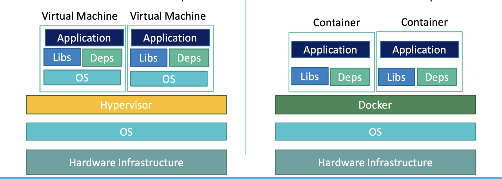
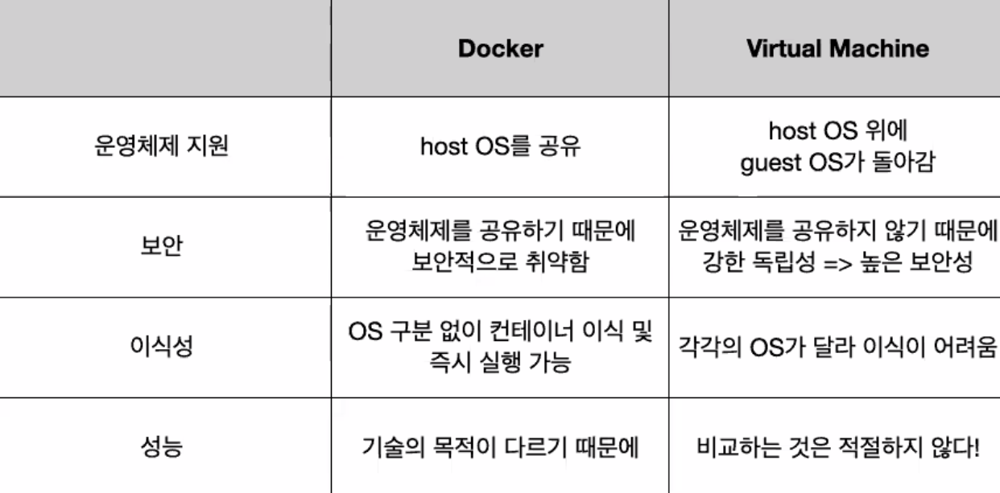

# Docker Intro

---

[TOC]

---


## Overview

도커(Docker)는 리눅스 컨테이너(Linux Container) 기술을 기반으로 하는 오픈 소스 서비스로, 메모리, CPU, GPU가 포함된 런타임 옵션이다. 도커를 통해 애플리케이션 실행 환경을 코드로 작성할 수 있으며, OS를 격리화하여 관리한다.


## Docker로 해결할 수 있는 문제들

1. **환경 표준화**

2. **환경 구성**

3. **리소스 격리**

   하나의 컴퓨터를 사용하지만, 여러 개의 컴퓨터를 이용하는 것처럼 하는 것처럼 IP나 Port 등을 다르게 설정할 수 있는 특성


## Docker vs 가상머신



`왼쪽은 가상머신(VM), 오른쪽은 Docker (출처: codestates)`

- 도커는 가상 머신만큼 견고한 격리성을 제공하지는 않는다.
- 도커는 Linux Container를 이용한 기술로, OS 위에 다른 OS를 실행하는 것이 아니므로 가상 머신보다 좋은 성능을 낼 수 있다.
- 애플리케이션에 대한 환경 격리성을 중Wx심으로 한 VM과는 달리, 도커는 Container의 관점에서 개발자와 사용자 커뮤니티를 중심으로 혜택을 제공하는 데 있다.



`(출처: git...)`


## 시작하기

Docker를 설치해준다. 문서를 따라 설치를 진행한다.

- Windows: https://docs.docker.com/desktop/windows/install/
- Ubuntu: https://docs.docker.com/engine/install/ubuntu/

개인적으로 시도해본 결과, Ubuntu에서는 [digitalocean.com](https://www.digitalocean.com/community/tutorials/how-to-install-and-use-docker-on-ubuntu-20-04)의 문서대로 진행하니 설치가 되었다.

> Ubuntu의 경우에는 [Docker Compose](https://docs.docker.com/compose/install/)도 별도로 설치해준다.

설치가 완료되었는지 확인한다.

```bash
# Windows
docker -v
docker run hello-world
```

```shell
# Ubuntu
sudo docker -v
sudo docker run hello-world
```


## Tutorial

### 1. Clone

First, clone a repository.

```shell
docker run --name repo alpine/git clone https://github.com/docker/getting-started.git
```

### 2. Build

Now, build the image. A Docker image is a private file system just for your computer. It provides all the files and code your container needs

```shell
cd getting-started
docker build -t docker101tutorial .
```

### 3. Run

Run your container. Start a container based on the image  you built in the previous step. Running a container launches your application with private resources, securely isolated from the rest of your machine.

```shell
docker run -d -p 80:80 --name docker-tutorial docker101tutorial
```

### 4. Share

Now save and share your image. You must be signed in to Docker Hub to share your image. Save and share your image on Docker Hub to enable other users to easily download and run the image on any destination machine.

```shell
docker tag docker101tutorial /docker101tutorial
docker push /docker101tutorial
```


***Copyright* © 2022 Song_Artish**