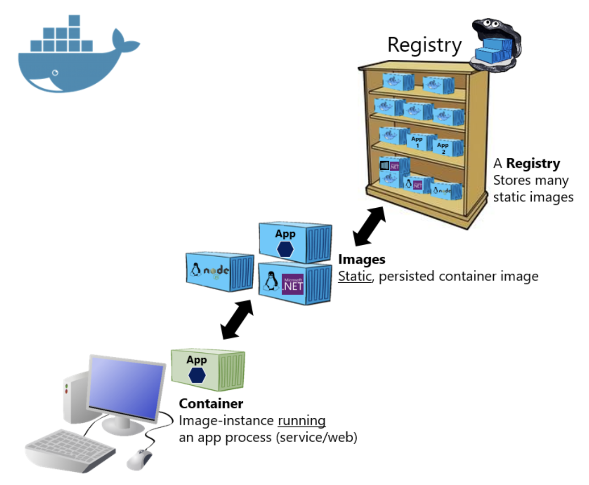

# Docker Container

---

[TOC]

---

## Overview

애플리케이션이 의존성, 네트워크 환경, 파일 시스템에 구애받지 않고, `Docker`라는 기술 위에 실행될 수 있도록 만든 애플리케이션 상자

`도커 이미지가 실행되면 도커 컨테이너가 된다 (출처: codestates)`

## 컨테이너 기술

> 실행 **환경**에 구애받지 않고 애플리케이션을 실행할 수 있다.

컨테이너는 다음 자원을 독립적으로 소유한다.

1. **프로세스**: 특정 컨테이너에서 작동하는 프로세스는 기본적으로 그 컨테이너 안에서만 액세스할 수 있으며, 다른 컨테이너의 프로세스에 영향을 줄 수 없다.
2. **네트워크**: 기본으로 컨테이너 하나에 하나의 IP 주소가 할당되어 있다.
3. **파일시스템**: 컨테이너 안에서 사용되는 파일 시스템은 구획화되어 있으며, 해당 컨테이너에서의 명령이나 파일 등의 액세스를 제한할 수 있다.

## 장점

**1. 의존성 충돌 문제를 해결해준다.**

컨테이너 기술은 애플리케이션을 컨테이너 내에 구성하여, 각자 고유의 의존성을 포함하고 있다.

**2. 개발과 배포 환경을 일치시킨다.**

OS에 상관 없이 `Docker Compose`라는 툴을 이용하여 간단하게 모든 애플리케이션 실행 환경을 구성할 수 있다. 개발을 컨테이너 위에서 진행할 경우, 모든 개발팀이 동일한 환경 아래에서 개발을 진행할 수 있다.

**3. 수평 확장을 쉽게 해준다.**

서비스 제공자들은 트래픽 분산을 위해 프록시 서버를 운영하며, 프록시 서버는 여러 대의 동일한 서버 중 한 군데를 이용할 수 있도록 돕는다. (이러한 서버를 리버스 프록시의 한 종류인 `로드 밸런서`라고 부른다.)

- Proxy Server: 클라이언트가 자신을 통해서 다른 네트워크 서비스에 간접적으로 접속할 수 있게 해 주는 컴퓨터 시스템이나 응용 프로그램

컨테이너 기술은 이러한 **실행 환경을 일치**시킨다.

**4. 각 서버에 새로운 내용을 배포하기 쉽게 만들어준다.**

## Linux Container

Docker는 Linux Container를 사용한다. **Linux Container**는 Linux 기반의 기술 중 하나로, 필요한 **라이브러리와 애플리케이션을 모아서 마치 별도의 서버처럼 구성**한 것을 의미한다. 컨테이너를 이루는 네트워크 설정, 환경 변수 등의 시트템 자원은 각 컨테이너가 독립적으로 소유하고 있다.

***Copyright* © 2022 Song_Artish**