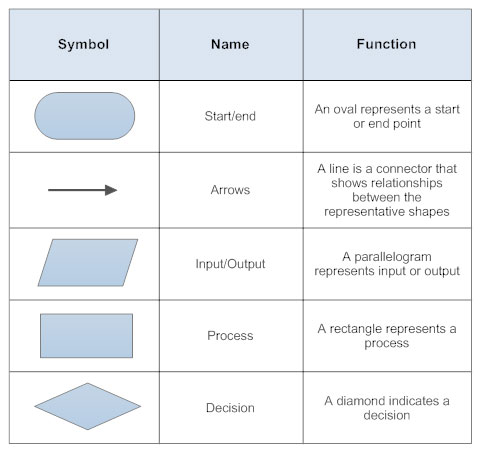

# Flowchart

> 순서도는 workflow 혹은 process를 보여주는 다이어그램의 한 종류다.

2021.10.19

---

[TOC]

---

## Symbols

`(출처: https://madaboutcomputerz.wordpress.com/2016/07/23/flowchart-symbols/)`

## Tools

- [diagrams.net](https://www.diagrams.net/)

***Copyright* © 2021 Song_Artish**