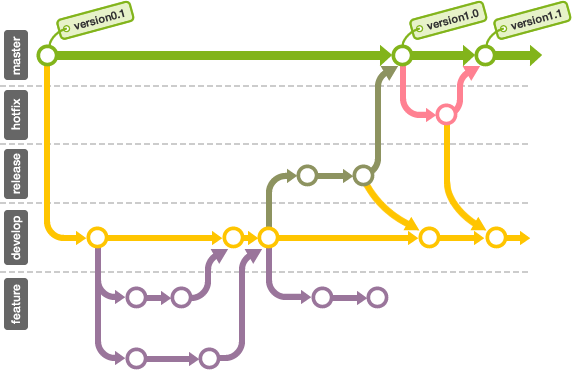

# Git 브랜치

---

[TOC]

---


## Overview

branch는 나무가지라는 의미로 코드의 분기를 의미한다. 효율적인 협업과 분업을 위한 도구로써 사용한다.

hotfix, release, develop, feature 등 다양한 브랜치를 만들고 작업을 하다보면 다음 이미지와 비슷한 git graph가 만들어진다.



`(출처: Git Beginner's Guide for Dummies)`


## 브랜치 종류

- **통합 브랜치(Integration Branch)**
    배포될 소스 코드가 기록되는 브랜치
- **피처 브랜치(Feature Branch)**
    기능 추가, 버그 수정과 같이 단위 작업을 위한 브랜치


## 브랜치 생성

```bash
$ git branch <브랜치명>
```


## 브랜치 확인

> 현재 생성한 branch의 목록을 확인할 수 있다.

```bash
$ git branch
```


## 브랜치 이동

> 해당 branch로 git 파일을 이동시킬 수 있다.

```bash
$ git checkout <브랜치명>
```

:ballot_box_with_check: `checkout` 명령어가 현재는 `switch(브랜치 변경)`와 `restore(변경사항 복원)`으로 변경되었다.


## 브랜치 병합

> 현재 branch와 대상 branch를 병합한다.

```bash
$ git merge <브랜치명>
```

:white_check_mark: `예시: B 브랜치를 A 브랜치로 병합하는 경우`

- 우선, 병합 브랜치인 A로 이동한다.

```bash
$ git checkout A
```

- 이후, 대상 브랜치인 B에 대한 병합 명령어를 입력한다.

```bash
$ git merge B
```

**`--squash` 옵션**

여러 개의 커밋 로그를 하나로 묶고 싶은 경우에 사용한다.

1. master 브랜치에서 feature 브랜치를 만든다.
    ```bash
    // 현재 브랜치: master
    git switch -c feature/login
    ```
2. feature 브랜치에서 내부 값을 바꾸면서 여러 커밋을 남긴다.
    ```bash
    // 현재 브랜치: feature/login
    git commit -m "commit 1"
    git commit -m "commit 2"
    git commit -m "commit 3"
    ...
    ```
3. master 브랜치로 switch한다.
    ```bash
    // 현재 브랜치: feature/login
    git switch master
    ```
4. master 브랜치에서 feature 브랜치를 merge함과 동시에 squash를 실행한다.
    ```bash
    // 현재 브랜치: master
    git merge --squash feature/login
    ```
5. squash한 결과 commit
    ```bash
    // 현재 브랜치: master
    git commit -m "merged branch feature/login"
    ```


## 브랜치 삭제

```bash
$ git branch -d <브랜치명>
```


## 브랜치 리스트 업데이트

- 원격 저장소의 branch 리스트를 업데이트 한다.

```bash
$ git remote update origin --prune
```


## 모든 브랜치 리스트 조회

- To show all local and remote branches that (local) Git knows about

```bash
$ git branch -a
```

아래 명령어를 통해 로그에 모든 브랜치를 그래프로 표현할 수도 있다.

```bash
git log --branches --graph --decorate
```


***Copyright* 2022 © Song_Artish**