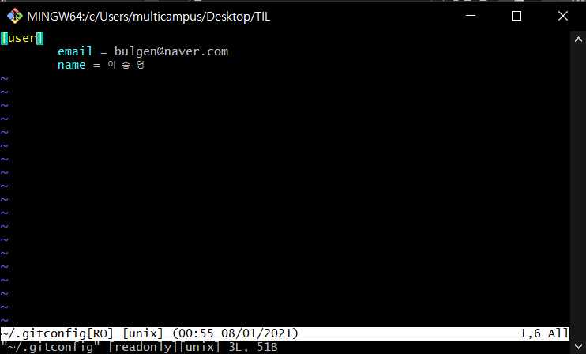

# Git Alias

2021.01.18

---

[TOC]

---


## 개념

> git에서는 `Alias`를 통해 명령어들을 간단하게 `단축키`로 지정하여 사용할 수 있다!


## 설정 방법

### 일반 설정

```bash
$ git config alias.<사용할 이름> "<사용할 명령어>"
```

- 예시

  ```bash
  $ git config alias.s "status -s"
  ```

  - `git status -s`라는 명령어를 `git s`로 바꾸어 쓸 수 있다.


### 글로벌 설정

```bash
$ git conifg --global alias.<사용할 이름> "<사용할 명령어>"
```

- 예시

  ```bash
  $ git conifg --global alias.s "status-s"
  ```


### vi 에디터 이용하기

- 아래의 명령어를 통해 `vi 편집기`fh `<alias>` 부분에 직접 설정할 수 있다.

```bash
$ vi ~/.gitconfig
```

- `vi 편집기`

  


## 자주 쓰는 git alias

```bash
$ git conifg --global alias.s "status -s"
$ git conifg --global alias.co "checkout"
$ git config --global.alias.ci "commit"
$ git config --global alias.br "branch"
$ git conifg --global alias.rb "rebase-i"
```


***Copyright* 2021 © Song_Artish**