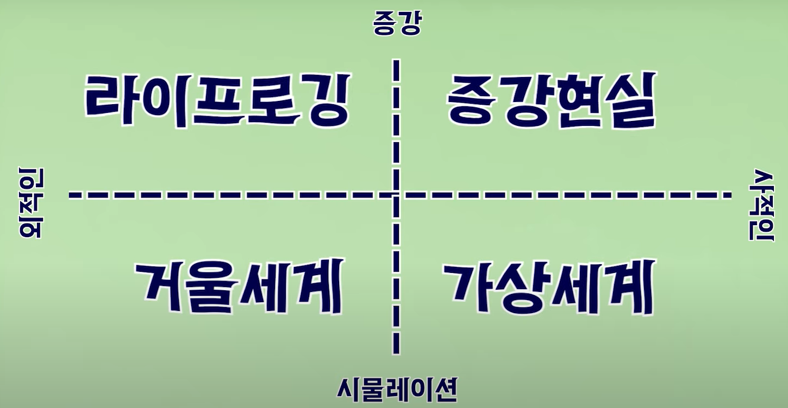

# Metaverse

> Meta + Universe

---

[TOC]

---

## 시나리오

`(출처: 서울경제썸 Thumb)`

### 1. 라이프로깅

디지털 플랫폼에 경험과 정보를 기록하고 저장하는 것

- 페이스북, 트위터, 인스타그램 같은 SNS

### 2. 증강현실

현실세계의 모습 위헤 가상의 물체를 덧씌워서 보여주는 기술

- 포켓몬고

### 3. 가상세계

디지털 데이터로 구축한 가상공간에서 이용자의 자아가 투영된 아바타들 간에 상호작용이발생하는 곳

- 로볼록스, 제페토

### 4. 거울세계

실제 세계의 모습을 가져가 복사하듯이 만들어낸 메타버스

- 카카오맵, 구글어스 + 네이버 아크버스(ARCVERSE)
- 현실의 문제를 푸는 도구로 사용됨

***Copyright* © 2021 Song_Artish**