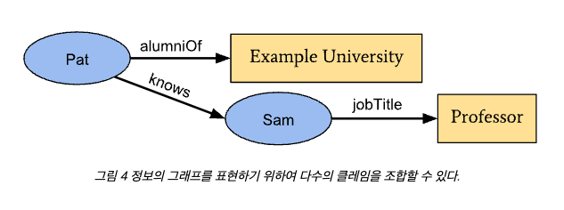

# SSI

> Self-Sovereign Identity

---

[TOC]

---


## Overview

신원의 소유권을 가진 주체가 신원에 대한 권리를 가지고 공개 대상과 범위를 선택할 수 있는 개념이다.


## 신원관리 모델

### 1세대: 개별신원(Sioloed Identity) 모델

개별 서비스(ex. 인터파크, 11번가)마다 이용자의 아이디와 패스워드를 저장하고 신원확인 서비스를 제공하는 형태이다. 신원관리 주체는 개별 서비스 제공자이고, 이용자는 서비스별로 회원가입하여 각각의 ID, PW를 관리해야한다. 이 때문에 서비스별 보안 수준에 따라 신원의 대량 유출 가능성이 높고, 이용자는 서비스별 통일되지 않은 ID와 PW 정책으로 인해 관리 어려움이 있다.

```markdown
- 개인이 개별 사이트의 ID, PW를 관리해야 함
- 개별 서비스 제공자 정보보호의무 가중, 천문학적 비용 발생
- 개인 정보 유출 우려
```

### 2세대: 연합형 신원(Federated Identity) 모델

구글, 카카오 같은 연합 신원을 제공하는 기업이 신원확인 서비스를 제공하는 모델이다. 신원관리 주체는 중앙화된 연결 서비스 제공자(ex. 구글, 카카오, 페이스북)이고, 이용자는 스스로 선택한 신원관리 서비스 제공자를 통해 ID, PW를 관리할 수 있다. 신원관리 주체인 중앙화된 연결 서비스는 로그인(OpenID, Oauth)을 제공하고, 개인정보를 이용하고자 하는 다른 개별서비스에 서비스를 제공한다.

```markdown
- 사용자 편의성 제고
- 글로벌 기업의 개인정보 독점적 확보
- 사용자 개인정보에 대한 권리 주장 어려움
- 개인정보가 독점되고 계속해서 유출 위험성 존재
```

### 3세대: 자기 주권 신원(Self-Sovereign Identity) 모델

개인이 디지털 상의 신원 주권을 가지게 될 때, 개인정보를 자신 스스로 소유하는 개념이다. 개인은 개인정보 발급 내역만 블록체인과 같은 분산원장에 기록하고, 특정한 상황에서 개인정보가 필요한 때 개인정보 발급자(issuer)에게 개인의 신원을 증명할 신원정보를 받아서 검증자(verifier)에게 신원 정보를 공유할 수 있는 모델이다. 다만, 자신의 데이터에 대한 주권을 가지게 된다는 것은 그만큼 데이터에 대한 책임과 의무가 강화될 수 밖에 없다.

```markdown
- 신원이 분산 관리되어, 이전 세대의 신원관리모델보다 가용성과 무결성이 높음
- 통합된 분산원장 관리가 가능하다면 확장성이 더 높음
- 신원확인 정보를 블록체인(분산원장)에 공유하여 신원확인이 피요한 서비스를 활용할 때 사용
- 비밀번호를 잃어버렸을 경우, 다시 찾기 어려움
```


## 구성 개념

1. **DIDs(Decentralized Identifier, 탈중앙화 식별자)**
   DIDs는 검증가능하고 탈중앙화된 디지털 신원을 위한 새로운 형식의 식별자이다. 누구나 DID 메소드로 자신의 주소를 만들 수 있으며, DID는 주소이면서 마스터키를 활용하여 만들 수 있다. 흔히 우리가 사용하는 ID, PW로 생각하면 된다.
2. **DID Auth(DID Authentication)**
   DID 소유자가 개인키를 가지고 있다는 것을 간단히 인증할 수 있는 방법을 다룬다. (DID를 이용한 인증법에 대한 표준화는 DIF에서 진행하고 있다.)
3. DKMS(Decentralized Key Management System, 탈중앙 키관리 시스템)
   신원을 증명하는데 사용하는 개인키를 어떻게 관리할 것인가를 다룬다.
4. Verifiable Credentials(검증가능한 크레덴셜)
   아이디의 소유자가 어떤 것을 할 수 있는 자격을 갖추었음을 검증하는 방법을 다룬다.


## 구성 요소


1. **Issuer(발행자)**
   > 신원정보를 발급하는 주체
   
   Verifiable Credential(VC)을 발행하는 주체이ㅕ, 정보 주체의 요구에 의해 신원정보와 DID를 발급하는 기관이다. 발행자는 발급한 정보에 대해 신뢰할 수 있는 신원정보를 전달한다.
2. **Holder(자격증명 소유자)**
   > 신원정보를 소유한 주체
   
   정보 주체로 DID를 활용하여 본인의 신원을 증명하고자 하는 사용자이다. 시스템에서는 DID를 발급 받고, 제출한다.
3. **Verifier(자격증명 검증자)**
   > 신원정보를 검증하는 주체
   
   정보 주체인 Holder로부터 Verifiable Presentation(VP)을 받아 신원정보를 검증하는 주체이다.
4. **Verifiable Data Registry(검증데이터 저장소)**
   정보 주체의 식별자와 issuer(발급기관)의 인증서, 신원증명 해지내역, 신원증명 스키마 등이 등록되어 있는 분산원장 기반의 데이터 무결성이 확보된 저장소이다. Verifiable Data Registry는 반드시 블록체인일 필요는 없으며, holder, issuer, verifier가 합의한 분산원장이면 사용할 수 있다.


## Verifiable Credential

Credential은 신원 확인에 필요한 정보이다. 디지털 세계에서는 물리적 신분증을 사용할 수 없기 때문에, 이를 해결하기 위해 나온 표준이 W3C의 [Verifiable Credentials Data Model](https://ssimeetupkorea.github.io/vc-data-model/)이다.

자기주권신원(SSI, Self-Sovereign Identity) 체계에서는 디지털 세계에서 개인의 신원을 증명할 수 있는 체계를 verifiable credential(VC)이라 한다. 

### 구성 요소

**클레임(Claim)**

디지털 세계에서 신원정보는 데이터로 표현할 수 있으며, 각 단위 데이터를 claim(클레임)이라고 한다. 아래 그림과 같이 `주체 - 속성 : 값`의 구조를 가진다.


Claim은 다른 claim과 결합하여 **연결정보(Graph of Information)**를 생성할 수 있다.



**W3C 문서의 Credential**

DID 체계에서는 credential을 주체에 대한 하나 혹은 그 이상의 claim으로 구성된 데이터의 집합이라고 정의할 수 있다.

### Verifiable Crendential (VC)

탈중앙신원체계에서는 단순히 credential이 아닌 **검증가능한 credential**이라고 표현한다. VC는 다음과 같은 구조를 가진다.


- Credential Metadata: Credential을 해석할 수 있도록 설명해주는 메타데이터
- Claim(s): 주체에 대한 claim 집합
- Proof(s): Credential을 검증가능하도록 만드는 암호학적 요소들이 포함된 증명

다음 그림은 Verifiable Credential의 기본 구성 요소를 도식화 한 것이다.


Claim이 그래프 형식으로 구성되어 있다. 또한 Verifiable Credential이 크게 두 개의 그래프로 구성되어 있다. 첫 번째 그래프는 Verifiable Credential Metadata와 Claim을 포함하는 VC를 나타내며, 두 번째 그래프는 Digital Signature인 Digital Proof를 나타낸다.

- Verifiable Credential 그래프
   - Claim으로 정보를 확인하고, Digital Proof를 통해 검증
   - Issuer와 Holder의 Digital Signature 포함
   - 발급내역이 Data Registry에 쓰여지며, 취소된 Credential인지 아닌지 확인
   - 제대로 된 포맷인지, Schema 검증

이를 통해, <u>VC는 적합한 발급자인지 확인하기 위해 다음의 4가지를 확인</u>한다.

1. Issuer가 발급한 DID인지 진위여부
2. Holder의 DID인지 진위여부
3. 블록체인의 발급내역의 유/무효 여부
4. Schema 확인을 통해 형식이 맞는지 확인

### Verifiable Presentation (VP)

SSI(자기주권신원)의 핵심은 프라이버시 보호이다. 그런데, 특정 상황에서 모든 정보를 제공해야하는 경우는 거의 없다. 이 때 SSI에서 최소한의 정보 공개(Minimum Disclosure)를 원칙으로 하여 증명이 필요한 정보들로만 구성된 새로운 형식이 필요한데, 이것이 바로 **Verifiable Presentation(검증가능한 프레젠테이션, VP)** 이다.


### VC 발행 구조

하나 이상의 VC를 발급하고, 스마트폰 앱의 디지털 지갑의 VC를 저장한다. Verifier에게 증명하기 위해 VC 중 필요한 정보를 VP로 구성한다. 검증자에게 VP로 검증한다.

**자기신원인증 과정**

- Issuer
   - Issuer는 holder에 대한 VC를 발급하여 전달한다.
   - VC의 유효성을 확인할 수 있는 ID(Identifiers)와 Schema의 발급내역을 블록체인에 기록한다.
- Holder
   - Issuer에게 VC를 받고, 자신이 증명서를 받았다는 내용과 스키마 정보를 가져온다.
   - Verifier가 필요로 하는 정보를 담아 VP 형태로 보낸다.
   - ISsuer에게 받을 때는 VC 형태, Verifier에게 보낼 때는 VP 형태이다.
- Verifier
   - Verifier는 Holder에게 받은 VP 내요을 확인한다.
      - 블록체인에서 다음 내용을 확인한다.
         - 발급 내역
         - Schema
      - VP 내용을 확인한다.
         - Issuer DID
         - Holder DID
   - 위 내용들을 확인하여, VP 내용의 진위여부를 검증한다.

예를 들어 입사지원 과정에서 대학교 졸업정보를 발급/제출하는 시나리오가 있다. 여기서 holder는 입사지원자, issuer는 대학교, verifier는 지원기업이다.


***Copyright* © 2022 Song_Artish**