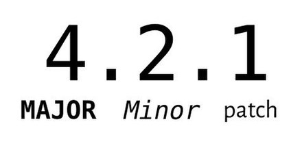

# Semantic Versioning

> 유의적 버전

2021.12.08

---

[TOC]

---

`(출처: https://velog.io/@slaslaya/Semantic-Versioning-2.0.0-MAJOR-MINOR-PATCH%EC%99%80-%EB%AA%85%EC%84%B8%EC%97%90-%EA%B4%80%ED%95%98%EC%97%AC)`

## Versions

### 1. Major Version

- 기존 api가 변경/삭제되었기 때문에 update하면 동작하지 않을 수 있다는 경고의 의미

### 2. Minor Version

- 이전 버전과 호환되는 방식으로 API가 추가되었으니 살펴보라는 의미

### 3. Patch Version

- 이전 버전과 호환되는 버그 수정을 했을 경우

## SemVer

> Semantic Versioning Specification (유의적 버전)

- SemVer을 쓰는 소프트웨어는 반드시 공개 API를 선언한다. 코드 자체로 선언하거나 문서로 엄격하게 명시해야 한다.
- Normal Version은 반드시 `X.Y.Z` 형태이며 음수가 아닌 정수여야 하며 절대 앞에 0이 붙으면 안 되고 각 수는 증가하는 수여야 한다.

***Copyright* © 2021 Song_Artish**