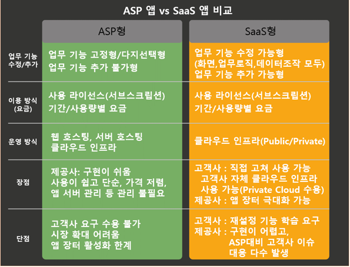

# Anything as a service

> 서비스형 만물

2022.03.14

---

[TOC]

---

## Overview

> Cloud Computing 및 원격 액세스와 관련된 일반 범주의 서비스

`(출처: Red Hat)`

## IaaS

> Infrastructure-as-a-Service

- On-promise 인프라에서 한층 발전한 유형
- 필요한 경우 제3사가 storage와 가상화와 같은 인프라 서비스를 인터넷을 통해 클라우드로 제공
- 사용자는 운영 체제 및 데이터, 애플리케이션, 미들웨어 및 런타임을 담당
- 제공업체는 사용자가 필요로 하는 네트워크, 서버, 가상화 및 스토리지의 관리와 액세스를 담당
- 예시: Public Cloud 공급업체(AWS, Microsoft Azure, Google Cloud)

## PaaS

> Platform-as-a-Service

- 전체 on-promise 인프라 관리가 조금 더 발전한 형태
- 제공업체가 자체 인프라에서 하드웨어와 스프트웨어를 호스팅하고 이러한 플랫폼을 사용자에게 통합 솔루션, 솔루션 스택 또는 인터넷을 통한 서비스로 제공
- 예시: AWS Elastic Beanstalsk, Heroku, Red Hat OpenShift

## SaaS

> Software-as-a-Service 혹은 클라우드 애플리케이션 서비스

- 가장 포괄적인 형식의 클라우드 컴퓨팅 서비스
- 모든 어플리케이션은 제공업체가 관리하며 웹 브라우저를 통해 제공
- 예시: Dropbox, Salesforce, Google Apps

### 핵심 필요조건

#### 1. Configurable App

> 사용자 기능 재정의

- 고객사의 특정 요구(업무 프로세스, 로직, 화면, 데이터베이스 조작 등)에 맞춰 수정하거나, 새로운 업무 기능을 기존 앱에 추가할 수 있는 기술을 내포해야 함
- 수정 작업에 `재코딩/재컴파일` 과정을 밟지 않고, 정의 작업만을 통해 수행할 수 있어야 함

#### 2. Multi-Tenant

- 앱 실행 인스턴스는 단 1개만 실행되어야 함

#### 3. Scalability

- 배경
  - 사실은 서비스가 실행되는 클라우드 인프라 서비스에서 제공되는 기술이기는 함
  - 하지만, 특정 클라우드 인프라 서비스에 종속적인 SaaS 서비스가 되지 않기 위해 비즈니스 앱 자체적인 스케일-업 기능 수단을 마련할 필요가 있음
- 앱 실행 상태를 자체적으로 수집하고 모니터링 할 수 있는 기능을 앱 내에 내재해야 함

## ASP vs SaaS

`(출처: Byline Network)`

***Copyright* © 2022 Song_Artish**