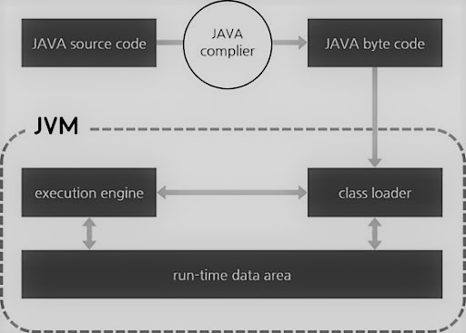

# Java 기초

2021.01.04

> 앱 제작에 필요한 자바 필수 문법에 대해서 학습한다.

---

[TOC]

---


## 1. Class

> 객체(Object)의 속성과 동작을 관리하는 설계도 또는 틀
>
> - 멤버변수(필드): 객체의 상태(속성)를 저장하는 변수
> - 생성자: 멤버변수를 초기화하는데 사용
> - 멤버메소드: 객체의 동작(기능)을 수행

### 1.1 클래스 생성

```java
public class Robot {
    
}
```

- 클래스의 Naming Rule은 `Camel_Case`이다.
- `public`은 다른 클래스에서도 사용할 수 있도록 공개되었다는 뜻이다.
- :ballot_box_with_check: Eclipse에서 `Class`를 생성하는 할 때, 프로젝트의 `src 폴더`에서 생성한다.

### 1.2 메소드 생성

```java
public class Robot {
    void moveForward() {
        
    }
}
```

- 메소드 이름 다음에는 `소괄호 ()`를 사용해야 한다.

- `void`는 텅 비어있다는 뜻으로 해당 메소드는 반환하는 값이 없다는 것을 의미한다.

- :ballot_box_with_check: 반환 값이 있는 경우에는 `void` 대신 해당 데이터형을 입력하며, 이 경우에는 반드시 `return`을 해야 한다.

  ```java
  // 예시
  int add(int x, int y) {
      return x+y;
  }
  ```

  - 여기서 `add`는 *변수명* 이다.

**클래스 예시**

```java
public class Robot {
	
	// 멤버변수(필드): 객체의 상태(속성)를 저장하는 변수
	int x, y;
	int power;
	String color;
	String name;
	
	// 생성자: 멤버변수를 초기화하는데 사용
	Robot(int x, int y, String color, String name){
		
		this.x = x;
		this.y = y;
		this.color = color;
		this.name = name;
		
	}
	
	// 멤버메소드: 객체의 동작(기능)을 수행
	void moveForward() {
		x += 5;
	}
	void moveBack() {
		y -= 5;
	}
}
```

### 1.3 객체 생성

- 객체 선언과 생성을 동시에 하는 경우

```
클래스명 객체명 = new 클래스명();
```

- 객체 선언과 생성을 각각 하는 경우

```
<클래스명> <객체명>;
<객체명> = new <클래스명>();
```

- 예시

  ```java
  Robot r1 = new Robot()
  ```

  ```java
  Robot robot1;	//객체 선언
  	robot1 = new Robot();	//객체 생성
  ```

- 생성된 객체의 멤버변수와 메소드는 아래와 같이 접근할 수 있다.

```java
r1.color = "red";
r1.name = "robot1";
```

- 아래와 같이 생성자에 매개변수를 넘겨주며 객체를 생성할 수도 있다. `생성자 오버로딩`도 가능하다.

```java
Robot r1 = new Robot(0, 0, "red", "robot1");
Robot r2 = new Robot(50, 100);	// 생성자 오버로딩
```

### <실습> 클래스 및 객체 생성

- 클래스를 아래와 같이 정의한다.

```java
// Robot.java
public class Robot {
	
	// 멤버변수(필드): 객체의 상태(속성)를 저장하는 변수
	int x, y;
	int power;
	String color;
	String name;
	
	// 생성자: 멤버변수를 초기화하는데 사용
	Robot(int x, int y, String color, String name){
		
		this.x = x;
		this.y = y;
		this.color = color;
		this.name = name;
		
	}
	
	// 멤버메소드: 객체의 동작(기능)을 수행
	void moveForward() {
		x += 5;
	}
	void moveBack() {
		y -= 5;
	}
	void introduceMe() {
		System.out.println("My name is " + name + ".");
		System.out.println("My color is "+ color + ".");
	}
}
```

- :ballot_box_with_check: `System.out.println()`은 **`sysout` + `Ctrl` + `Spacebar`**이라는 단축키를 사용하면 편리하다.
- 객체를 아래와 같이 생성한다.

```java
// RobotFactory.java

public class RobotFactory {
	
	public static void main(String[] args) {
		
		Robot r1 = new Robot(0, 0, "red", "robot1");
		Robot r2 = new Robot(100, 0, "yellow", "robot2");
		Robot r3 = new Robot(100, 0, "blue", "robot3");
		
		r1.introduceMe();
		r2.introduceMe();
		r3.introduceMe();
	}
}
```


## 2. Variable

### 2.1 데이터 타입

|           |    형태    |  데이터명   |        |                        특징                        |         변수 선언 예시          |
| :-------: | :--------: | :---------: | :----: | :------------------------------------------------: | :-----------------------------: |
| 기본 타입 |   문자형   |  **char**   | 2byte  |  16bit로 유니코드로 구성<br />한 글자만 입력 가능  |       `char txt = '연';`        |
|           |            | **String**  | 클래스 |            여러 글자(문자열) 입력 가능             |  `String myHobby = "soccer";`   |
|           |   정수형   |  **byte**   | 2byte  |                     -127 ~ 127                     |       `byte level = 100;`       |
|           |            |  **short**  | 2byte  |                   -32768 ~ 32767                   |      `short num = -30000;`      |
|           |            |   **int**   | 4byte  |                    -21억 ~ 21억                    |     `int money = 7000000;`      |
|           |            |  **long**   | 8byte  |                 -21^63 ~ 2^63 - 1                  | `long population = 6313210561;` |
|           |   실수형   |  **float**  | 4byte  |                     실수 입력                      |       `float f = 3.14f;`        |
|           |            | **double**  | 8byte  | float형보다 많이 사용<br />더 정확한 실수 처리가능 |       `double d = 1.234;`       |
|           |   논리형   | **boolean** | 1byte  |                 `true` or `false`                  |       `boolean b = true;`       |
| 참조타입  |   클래스   |             |        |                                                    |                                 |
|           |    배열    |             |        |                                                    |                                 |
|           | 인터페이스 |             |        |                                                    |                                 |

- :ballot_box_with_check: 실수형의 경우 `x = 3.14`를 사용하면 자동으로 변수 x를 `double`로 인식하므로, float형 변수를 만들려면 숫자 뒤에 f를 추가하여 `x = 3.14f`라고 사용해야 한다!
- :white_check_mark: 클래스 멤버변수에 초기값을 주지 않는 경우에도 객체 생성시에 멤버변수값에 기본값이 들어간다. 예를 들어 int형인 경우 멤버변수에 0이 저장된다.
- :ballot_box_with_check: class, long, if, extends 등의 예약어(키워드)는 변수명으로 사용해서는 안된다!


### 2.2 참조변수

**JVM(자바 가상머신)**

> JVM은 운영체제로부터 메모리를 할당받아 `메소드 영역`, `스택 영역`, `힙 영역`으로 나누어 메모리를 관리한다.
>
> - 운영체제가 달라도 JVM만 있으면 프로그램이 실행된다.



- `참조 변수`는 스택 영역의 변수로 가지고 있는 주소값을 통해 힙 영역의 객체를 참조한다.

|          영역           |                        저장되는 내용                         |
| :---------------------: | :----------------------------------------------------------: |
| **메소드(Method) 영역** | static 변수/메소드, 메소드 바이트 코드, 생성장 바이트 코드<br />프로그램이 시작해서 끝날 때까지 계속 존재하는 영역 |
|  **스택(Stack) 영역**   | `기본 및 참조 타입 변수` 저장<br />메소드 내에서만 유효한 변수들(지역변수, 매개변수) |
|    **힙(Heap) 영역**    |                  생성된 객체들의 정보 저장                   |


### 2.3 위치에 따른 변수 종류

**static 변수**

> 클래스 변수, 전역 변수, 공유 변수라고도 한다.

- 정적(static) 멤버들은 객체 생성 없이 바로 접근하여 사용할 수 있다.
- static 변수를 사용하는 방법은 `클래스명.변수`이다.

**인스턴스 변수**

- 클래스의 인스턴스(객체)를 생성할 때 만들어진다.
- 객체를 여러 개 생성했을 때 각각 독립된 저장 공간을 가지기 때문에 값이 다를 수 있다.

**지역 변수**

- 메소드, 생성자 안에서 사용되는 변수이며 그 안에서만 사용 가능하다.
- 일반적으로 메소드나 for 구문에서 쓰인다.

```java
public class Robot {
  // 멤버 변수
    // 인스턴스 변수
    int x;
    int y;
    String name;
    String color;
    // static 변수
    static int totalNumber;
    
    void moveForward() {
        //지역 변수
        int x = 0;
    }
}
```


### 2.4 static 변수/메서드

> static 변수/메소드는 클래스로더에 의해 메소드 영역에 저장되어 다른 클래스에서 객체 생성없이 **`클래스이름.변수명`**으로 바로 사용할 수 있다.

```javascript
// static 변수
public class Robot {
    static int robotCount = 0
}

public class RobotStatic {
    public static void main(String args[]) {
        int num = Robot.robotCount	// <클래스이름.변수명>으로 사용
    }
}
```

- `static 메소드` 안에는 인스턴스 변수/메소드를 사용하면 안된다.

```java
// static 메소드
public class StaticMethod {
    int a = 100;
    static int b = 100;
    public static void main(String[] ar) {
        System.out.println(b);	// 여기서 인스턴스 변수인 a는 출력할 수 없다!!
    }
}
```


***Copyright* © 2021 Song_Artish**