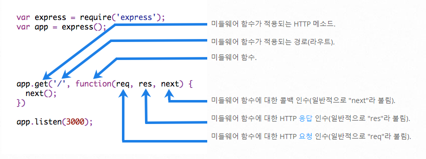

# Express.js

---

[TOC]

---


## Overview

Node.js를 위한 웹 프레임워크의 하나로, 웹 서버 또는 API 서버를 제작하기 위해 설계되었다.


## 시작하기

아래 명령어를 통해 Express.js 패키지를 설치할 수 있다.

```bash
$ npm install express --save
```


## Basic Routing

전체적인 구조는 http 모듈을 사용할 때와 동일하다. `app.<메서드>`를 이용하여 url에 따른 분기를 할 수 있다.

```javascript
const express = require('express')
const app = express()
const port = 3000

app.get('/', (req, res) => {
  res.send('Hello World!')
})

app.listen(port, () => {
  console.log(`Example app listening on port ${port}`)
})
```


## Router 사용하기

```javascript
const express = require('express')
const app = express()
app.get('user/a', (req, res, next) => {
    ...
})
app.get('user/b', (req, res, next) => {
    ...
})
module.exports = router
```

코드의 길이가 짧은 경우에는 위의 코드와 같은 식으로 작성해도 되지만, 코드 길이가 길어지게 되면 위의 코드와 같이 작성하는 경우 유지보수가 어려워질 수 있다. 이 때 **Router를 분리**하여 작성하는 효율적이다.

```javascript
// App.js --> 서버를 선언한 파일
const express = require('express')
const cors = require('cors')
const app = express()
const port = 3000

// Router init
const userRouter = require("./router/userRouter")
const infoRouter = require("./router/infoRouter")

// Route Start
app.use("/user", userRouter)
app.use("/info", infoRouter)

...
```

```javascript
// /routes/userRouter.js
const { getUsers, createUser } = require('../controller/userController')
const express = require("express")
const router = express.Router()

router.get('/', getUsers)

router.post('/:id', createUser)

/**
router.get('/', (req, res, next) => {
    // 내용
    res.render()
})
**/
module.exports = router
```

```javascript
// /controller/userController.js
const users = require('../repository/userList')

module.exports = {
    getUsers: (req, res) {
    	...
    	// 쿼리 문으로 보낸 데이터를 가져온다.
    	console.log(req.query)
        console.log(req.query.userId)
		// body에 담아 보낸 데이터를 가져온다.
		console.log(req.body)
		return res.status(200).json(req.body)
	},
    createUser: (req, res) {
        // 넘겨 받은 id 값을 가져온다.
        console.log(req.params.id)
        let data
        return res.json(data)
    }
}
```


## Middleware

> 미들웨어는 양 쪽을 연결하여 데이터를 주고받을 수 있도록 중간에서 매개 역할을 하는 소프트웨어, 혹은 네트워크를 통해서 연결된 여러 개의 컴퓨터에 있는 많은 프로세스들에게 어떤 서비스를 사용할 수 있도록 연결해주는 소프트웨어를 말한다.

미들웨어는 프로세스 중간에 관여하여 특정 역할을 수행한다. Express.js에서 미들웨어의 구성은 다음 그림과 같다.



`(출처: https://expressjs.com/ko/guide/writing-middleware.html)`

Express.js에서 미들웨어를 사용하는 상황은 아래 4가지와 같다. 미들웨어를 이용하면 node.js만으로 구현한 서버에서는 다소 번거로울 수 있는 작업을 보다 쉽게 적용할 수 있다.

### 1) 모든 요청에 대해 url이나 메소드를 확인할 때

여기서는 디버깅이나, 서버 관리에 도움이 되기 위해 `console.log`로 적절한 데이터나 정보를 출력하는 **logger** 예제를 다룬다.

```javascript
const express = require('express')
const app = express()

const myLogger = (req, res, next) => {
    console.log("현재 request는: " + req)	// 로그를 이런 식으로 찍을 수 있다.
    next()	// 다음 미들웨어를 실행하게 하는 역할을 한다.
}

app.use(myLogger)	// 모든 요청에 동일한 미들웨어(myLooger)를 적용한다.

app.get('/', (req, res) => {
    res.send('Hello World!')
})

app.listen(3000)
```

### 2) POST 요청 등에 포함된 body(payload)를 구조화할 때

순수 node.js로 HTTP body(payload)를 받을 때에는 Buffer를 조합해서 다소 복잡한 방식으로 body를 얻을 수 있다.

```javascript
// 순수 node.js를 이용한 경우
let body = []
request
    .on('data', (chunk) => {
    	body.push(chunk)
	})
	.on('end', () => {
    	body = Buffer.concat(body).toString()
    // body 변수에는 문자열 형태로 payload가 담겨져 있다.
	})
```

body-parser 미들웨어를 사용하면 이 과정을 간단하게 처리할 수 있다.

```javascript
// 옛날 코드
const bodyParser = require('body-parser')
const jsonParser = bodyParser.json()

// 생략
app.post('/api/users', jsonParser, (req, res) => {
    // req.body에는 JSON 형태로 apyload가 담겨져 있다.
})
```

```javascript
// 현재 버전의 코드 - body-parser를 사용하지 않는다.
var express = require('express')
var app = express()

app.use(express.json())	// for parsing application/json
app.use(express.urlencoded({ extended: true }))	// for parsing application/x-www-form-urlencoded

app.post('/api/users', (req, res, next) => {
    console.log(req.body)
    res.json(req.body)
})
```

마찬가지로, request에서 text로 넘어오는 데이터는 `express.text()`를 사용하여 처리할 수 있다.

```javascript
const express = require('express')
const app = express()

app.use(express.text())

app.post('/lower', (req, res, next) => {
    res.end(req.body.toLowerCase());
})
```

이와 관련된 자세한 내용은 아래 공식문서를 참고한다.

- 공식 문서: https://expressjs.com/en/api.html#express.json

### 3) 모든 요청/응답에 CORS 헤더를 붙여야 할 때

순수 node.js 코드에 CORS 헤더를 붙이려면, 응답 객체의 `writeHead` 메소드 등을 이용해야한다. 이런 메소드를 이용하더라도 `Access-Control-Allow-*` 헤더를 매번 재정의해야 한다. 그 뿐만 아니라 ,`OPTIONS` 메소드에 대한 라우팅도 따로 구현해야 한다.

```javascript
// 순수 node.js에 CORS를 적용한 경우
const defaultCorsHeader = {
    'Access-Control-Allow-Origin': '*',
    'Access-Control-Allow-Methods': 'GET, POST, PUT, DELETE, OPTIONS',
    'Access-Control-Allow-Headers': 'Content-Type, Accept',
    'Access-Control-Max-Age': 10
};

// 생략
if (req.method == 'OPTIONS') {
    res.writeHead(201, defaultCorsHeader)
    res.end()
}
```

[CORS 미들웨어](https://github.com/expressjs/cors)를 사용하면 이 과정을 간단하게 처리할 수 있다.

```javascript
// cors 모듈을 이용한 CORS 처리
const cors = require('cors')

app.use(cors())

// 만약 특정 요청에 대해 CORS를 허용하고자 하는 경우에는
app.get('/products/:id', cors(), (req, res, next) => {
    res.json({ msg: 'This is CORS-enabled for a Single Route'})
})
```

### 4) 요청 헤더에 사용자 인증 정보가 담겨있는지 확인할 때

여기서는 HTTP 요청에서 토큰이 있는지 판단하여, 이미 로그인한 사용자일 경우 성공, 아닐 경우 에러를 보내는 미들웨어 예제를 다룬다.

> 토큰(Token): 주로 사용자 인증에 사용하며, authentication을 학습할 때 다룬다.

```javascript
// 토큰을 통해 로그인 여부를 확인하는 미들웨어 예시
app.use((req, res, next) => {
    if (req.headers.token) {
        req.isLoggedIn = true
        next()
    }
    else {
        res.status(400).send('invalid user')
    }
})
```

이것을 사용하면 로그인 없이 웹사이트에 접근했을 때, 로그인 창 등으로 되돌려 보내는 로직 등을 작성할 수 있다.


***Copyright* © 2022 Song_Artish**
