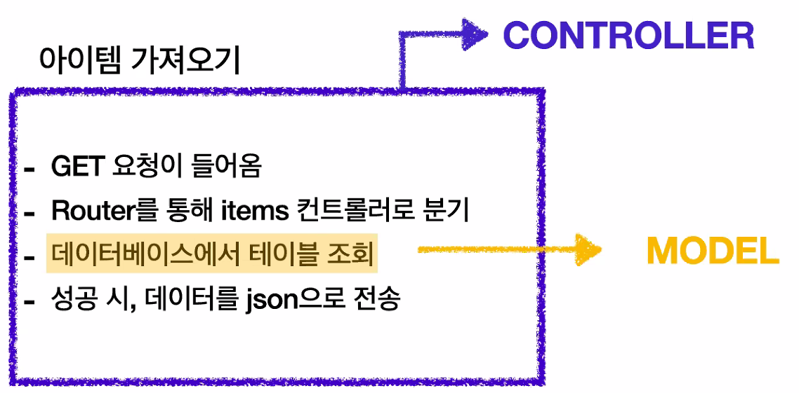
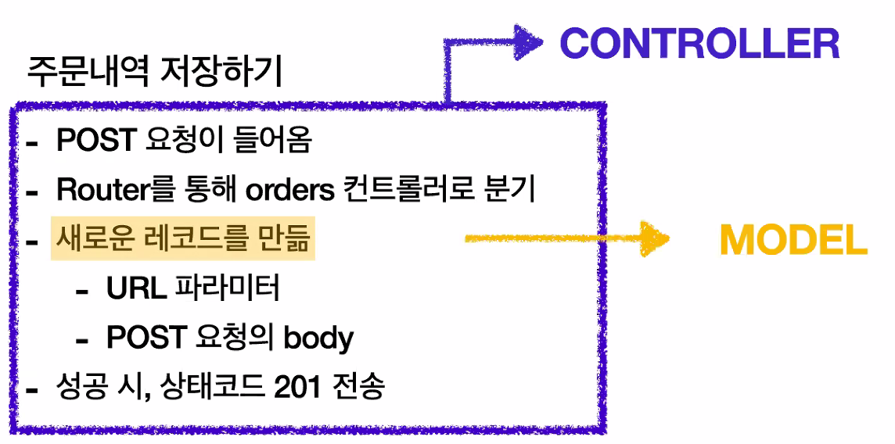
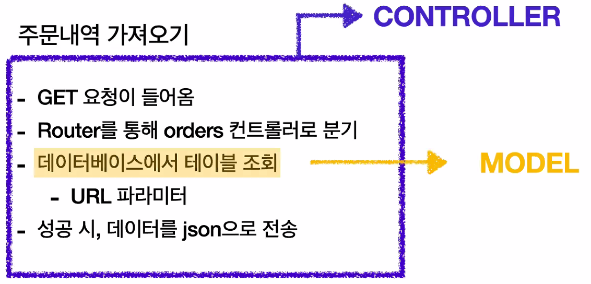

# Node.js와 MySQL 연결하기

---

[TOC]

---

## 시작하기

Node.js에서 MySQL 데이터베이스를 사용하기 위해서는, 먼저 컴퓨터에 MySQL이 설치되어 있어야 한다.설치를 확인한 후, npm을 통해 MySQL 드라이버를 설치한다.

```bash
npm install mysql
```

- 공식 문서: https://github.com/mysqljs/mysql
- 가이드: https://www.w3schools.com/nodejs/nodejs_mysql.asp

JavaScript 파일에서 MySQL을 다음과 같이 불러온다.

```javascript
var mysql      = require('mysql');
var connection = mysql.createConnection({
  host     : 'localhost',
  user     : 'me',    // root 등 사용자
  password : 'secret',    // 반드시 환경변수로 관리한다.
  database : 'my_db'    // 사용할 DB명
});

connection.connect();

connection.query('SELECT 1 + 1 AS solution', function (error, results, fields) {
  if (error) throw error;
  console.log('The solution is: ', results[0].solution);
});

connection.end();
```

## 환경 변수 설정하기

MySQL 서버 접속 시 사용되는 사용자명, 패스워드, 데이터베이스 명 등은 환경 변수로 관리한다. `.env` 파일을 프로젝트 root 폴더에 생성하고 다음과 같이 변수를 입력한다.

```
// .env
DATABASE_USERNAME=root
DATABASE_PASSWORD=abcd1234
DATABASE_NAME='learnmysql'
```

환경 변수 파일 `.env`는 `.gitignore`되기 때문에 환경 변수 예시 파일을 만들어 놓으면 편리하다. 환경 변수 예시 파일은 `.env.example` 등으로 생성한다.

```
// .env.example
DATABASE_USERNAME=
DATABASE_PASSWORD=
DATABASE_NAME='learnmysql'
```

설정한 환경 변수를 js 파일에서 가져오기 위해서 `dotenv` 패키지를 설치한다.

```bash
npm i dotenv
```

- 공식 문서: https://www.npmjs.com/package/dotenv

환경 변수는 다음과 같이 가져와 사용할 수 있다.

```javascript
require('dotenv').config()

...
module.exports = class DatabaseConnector extends SingletonBase {
  constructor() {
    super();
    this.config = {
      host: 'localhost',
      user: process.env.DATABASE_USERNAME || 'root',
      password: process.env.DATABASE_PASSWORD || '',
      database: process.env.DATABASE_NAME || 'learnmysql'
    };

    return this;
  }
...
```

## SQL문 작성하기

SQL문은 프로젝트에서 sql 파일을 생성하여 작성할 수 있다. `migrations > schema.sql`과 같이 구조를 관리하면 편리하다. 아래 예시와 같이 작성할 수 있다.

```sql
-- schema.sql
USE learnmysql;

CREATE TABLE `user` (
  `id` int PRIMARY KEY AUTO_INCREMENT,
  `name` varchar(255) not NULL,
    ...
-- 밑에서 user의 roleId를 선언하고 있다
);

CREATE TABLE `content` (
  `id` int PRIMARY KEY AUTO_INCREMENT,
   ...
  `created_at` timestamp not NULL DEFAULT CURRENT_TIMESTAMP,
  `userId` int,
  FOREIGNKEY (`userId`) REFERENCES `user` (`id`)
);

CREATE TABLE `role` (
  `id` int PRIMARY KEY AUTO_INCREMENT,
  `name` varchar(255) NOT NULL
);

-- role이 선언되기 전에 user에서 role을 참조하기 때문에, 별도로 처리해준다.
ALTER TABLE `user` ADD roleId int;
ALTER TABLE `user` ADD FOREIGN KEY (`roleId`) REFERENCES `role` (`id`);
```

## Issues

### windows 'mysql'은(는) 내부 또는 외부 명령, 실행할 수 있는 프로그램, 또는 배치 파일이 아닙니다.

cmd와 git bash에서 mysql 명령어가 실행되지 않았다. 이런 경우, `환경 변수 > 사용자 변수 > Path`에 아래 경로를 추가해준다.

```
C:\Program Files\MySQL\MySQL Server 8.0\bin
```

### Error: ER_NOT_SUPPORTED_AUTH_MODE: Client does not support authentication protocol requested by server; consider upgrading MySQL client

서버 연결을 시도하였지만, 위와 같은 오류 메시지가 발생하면서 서버 연결이 거부되었다. 이런 경우에는 mysql 서버에 들어가서 비밀번호를 변경해준다.

```sql
ALTER USER 'root'@'localhost' IDENTIFIED WITH mysql_native_password BY '<변경할 비밀번호>';
```

## 작동 원리



***Copyright* © 2022 Song_Artish**