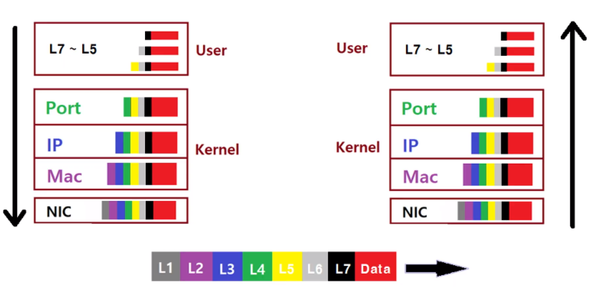

# Network

2021.01.22

---

[TOC]

---


## Intro

> 네트워크 시스템에서 데이터가 전송되는 방법은 **택배시스템**과 비슷하다.

:white_check_mark: 택배를 보내려면 상자에 포장해서 주소를 기입해야 한다.

```markdown
네트워크 시스템에서도 데이터를 보낼 때 **IP, Port, MAC 주소** 등을 넣어서 **packet**이라는 단위로 잘 포장해서 보낸다.
```

:white_check_mark: 배송 중인 택배는 집결지에서 집결지 사이로 <u>정해진 경로</u>를 따라 이동한다.

```markdown
네트워크에서 데이터도 정해진 루트를 따라 이동하는데, 이러한 루트를 **L1 계층(물리 계층)**이라고 부른다.
```

:white_check_mark: 지역구 집결지는 해당 지역 안에서 이동하는 택배를 관할한다.

```markdown
네트워크 상에서 지역구 집결지와 같은 역할을 하는 것은 **L2 Switch**이며 자신과 연결되어 있는 영역이 정해져있다. L2 Switch가  연결되어 있는 영역을 **LAN(Local Area Network)**이라고 부른다.
```

:white_check_mark: 도시 간에 택배를 운송하기 위해 도시 단위의 집결지가 존재한다.

```markdown
네트워크 상에서는 하나의 LAN에서 다른 LAN으로 통신이 이루어지면 그것을 **WAN(Wide Area Network)**이라고 부르며, 이들의 통신을 가능하게 해주는 **L3 Router**가 있다.
```


`(출처: https://genesis8.tistory.com/255)`


## OSI 7 계층

> 네트워크 상에서 패키지를 보내기 위해서는 많은 기술과 프로토콜이 필요한데, 이를 카테고리화해서 7개의 계층으로 나눈 것이 **OSI(Open Systems Interconnection) 7 계층**이다.

- 왼쪽 칼럼부터 `계층의 이름`, `기능에 대한 설명`, `관련 프로토콜`, `관련 장비`, `개발자 관점에서의 분류`


- [참고자료](https://velog.io/@hidaehyunlee/%EB%8D%B0%EC%9D%B4%ED%84%B0%EA%B0%80-%EC%A0%84%EB%8B%AC%EB%90%98%EB%8A%94-%EC%9B%90%EB%A6%AC-OSI-7%EA%B3%84%EC%B8%B5-%EB%AA%A8%EB%8D%B8%EA%B3%BC-TCPIP-%EB%AA%A8%EB%8D%B8)


**L1**

- 네트워크 상에서 정해진 길로만 패킷을 보내는 장비
- Repeater, NIC, 광케이블과 같은 장비들이 속한다.

**L2**

- Physical addressing과 관련되어 있다.
- MAC 주소가 속한다. MAC 주소는 유니크한 값이며 정말 특수한 경우를 제외하면 내가 쓰는 MAC 주소는 전세계에서 유일하다.
- MAC 주소를 가지고 패킷을 보내는 장비가 L2 Switch이며, L2 Switch는 LAN에서 패킷을 보내기 위한 장비다.

**L3**

- Logical addressing과 관련되어 있다.
- IP 주소가 여기에 해당되며, 이외에도 ICMP, ARP 등의 프로토콜이 관련되어 있다.
- IP 주소를 보고 패킷을 보내는 장비가 L3 Router이며, WAN을 위한 장비이다.

**L4**

- Port가 이 계층에 해당되며, L2 계층의 MAC 주소와 L3 계층의 IP 주소, 그리고 L4 계층의 Port 정보까지 다 가지고 있어야 의미있는 데이터 전송이 이루어질 수 있다.
- 따라서 양방향에서 고나계를 맺고 전송이 이루어질 수 있는 게층이기 때문에 `end to end connection`이 가능해지는 계층이다.
- 관련된 프로토콜로는 TCP와 UDP가 있으며, 장비로는 Load Balancer가 있다.

**L5**

- 세션 계층으로, 인증과 관련된 계층이다.
- 로그인을 위한 토클과 같은 프로토콜이 여기에 속한다.

**L6**

- 데이터를 전송할 때는 정해진 프로토콜에 따라 encapsulation을 해서 보내야한다.
- 관련된 프로토콜로는 SSl, GIF, JSON이 있다.

**L7**

- HTTp와 같은 프로토콜이 있으며, 보내는 쪽/ 받는 쪽 모두 프로토콜이 맞아야 기능이 제대로 작동한다.


## 데이터 전송/수신 과정

- 왼쪽은 데이터 전송, 오른쪽은 데이터 수신 과정을 나타낸다.



**데이터 전송**

- 데이터를 전송할 때는 L7부터 시작해서 L1까지 데이터 앞에 필요한 헤더들이 붙는다.
- L7부터 L5까지는 응용 개발자가 헤더를 붙여줘야한다. 프론트 개발을 할 때 axios를 많이 사용하는데, axios는 이러한 헤더들을 자동으로 붙여주는 것이다.
- 유저 영역에서 커널 영역으로 넘어가는 L5와 L4 사이에는 socket이 있으며, 데이터를 전송할 때는 socket의 send 함수가 사용된다.
- 가장 마지막에 붙는 NIC(Network Interface Controller)는 LAN에 연결 지점을 제공하기 위해 컴퓨터에 설치하는 장치 어댑터로, NIC도 그에 맞는 필요한 헤더가 존재한다.

**데이터 수신**

- 데이터를 수신할 때는 L1부터 시작해서 검증을 한다.
- L4에서 L5로 넘어갈 때는 socket의 receive 함수를 이용해서 패킷을 유저 영역으로 넘긴다.
- L5부터 L7까지는 응용 개발자가 패킷을 검증한다.

:ballot_box_with_check:헤더는 항상 데이터의 앞에만 붙는 것이 아니라, 기술에 따라 뒤에 붙을 수도 있고 양쪽으로 붙을수도 있다!


## Network 구성

- 사내망 안에는 L2 Switch가 있으며, L2 Switch가 연결되어 있는 영역이 LAN이다.
- 같은 LAN 안에서 패킷을 보내기 위해서는 L2 Switch만 거치면 된다.
- LAN 간의 패킷을 보내는 것은 WAN이 되기 때문에 L3 Router를 거쳐야한다.
- 컴퓨터마다 IP 주소, 서브넷 마스크, 그리고 MAC 주소를 가지고 있다.


**IP 주소 규칙**

```markdown
### IP 주소 예시
-------- network -------- -- host --
11000000 10101000 00100100 01100101 > (192.168.36.101)
### 서브넷 마스크 예시
-------- network -------- -- host --
11111111 11111111 11111111 00000000 > (255.255.255.0)
```

- IP는 서브넷 마스크에 의해 network 영역과 host 영역으로 나뉜다.
- 동일한 L2 switch에 연결된 IP 주소들은 network 영역이 같다. 즉, LAN 안에서는 모두 같은 network 영역을 가지고 있다.
- 같은 LAN 안에서는 각각 다른 고유의 host 영역을 가지고 있다.

```markdown
## 정리
1. Network 값이 같으면 LAN
- L2 switch (mac)
2. Network 값이 다르면 WAN
- L3 router (IP)
```

- Gateway는 L3 router에 몰려있는 IP로 보통은 `.1`로 끝난다.
- WAN으로 나가기 위해서는 gateway를 통과해야한다.
- [참고자료](https://medium.com/pocs/tcp-ip-%EC%9D%B4%EB%A1%A0-ip-%EC%A3%BC%EC%86%8C-%EC%84%9C%EB%B8%8C%EB%84%B7-%EB%A7%88%EC%8A%A4%ED%81%AC-%EA%B7%B8%EB%A6%AC%EA%B3%A0-%EA%B8%B0%EB%B3%B8-%EA%B2%8C%EC%9D%B4%ED%8A%B8%EC%9B%A8%EC%9D%B4-ccd6d832711e)


***Copyright* © 2021 Song_Artish**