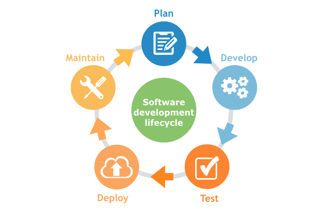

# Software Development

> the process of conceiving, specifying, designing, programming, documenting, testing, and bug fixing involved in creating and maintaining applications, frameworks, or other software components.

---

[TOC]

---

## SDLC

> Software Development Lifecycle

`(출처: inflectra)`

- the application of standard business practices to building software applications

### 1. Planning

### 2. Requirements Analysis

### 3. Design & Prototyping

### 4. Software Development

### 5. Testing

### 6. Deployment

### 7. Maintenance

### 8. Retirement

***Copyright* © 2021 Song_Artish**