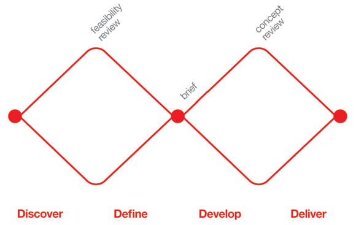

# UX 디자인 프로세스

2021.12.19

---

[TOC]

---

## Overview

|  #   |     Step     |             Desc.             |
| :--: | :----------: | :---------------------------: |
|  1   | **Research** |          니즈를 조사          |
|  2   | **Concept**  |    Uncertainty -> Insights    |
|  3   |  **Design**  | Insights -> Clarity & Focuses |

## Double Diamond 모델

> 사용자 중심의 디자인 프로세스를 나타내는 대표적인 방법론

`(출처: https://m.blog.naver.com/youngdisplay/60205111308)`

### 1) Discover

- 사용자 관찰
- 비즈니스 골과 이해관계자들의 의견 경청
- 문제 파악 및 사용자 학습
- 양질의 정보 수집과 관찰이 이루어져야 함

### 2) Define

- 사용자의 문제를 명확하게 정의
- Discover 단계에서 배운 인사이트를 종합하여 솔루션 도출

### 다이아몬드 간의 접점

- 전체 프로젝트에서 방향성 및 전략을 결정하는 단계
- 솔루션 정의, 서비스 컨셉 등

### 3) Develop

- 많은 스케치와 프로토타입 등을 통해서 아이디어 시각화 및 구체화
- 프로토타입(시안) 단계에서 시각적인 디자인 부분(`비주얼 디자인`)도 포함

### 4) Deliver

- 시각화된 솔루션 테스트
- 사용성 테스트등

## UX vs UI

> User experience encompasses all aspects of the end-user's interaction with the company, its services, and its products. - Donald Norman

### UX Design

서비스/제품을 사용하면서 총체적으로 느끼는 사용자의 경험을 디자인

- Personas
- User Stories
- User Research
- Usability Testing
- Wireframes

### UI Design

사용자가 서비스/제품을 사용하면서 interaction하게 되는 제품의 접점을 디자인
- Wireframes
- Layout
- Visual Design
- Branding

> Good UI is not always Beautiful UI!

**Facebook**

- 다양한 문화, 나이, 성별을 포괄하는 서비스
- 심플하지만 직관적인 디자인

**Amazon**

- 쇼핑을 위한 정보를 잘 표시
- 결제를 빠르게 진행할 수 있도록 설계됨

## 어떻게 사용자의 니즈를 알아낼까?

### 1) Context

- 사용자가 제품을 사용하는 시간, 장소, 상황, 사회문화적 배경

### 2) Behavior

- 사용자가 제품과 실제로 interaction하는 방식

### 3) Needs

- 무언가를 필요로 하는 내적 욕구

### 4) Attitude

- 대상에 대해서 갖는 인지적, 정서적 반응

### 5) Motivation

- 행동을 일으키게하는 요인

***Copyright* © 2021 Song_Artish**