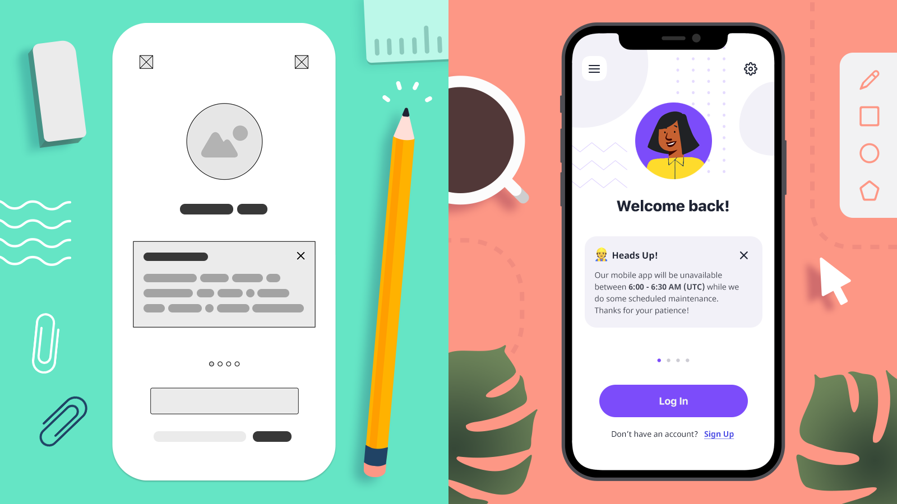

# UX/UI 용어

2021.12.19

---

[TOC]

---

## Feature

- 제품이나 서비스에서 하나의 기능 단위를 의미
- 핵심이 되는 기능을 Key Features라고 지칭하기도 함
- cf) **Feature creep**
  - 제품 내 새로운 소프트웨어 기능의 과도한 확장 및 추가를 의미

## Feasibility

- 실현 가능성
- 디자인/개발 리소스, 기간, 예산 등을 현실적으로 따져보았을 때 실현 가능성이 있는지를 의미함

## VOC

> Voice of Customers

- 고객의 목소리
- 고객으로부터 접수된 피드백이나 불만, 리뷰 등을 의미

## UGC

> User Generated Content

- 사용자가 생성한 콘텐츠
- 사용자는 다양한 콘텐츠의 생산과 소비를 통해 서비스에 적극적으로 참여 활동을 할 수 있고 다른 사용자들의 서비스에 대한 신뢰를 높여주는 기능을 하기도 함

## Fidelity

- 충실도; 묘사/표현의 정도를 나타냄
- 디자인의 디테일한 정도나 컬러 폰트 등이 얼마나 최종 디자인에 가깝냐, 혹은 힘이 많이 들어간 상태냐의 의미

|       Type        | Desc.                                                        |
| :---------------: | ------------------------------------------------------------ |
| **Low Fidelity**  | 최소한의 구성요소는 다 갖추고 있는 정도 손으로 그린 스케치, 기획서 상의 와이어프레임 등 최소한의 구성 요소만으로 컴포넌트나 정보를 배치 |
| **High Fideilty** | 완성에 거의 가까운 형태 스케치나 포토샵 등으로 컬러나 폰트, 요소들이 최종 디자인에 가까운 고 퀄리티 상태 |

`(출처: moqups)`

## Wireframe

- 기획 단계에서 주로 제작
- 각 페이지들의 정보와 UI 요소 등에 대한 배치를 표현
- 와이어프레임에 시나리오, 컨텐츠 설명 등이 첨부되면 스토리보드가 된다.
- 서비스의 대략적인 모습을 흰색, 검은색, 회색의 단순한 컬러로 보통 표현
- 화면에서의 정보 배치와 흐름들이 보여지기 때문에 UI 디자이너나 개발자들이 보고 피드백을 주거나, 이를 바탕으로 high-fidelity 디자인으로 발전되기도 함

## Storyboard (SB)

- 서비스의 각 페이지 구성 요소나 콘텐츠의 설명 및 페이지 간의 이동 흐름, 로직 등을 기술한 문서
- 사용자가 서비스와 어떤 context에서 interaction 하는지 시각적으로 시나리오를 표현
- 화면 설계서, UI문서, 스펙문서, 기획서, MM(Man Machine Interface), Wireframe

## Mockup

> 디자인 시안

- 디자인, 데모 시연 및 평가를 위한 서비스/제품의 디자인
- 일반적으로 최종 버전의 디자인이 되는 경우도 많다.
- 서비스가 시각적으로 어떻게 표현될지를 보여줌
- 컬러, 타이포그래피가 들어가 있고 버튼, 아이콘들 간의 간격도 디자이너가 정교하게 배치한 상태

## Prototype

- 서비스에 대한 기능 및 사용성 등의 테스트를 위해 제작되는 동적인 모형
- 개발자-디자이너 사이의 시각적인 커뮤니케이션 툴이 되기도 하고 사용성 테스트에 종종 사용되기도 함
- 그리스어 `protos`(처음) + `typos`(느낌): 처음 느낌을 본다

## Affordance

> 행동 유도성

- 사용자가 제품 또는 서비스를 인지했을 때 어떻게 사용해야 하는지 알거나 디자이너의 의도대로 사용자의 행동을 유도하는 것을 의미
- 예시) 스위치, iPhone의 Slide to unlock

## IA

> Information Architecture (정보 구조)

- 제품, 서비스를 구성하는 정보의 구조와 우선순위, 흐름의 설계 등을 포함
- 예시) 사이트맵

`(출처: Toptal)`

## CTA

> Call to Action

- 사용자의 반응/행동을 유도하는 행위 혹은 요소
- 버튼, 링크, 배너 등
- 화면에서 가장 중요한 회원가입이나 결제 등의 액션이 필요한 버튼

## Usability

> 사용성

- 서비스를 어떤 특정목적을 달성하기 위해 사용할 때에 어느 정도 사용하기 쉬운가를 말하는 용어
- 사용성의 평가를 위한 방법을 지칭하기도 함 cf) **UT(Usability Testing)**

## Breadcrumbs

- 사용자가 사이트 전체 구조 안에서 어디에 위치했는지 알려준다.
- 많은 양의 콘텐츠가 수직형 구조나 계층 구조로 이루어져 있는 경우 사용자의 네비게이션을 돕는다.
- 논리적 계층 구조가 없는 단일 레벨 서비스에서는 유효하지 않다.

***Copyright* © 2021 Song_Artish**