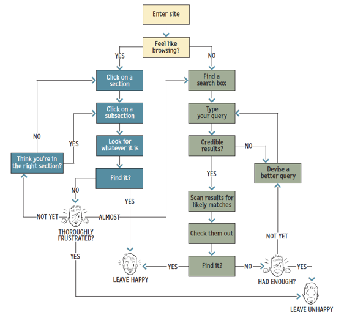

# 제품 개발 프로세스

2021.12.20

---

[TOC]

---


## 개발 방법론

### 1. Waterfall

- 폭포수와 같이디자인,개발 등 각각의 프로세스가 **순차적**으로 진행됨
- 미리 모두 정해진 요구사항을 바탕으로 기획-디자인-개발 프로세스가 순서대로 진행되며 출시하는 방식의 개발 프로세스
- 각 단계의 요구사항의 변화나 문제가 발생했을 경우 유연한 대처가 어려움


### 2. Agile

> Waterfall의 단점을 보완하기 위한 개발 방법론

- 큰 프로젝트(scope)를 잘개 쪼개어 진행하기 때문에 요구사항 변경이나 이슈가 생겼을 때 유연하게 대처가 가능

```markdown
- 포괄적인 문서 < 작동하는 소프트웨어
- 계액, 협상 < 고객과의 협력
- 계획 < 변화의 대응
```

- scope(프로젝트의 범위)이 작기 때문에 각 쪼개어진 프로젝트에서 실무자들 간의 협업을 통해 수정사항의 반영이나 사용자들의 피드백, 클라이언트의 의견 등이 유연하게 반영될 수 있다
- 빠르게 개발과 가설 검증을 통해 변화에 대처할 수 있음
- 디자인 프로세스를 빠르게 실행 가능
- 전체 product의 작은 부분별로 집중하여 개선이 가능
- 개발자, 마케터, 클라이언트와 가깝게 커뮤니케이션하며 수정사항을 유연하게 반영 가능


## Agile 조직의 제품 개발 방식

1. 비전/로드맵

   - 연 단위의 장기적인 계획
   - 월 단위의 단기적인 목표

2. 우선 순위 정하기

   > 계획과 목표를 달성하기 위한 많은 feature들이 `백로그`에 쌓이게 된다.

   - 백로그를 관리하고 우선 순위 정하기

3. 디자인/개발

   >  우선 순위가 높은 feature는 `sprint`라는 사이클 안에 들어가게 된다.

   - Sprint(짧게는 2주, 길게는 4주 정도의 과정) 안에서 실제 디자인과 개발이 이루어진다.
   - PM은 sprint를 진행하며 실무자들과 협업을 하기 위해 **데일리 스탠드업**을 진행한다.

4. 배포, 회고, 가설 검증

   - 테스트 후 배포
   - 매번 sprint가 끝날 때마다 잘된 것, 부족했던 것, 개선할 점에 대해서 회고
   - 지표/가설에 대한 점검
   - 이후 다음 sprint로 넘아감


## UX/UI 디자이너가 하는 일

### 1. 사용자 리서치

 먼저 사용자들로부터 인사이트를 얻기 위해 사용자 리서치를 진행한다. UX 리서쳐

### 2. 인사이트 도출

 직접 사용자 인터뷰를 통해 얻은 데이터를 분류하고 정리하는 과정에서 인사이트를도출하는 데이터 모델링 과정을 거치고 사용자들의 니즈를 만족시키기 위해서는어떤 feature가 필요할 지에 대한 기획을 진행하기도 한다.

### 3. 시각화

 Feature들은 어떤 요소가 필요하고 어떤 과정을 통해 실행되어야 하는지를 시각적으로보여주는 **와이어프레임**을 그리기도 하는데, 이 때 UX 리서치 결과가 시각적으로 변환되게 된다.

### 4. 유저 플로우 작성

 단지 시각적인 부분 뿐만 아니라 실제 개발을 위해 필요한 예외 케이스나 조건에 따라 보여져야 하는 다양한 로직들에 대한 고려를 개발자와 함께 논의하고 이미지와 같은 **유저 플로우**를 작성한다.



`(출처: 패스트캠퍼스)`

### 5. UI 디자인

 컬러, 간격, 폰트 등이 고려된 high-fidelity 목업을 제작한다.

### 6. 프로토타입 제작

 필요에 따라 내부 커뮤니케이션이나 설명을 위해 프로토타입을 제작하기도 한다.

### 7. 서비스 운영 참여

 사용자 단 뿐만 아니라 서비스가 실제로 운영되기 위해 필요한 백오피스를 기획하기도 하고, 작은조직에서는 UX 디자이너가 서비스 운영에 관여하기도 한다.

### 8. 테스트

 디자인한 의도대로 개발이 다 잘 되었는지, 버그는 발생하지 않는지등을 확인하기 위해 테스트를 진행해야 한다.

### 9. 모니터링

 개발된 feature를 통해서 검증해보려고 했던 가설과 지표들을 지속적으로 모니터링하고 내부에 공유하는 일에도 디자이너들이 점점 참여하는 추세이다.

 사용자들의 행동 데이터를 바탕으로 가설을 세우고 디자인의 방향성을 도출해 내는 역량이 점점 중요해지고 있다.


***Copyright* © 2021 Song_Artish**