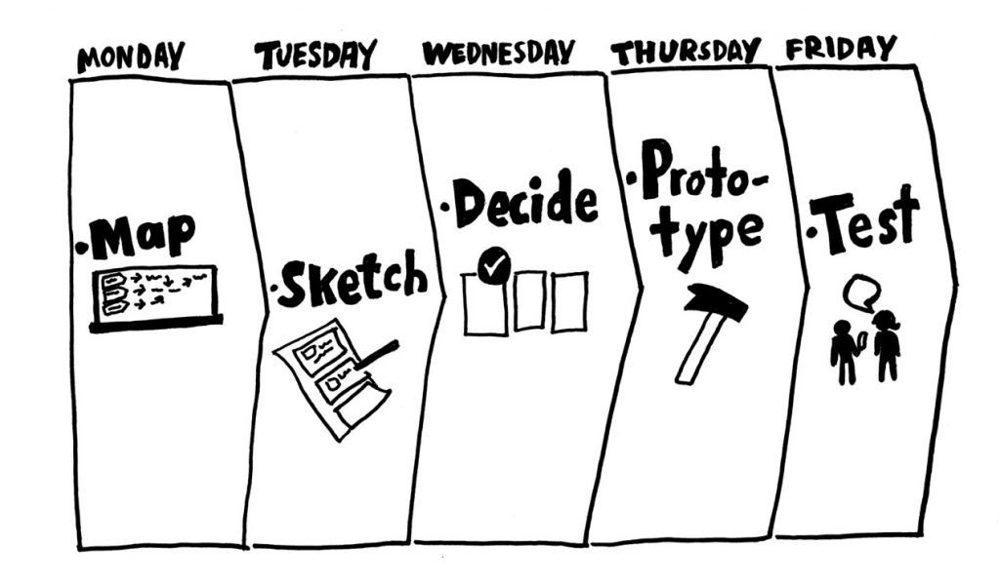

# Lean Startup

2021.12.21

---

[TOC]

---


## Google Sprint

> 아이디어를 짧은 시간에 prototype을 통해서 테스트해보는 방법론

- 구글벤처스 제이크 크냅에 의해 고안됨
- 구글 뿐만 아니라 페이스북, 에어비앤비 등 다양한 기업에서 활용



`(출처: Line Engineering)`

1. Map
   - 이해관계자들과 현재 상황을 파악하고 문제 나열
2. Sketch
   - 문제 해결을 위한 다양한 스케치 활동을 통해 아이데이션 진행
3. Decide
   - 구성원들이 낸 아이디어 스케치를 pitching하고 투표를 통해 아이디어 선별
4. Prototype
   - 선별된 아이디어들을 데모가 가능한 프로토타입으로 발전시킨다.
5. Test
   - 프로토타입을 가지고 고객 테스트와 피드백 수렴
   - 이를 통해 처음 세웠던 가설을 검증하고 개선하는 작업 


## Lean Startup

> 완벽한 제품을 오랜시간에 거쳐 개발 후 출시하는 것이 아니라 **가설**을 가지고 **최소한의 제품**으로 **빠르게 출시**하여 고객의 피드백을 얻고 이를 바탕으로 개선해나가는 방식

- 빠르게 변화하는 시장에서 작은 제품을 빠르게 개발해서 시장에 내놓고 고객 반응을 통해 성공 여부를 측정하고 방향성을 수정해나가고 고도화해나감

  ```
  처음에 원을 그리면 가늘지만, 계속해서 원을 그리면 더 두꺼운 원이 된다.
  ```

  

### MVP

> Minimun Viable Product

- 최소한의 노력으로 사용자의 니즈를 검증할 수 있는 제품
- 한 번에 완벽한 product를 만드는 것이 아니라 **최소 존속 가능한 제품**으로 **빠르게 출시**하고 시장의 반응에 따라 개선해나가는 프로세스가 가능
- 사용자의 니즈를 충족시킬 수 있어야한다.
  - cf) MLP(Minimun Lovable Product)
- 최초 가설을 검증할 수 있어야한다.


***Copyright* © 2021 Song_Artish**