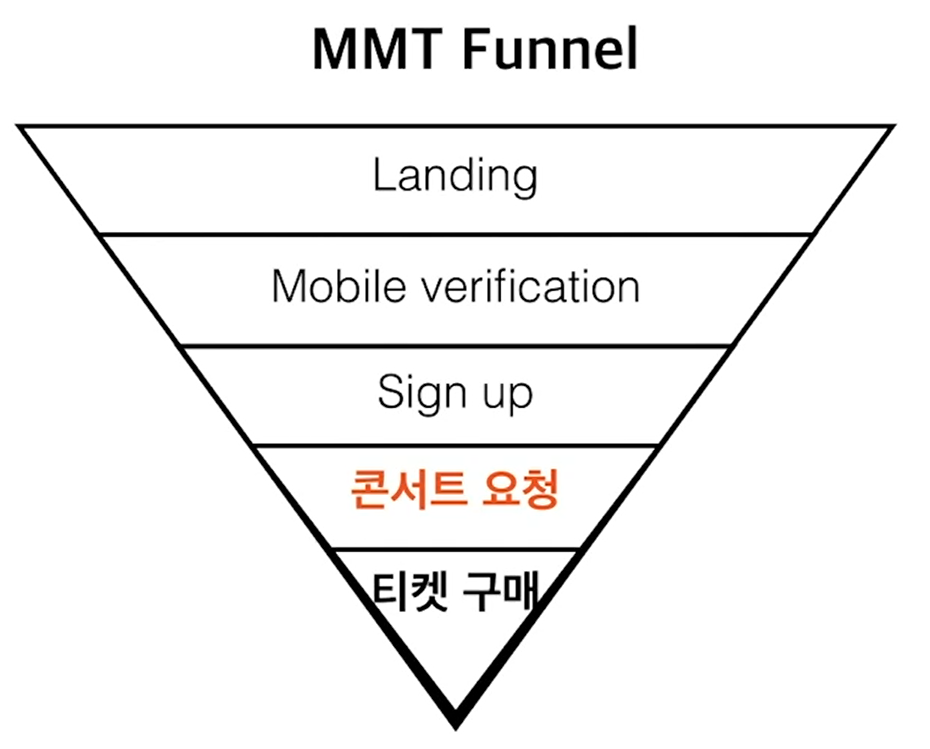

# 정량적 UX 리서치

2022.01.06

---

[TOC]

---

## Overview

> 구체적인 숫자를 통해 사용자 행동데이터를 수집하고 분석하는 방식의 리서치

- 넓고 큰 범위의 사용자들을 대상으로 실험하므로 객관적인 지표로 설득력을 가진다.
- 서비스, 제품에 대한 추측보다 실제 데이터를 가지고 의사결정을 내릴 수 있다.
- 정성적인 리서치를 통해 세운 가설을 검증할 수 있다.
- 종류
  - Surveys(설문 조사)
  - A/B Testing
  - Funnel 분석(AARRR, Cohort)

## 1. A/B Testing

> 사용자를 실험군과 대조군 임의의 두 집단으로 나누고 한 집단에는 A안을, 다른 집단에는 B안을 보여줘서 A안과 B안 중 어느 것이 더 나은지 정량적으로 평가하는 방식

- 2개 이상의 안을 선택하기 위해 사용
- 페이지의 구성에 큰 변하를 가져오거나 일반적으로 페이지에 요소를 제거하거나 더해야하는 경우에 적합
- 테스트를 단순하고 신속하게 진행할 수 있다.
- 결과에 대한 의사결정 판단이 쉽다.
- 가설과 목표를 명확히 세우고 테스팅 설계

## 2. Funnel 분석

> 단계별 분석, 깔때기 분석

- 사용자가 유입되고 전환에 이르기까지의 주요 단계를 트래킹 해보면서 사용자들이 어떤 단계에서 이탈을 하고 서비스의 취약 단계를 파악
- 전환(`Conversion`)에 이르는 고객 경험 프로세스를 단계별로 나누어 언제, 어디서, 어떻게 이탈하는지를 파악해서 이탈 원인을 파악하고 이를 개선하여 전환율을 높이는 것이 목표

`(출처: Class101)`

## 3. AARRR

> Acqusition, Activation, Retention, Revenue, Referral

- 데이브 맥클루어가 개발한 분석 프레임
- 고객 유입부터 활동, 재방문, 추천, 구매에 이르는 여정을 효과적으로 단계별로 관리할 수 있다.

|      단계      | 핵심                                                   | 예시                            |
| :------------: | ------------------------------------------------------ | ------------------------------- |
| **Acqusition** | 사용자가 어떤 경로로 유입했는가?                       | 바이럴 마케팅, 방문자 수        |
| **Activation** | 어떻게 처음으로 회원가입이나 제품 사용이 이루어지는가? | 로그인, 회원가입, 구독          |
| **Retention**  | 한 번 사용해본 사람이 계속 이용하는가?                 | 이탈률, Retention, DAU, MAU     |
|  **Revenue**   | 사용자의 활동이 매출로 이어지는가?                     | ARPU(사용자 당 평균 매출), 구매 |
|  **Referral**  | 사용자들이 주변에 제품을 소개하는가?                   | 초대 쿠폰, 바이럴 계수, 공유    |

- Retention Rate의 반대말은 `Churn Rate`
  - Churn: 고객이 유지되지 않고 제품을 그만 사용함을 의미
- Rentention(꾸준한 전환과 사용)을 높이는 것은 `Customer Lifetime Value(고객생애가치)`를 높이는 것이다.

## 4. Cohort 분석

> Retention 분석

- **Cohort**: 특정 기간 동안 공통된 특성이나 경험을 갖는 사용자 집단
  - 예, 저번 주 가입한 집단과 이번 주 가입한 집단 간의 분석
- 일반적으로 사용자 retention에 대한 분석에 자주 사용됨

## 5. ARPU, ARPPU

> Revenue 측정

- **ARPU** (Average Revenue Per User)
  - 가입한 사용자 1인당 평균 결제 금액
  - ARPU = 총 매출액 / 사용자 수
- **ARPPU** (Average Revenue Per Paying User)
  - 지출한 사용자 1인당 평균 결제 금액
  - ARPPU = 총 매출액 / <u>결제를 한 사용자 수</u>

## 6. Referral

- 사용자들이 다른 사람들에게 제품을 추천해서 **확산되는 과정**
- 트래킹할 수 있는 데이터로는 초대 쿠폰, 공유 수 등이 있다.

## A ha! Moment

> 사용자가 서비스의 가치를 깨닫게 되는 순간

- A ha! Moment 찾기
- 예시
  - 페이스북: 일주일 내에 10명의 친구 추가
  - 트위터: 30명 이상의 팔로워
  - 슬랙: 팀 내 2,000개 이상의 메시지

***Copyright* © 2022 Song_Artish**

