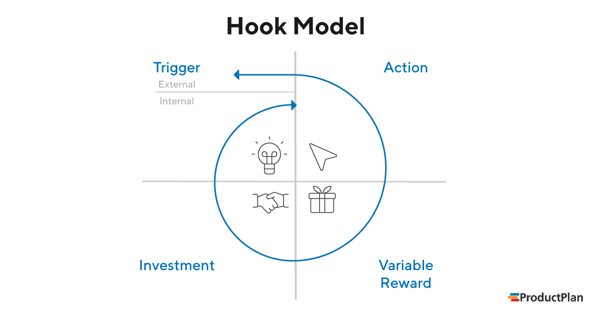

# Hook Model

> 사용자 습관을 형성

2022.01.11

---

[TOC]

---


## Overview

```
Hook 사이클의 반복 순환으로 사용자의 습관 형성
```

- 사용자가 서비스를 여러 번 사용해서 결국에는 사용자의 일상의 한 부분, 습관이 되는 사이클이 되는 것



`(출처: ProductPlan)`

- 장점
  - WOM이 되어 다른 사용자에게 빠르게 전파될 수 있음
  - Customer Lifetime Value 증가


## 1단계: Trigger

> 계기

- 습관이 되기 위한 첫 단계
- **내부계기**가 충분하면 외부계기가 더 이상 필요하지 않다.

### External Trigger

- 사용자에게 **다음 행동**을 알려주는 정보 내포

### Internal Trigger

- 사용자의 기억 속에 저장되어 있는 서비스와의 **연결고리**이다.
- 감정, 욕구의 연결


## 2단계: Action

> 행동

```
쉽게 만들라!
```

- 행동이 쉽게 일어나도록 만들라


## 3단계: Variable Reward

> 보상

- 사용자를 유혹하기 위해 `가변적 보상`(예측하지 못한 보상)을 사용
- 사용자의 욕구를 충족시키면서 **재참여를 유도**할 수 있는 **가변적 보상 체계**를 만들어야 한다.
- 자율성


## 4단계: Investment

> 투자

- 사람들은 특정 상품이나 서비스에 많은 **시간**과 **노력**을 투자할수록 그것을 더 중요시한다.


***Copyright* © 2022 Song_Artish**
