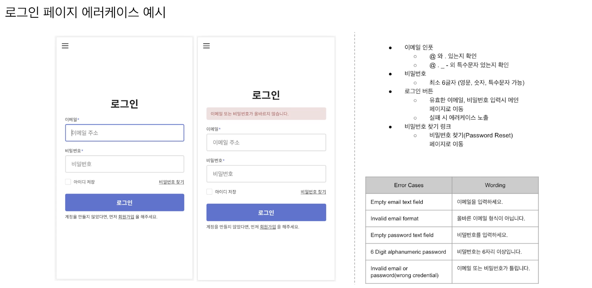

# 서비스 기획서

2022.01.17

---

[TOC]

---

## Overview

> 서비스의 각 페이지 구성 요소나 콘텐츠의 설명, 페이지 간의 이동 흐름, 로직 등을 기술한 문서

- Agile에서는 자세한 기획서보다 User Story와 UI 디자인으로 빠르게 커뮤니케이션 하는 것이 더 효율적

## 작성법

- Flow의 시작과 끝이 한 눈에 보이게 그린다.
- 각 구성 요소의 역할이 명확하게 드러나게 작성한다.
- Description은 짧고 간결하게 작성한다.
- 한 화면씩 상세 설명할 때는 해당 화면이 전체 서비스 정보 구조에서 어떤 위치에 있는지 명확히 표기한다.
  - ex. Home > 수업 상세 page > 결제 page

## 에러케이스

> 아래는 에러케이스 예시이다.

`(출처: CLASS101)`

***Copyright* © 2022 Song_Artish**
