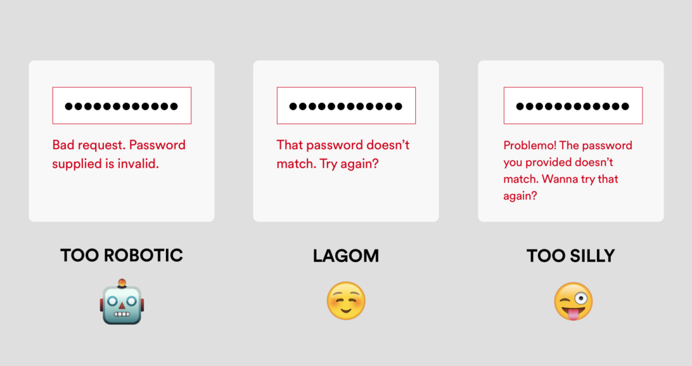

# 에러 메시지

> 에러메시지 잘 쓰는 법

---

[TOC]

---


## 작성 팁 :bulb:

### 1. 무슨 일이 일어났는지 그리고 왜 일어났는지 설명한다.

- 가능하면 일의 결과를 분명히 해야한다.
- 세부 사항을 지나치게 나열하지 않고, 누구나 이해할 수 있게 작성해야 한다.
- 전문용어를 사용하면 안 된다.

```markdown
Sorry, you're ineligible for this offer.
```

:white_check_mark: 사용자에게 접근 권한이 없는 이유를 설명하지 않기 때문에 좋은 메시지가 아니다. 이 경우 사용자에게 무슨 일이 일어났는지, 원인이 무엇인지를 명시하는 것이 좋다.

```markdown
It looks like you've taken a trial before, which means you aren't eligible for this offer. But you can still get Premium for $9.99/month.
```

:ballot_box_with_check: 메시지가 길어졌지만, 때로 유용한 에러메시지를 위해 정보를 추가하는 것이 좋다.


### 2. 다음 단계를 제안한다.

- 무슨 일이 일어났는지 설명한 후 문제를 해결하기 위해 사용자가 무엇을 할 수 있는지 알려줘야 한다.

- 버튼, 링크 또는 CTA(Call to Action)를 포함시킨다.

  > **Call to Action**은 사용자에게 어떤 행동을 권하거나 유도하는 도구 또는 기법을 의미하며 '전환율'을 높이는데 중요한 역할을 한다.

- 요점을 재빨리 파악할 수 있는 명확한 헤드라인을 사용해야 한다.

```markdown
**Error**
App is out of date
```

:white_check_mark: 이 메시지는 무엇이 잘못되었고 왜 잘못되었는지 명시하지만 다음 단계를 제시해주지 않는다.

```markdown
**App is out od date**
Download the newest version to keep listening

**Download**
```

:ballot_box_with_check: 명확한 헤드라인과 CTA를 포함하는 것이 좋다.


### 3. 알맞은 톤을 사용한다.

- UI/UX Writer는 적시에 올바른 정보를 전하고 싶어한다. 그러기 위해서는 말하고자 하는 '것' 뿐만 아니라 말하는 '방식'도 중요하다.
- 특히 적절한 균형을 갖춘 톤의 사용은 매우 중요하다. 어떤 톤을 사용할지는 '누구'를 위해 쓰는지, '무엇'에 대해 쓰는지에 달려 있다. 적절한 톤을 고르는 법: 스스로에게 먼저 물어보기
  - "이 상황에서 사용자는 어떤 느낌을 받을까?"
  - 정말로 이렇게 말할래?



`이미지 출처: “The Art of the Error Message: How to write clear, helpful copy for when things go wrong”`


## Guidelines

1. Keep language clear and concise
2. Keep user actions specific and logical
3. Avoid oops and whoops
4. Don't User Blame
5. Avoid ambiguity
6. Don't mock your users / Keep the jokes to a minimum
7. Avoid negative words
8. Write for humans
9. Don't write in ALL CAPS (and avoid exlcmation marks)
10. Try to use inline validation


***Copyright* © 2021 Song_Artish**