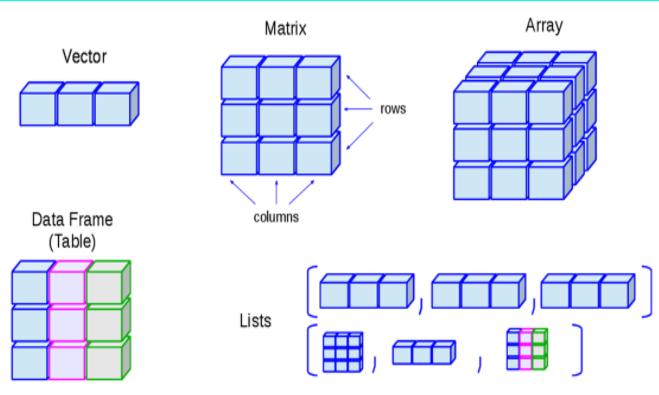

# R 데이터 구조

2021.08.23

---

[TOC]

---


## 데이터 구조

> R은 S 또는 C 언어와 유사하며, 명령어를 직관적으로 적용할 수 있어 쉽게 사용할 수 있다.



`(출처: https://is-this-it.tistory.com/15)`


## 1. Vector

> 하나의 스칼라값, 혹은 하나 이상의 스칼라 원소들을 갖는 단순한 형태의 집합

- 벡터 데이터 내에 들어갈 수 있는 원소는 숫자, 문자, 논리연산자이다.

- 동일한 자료형을 갖는 값들의 집합

  ```markdown
  프로그래밍 언어에서 정수(3), 실수(2.3856), 문자('a')를 스칼라라고 말한다. 말 그대로 가장 작은 데이터이다. {1, 2, 3, 4, 5}와 같이 스칼라가 여러 개 모인 것을 **벡터**라고 한다. R에서 다루는 데이터 구조 중 가장 단순한 형태이며 명령어 c를 이용해 선언할 수 있다.
  ```

- :pushpin: 벡터 생성함수: **c(), seq(), rep()**

| 벡터의 원소 유형 |   숫자형 벡터   |    문자형 벡터     | 논리연산자 벡터  |
| :--------------: | :-------------: | :----------------: | :--------------: |
|                  | x=c(1,10,24,40) | y=c("사과","망고") | z=c(TRUE, FALSE) |

- :ballot_box_with_check: R은 대/소문자를 구분한다.
- :ballot_box_with_check: 값을 할당할 때에는 `=` 대신 `<-`를 사용할 수도 있다.
- R에는 4가지 종류의 벡터 유형이 있다.

|  Vector Type   |         Description         |
| :------------: | :-------------------------: |
|  Numeric Type  |     실수까지 표현 가능      |
|  Integer Type  |        정수값을 표현        |
|  Factor Type   | 순서형 & 명목형 변수를 표현 |
| Character Type |       문자열을 나타냄       |

```R
x<-c(1,10,20)
y<-c("사과","배","복숭아")
xy<-c(x,y)
xy

[1] "1"      "10"     "20"     "사과"   "배"     "복숭아"
```


## 2. Matrix

> Row * Column의 수가 지정된 구조

- 한 가지 유형의 스칼라만 사용할 수 있다.

```R
m<-matrix(c(1,2,3,4,5,6),ncol=2)	# ncol=2 옵션은 2열짜리 행렬을 의미
m

     [,1] [,2]
[1,]    1    4
[2,]    2    5
[3,]    3    6
```

- 행렬 생성 함수 `martix`는 다음과 같다.

  ```R
  matrix(data, nrow, ncol, byrow=FALSE, dimnames=NULL)
  ```

  - data: 행렬을 생성한 데이터 벡터

  - nrow, ncol: 행의 수, 열의 수 (R은 기본적으로 열을 우선을 값을 채움)

  - byrow=FALSE (FALSE인 경우 열 우선으로)

  - 이미 만들어진 행렬에는 `dimnames()`를 사용해 행/열 이름을 부여할 수 있다.

    ```R
    dimnames(m) <- list(c("t1","t2","t3"), c("a1","a2"))
    m
    
       a1 a2
    t1  1  4
    t2  2  5
    t3  3  6
    ```

    


## 3. Data Frame


## 4. Array


## 5. List


***Copyright* © 2021 Song_Artish**