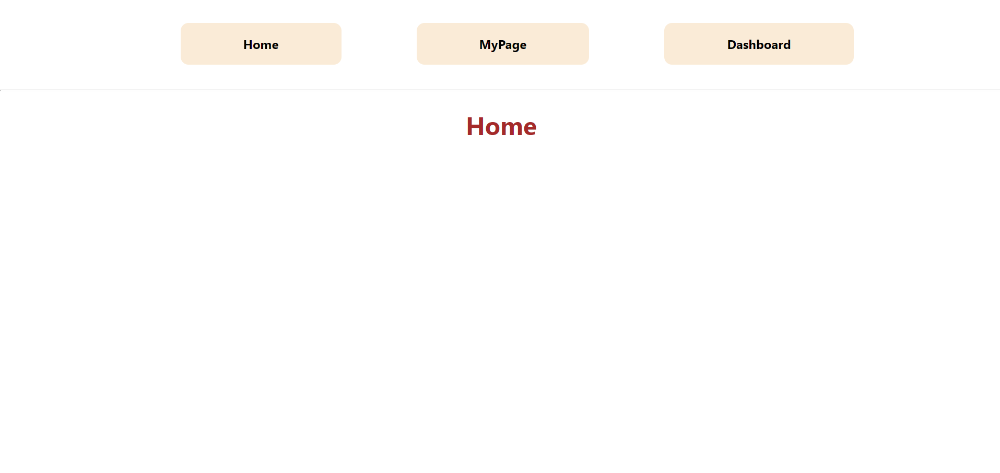

# Router

---

[TOC]

---


## Overview

다른 주소에 따라 다른 뷰를 보여주는 과정을 **라우팅(Routing)**이라고 한다. React SPA에서는 라우팅을 위해 **React Router**라는 라이브러리를 가장 많이 사용한다.


## Major Components

|                     | Role      | Component             |
| ------------------- | --------- | --------------------- |
| **Router**          | 라우터    | `<BrowserRouter>`     |
| **Router Matchers** | 경로 매칭 | `<Switch>`, `<Route>` |
| **Router Changers** | 경로 변경 | `<Link>`              |

```react
// 비구조화 할당(destructuring assignment)
import { BrowserRouter, Switch, Route, Link} from 'react-router-dom'
```

### BrowserRouter

웹 애플리케이션에서 HTML5의 [History API](https://developer.mozilla.org/ko/docs/Web/API/History_API)를 사용해 페이지를 새로고침하지 않고도 주소를 변경할 수 있게 한다.

### Switch, Router

경로를 매칭해주는 역할을 하는 컴포넌트이다.

- `<Switch>` 컴포넌트는 여러 `<Route>`를 감싸서 그 중 **경로가 일치하는 단 하나의 라우터만 렌더링 시켜주는 역할**을 한다. `<Switch>`를 사용하지 않으면 매칭되는 모든 요소를 렌더링한다.
- `<Route>` 컴포넌트는 **path 속성을 지정하여 해당 path에 어떤 컴포넌트를 보여줄지 정한다.** `<Link>` 컴포넌트가 정해주는 URL 경로와 일치하는 경우에만 작동한다.

### Link

경로를 연결해주는 역할을 하는 컴포넌트이다. 페이지 전환을 통해 페이지를 새로 불러오지 않고 애플리케이션을 그래도 유지하며, HTML5 History API를 이용해 페이지의 주소만 변경해준다.

ReactDOM으로 render를 시키면 `<Link>` 컴포넌트가 `<a>` 태그로 바뀌게 된다.

> **Q. React Router에서 `<a>` 태그가 아닌 `<Link>`를 사용하는 이유:question:** 
>
> `<a>` 태그는 페이지를 전환하는 과정에서 페이지를 불러오기 때문에 다시 처음부터 렌더링을 시키는 새로고침 현상이 일어나게 된다. 하지만, `<Link>` 컴포넌트는 **페이지 전환을 방지하는 기능이 내장**되어 있기 때문에 SPA를 구현할 수 있다.


## 시작하기

1. react-router 라이브러리를 설치한다.

```bash
$ npm install react-router-dom
```

2. App.js로 react-router 컴포넌트를 가져온다.

```react
// App.js
import { BrowserRouter, Switch, Route, Link} from 'react-router-dom'
```


## 간단한 사용법

1. index.js에서 `<BrowserRouter>`를 등록한다.

```react
// index.js
import { BrowserRouter } from 'react-router-dom';

const root = ReactDOM.createRoot(document.getElementById('root'));
root.render(
  // <BrowserRouter>를 렌더하도록 한다
  <BrowserRouter>
    <App />
  </BrowserRouter>
);
```

2. App.js로 react-router 컴포넌트를 가져온다.

```react
// App.js
import { BrowserRouter, Switch, Route, Link} from 'react-router-dom'
```

3. `<BrowserRouter>`로 `<Route>` 컴포넌트를 이용하기 위한 환경을 세팅한다.

```react
// App.js
function App () {
    return (
        // <BrowserRouter>를 추가한다
    	<BrowserRouter>
            <div id="container">
            	...
            </div>
        </BrowserRouter>
    )
}
```

4. `<Switch>`와 `<Route>`로 주소 경로와 컴포넌트를 연결한다.

```react
// App.js
function App () {
    return (
    	<BrowserRouter>
            <div id="container">
            	...
            </div>
            {/* Switch 하위에 Route를 작성하고, Route 내에 경로와 컴포넌트를 작성한다 */}
            <Switch>
            	<Route exact path="/">
                	<Home />
                </Route>
                <Route path="/about">
                    <About />
                </Route>
                ...
            </Switch>
        </BrowserRouter>
    )
}
```

> **Q. Home 컴포넌트 Route에 exact를 사용하는 이유:question:**
>
> `exact` 속성이 없으면 해당 경로로 시작하는 `/about`, `/sample` 등의 중복된 `<Route>` 컴포넌트를 모두 보여주기 때문이다.

5. `<Link>`의 `to` 속성을 활용하여 Route 컴포넌트에 설정해준 path 주소를 연결해준다.

```react
// App.js
...
<div id="container">
    <ul>
        <li>
            {/* Route의 컴포넌트로 이동할 수 있는 Link를 작성한다 */}
            <Link to="/">Home</Link>
            <Link to="/about">About</Link>
            ...
        </li>
    </ul>
</div>
...
```




***Copyright* © 2022 Song_Artish**