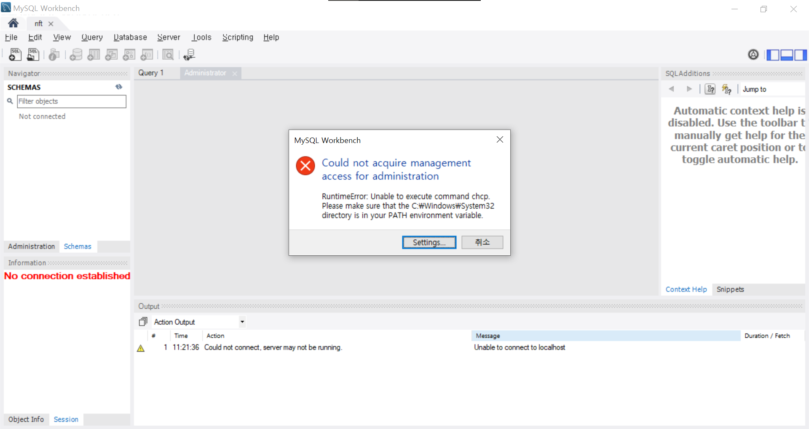
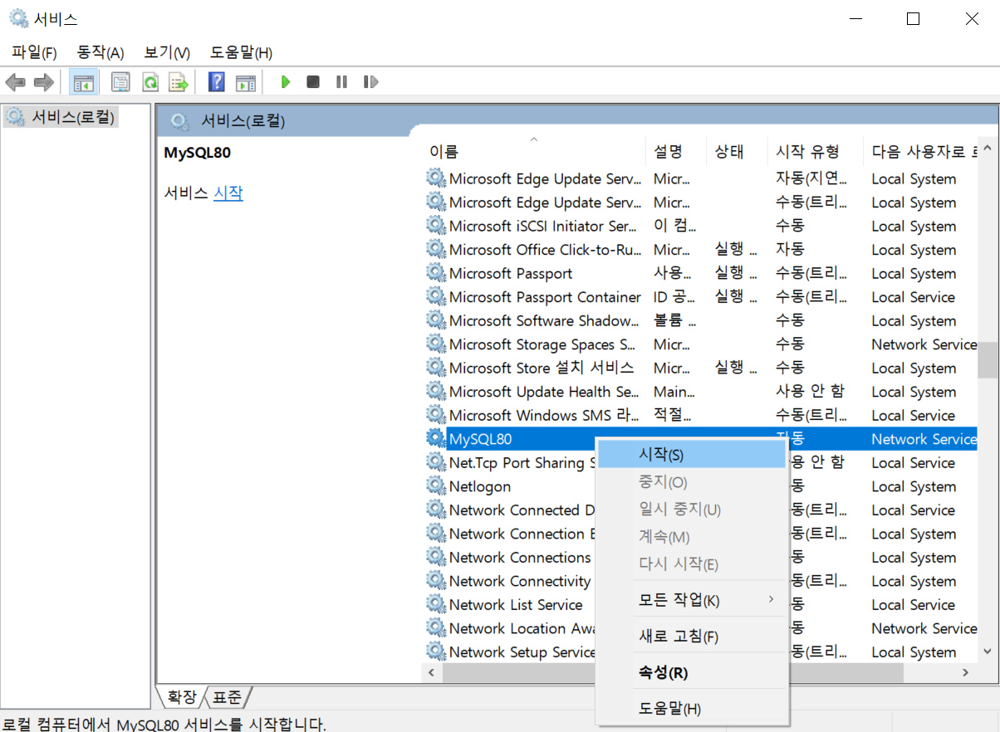

# Problem Solver: MySQL

> MySQL 관련 이슈 및 해결 방안

---

[TOC]

---

## Could not acquire management access for administration

> 어느 날 MySQL Workbench에 접속하니 잘 연결되던 것이 연결할 수 없다는 오류 메시지가 표시되었다.

1. 실행(`cmd+r`)을 실행하고 `services.msc`를 입력한다.
2. 서비스에서 `MySQL80`을 항목을 우클릭하고 `시작`을 눌러준다.
   

***Copyright* 2022 © Song_Artish**