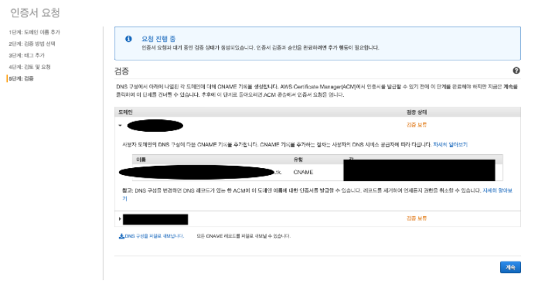

# AWS로 스프링프로젝트 배포하기(도메인구입ver)

-서울캠퍼스 박종원

## 전체적인 과정을 나누면

1. AWS가입 
2. `도메인` 얻기 (구입 OR 무료도메인) -> 나는 가비아에서 구매!
3. `https`를 사용하기위해서는 도메인에 대한 `ssl인증 받기`(aws에서 인증)
4. `aws` -> `Route 53` 콘솔(호스팅영역)을 통해 구입한 도메인과 aws인스턴스를 연결하기.
5. `로드밸런서`를 생성준다(https를 쓰실 분 들만 )
6. Route 53 콘솔(호스팅영역)을 통해 도메인을 `elb`와 연결한다!
7. 도메인으로 접속해본다 끝

## 시작하기 전에

> 왜 굳이 위의 과정을 거쳐야하나?
>
> 우리 프로젝트에 있는 `geolocation`기능은 보안문제 때문에 크롬 `특정버전` 이후로부터는 
>
> `http`환경에서사용 할 수 없습니다.
> 
> 하지만 기능을 포기할 순 없으니 `https`로 개설하여 기능을 적용시켜 봅니다.
>
> 이를 위해서는 aws의 콘솔들을 사용해야하니 aws에 가입해야 합니다.

### 1. aws가입 ###

해외 결제가능한 카드를 이용하여 가입하세요.

aws의 자기 정보가 밖에 노출 되면, 외국형님들의 비트코인채굴에 내 서버가 이용당해서

요금 몇백만원 나올수도 있습니다. 항상 보안에 신경쓰세요

### 2. 도메인 얻기 ###

###[가비아]

- 가비아라는 사이트를 들어가서 회원가입을 한 후,

- 검색창에 원하는 키워드를 넣고 가격대가 적당한 도메인을 결제한다.

- 단기프로젝트를 위해서는 1년짜리로 구매하고, https를 사용하실분들은 가비아 네임서버(ns)가

- 아닌 외부 네임서버(ns)를 선택하도록 한다.

### 3. ssl 인증받기 ###

- AWS로 넘어가서 

- AWS에 로그인한 후 Certificate Manager콘솔로 이동한다.

- AWS region을 꼭 확인하시기 바랍니다. 해당서비스가 제공될 지역에서 인증을 받아야한다!

- 인증서 요청 버튼을 눌러주세요!

- 공인인증서 요청이 디폴트값으로 되어있을텐데 놔두고 인증서 요청 클릭

- 내 도메인 이름을 넣고 다음을 눌러주세요!

- 여기서 내 도메인이 udong.shop 이라면 이 주소는 당연히 넣어야하고

- 이 인증서에 다른 이름 추가버튼을 누르고

- *.udong.shop 을 추가해준다.

- 여기서 *.을 앞에 붙이는 이유는 ssl인증서의 유효범위가 

- udong.shop뿐만 아니라 www.udong.shop, ssafy.udong.shop 다 적용 시키기 위함이다.

- 마지막으로 확인 및 요청을 누르면 

- 도메인 이름 옆에 이름 유형 값이 3개가 뜨는데 이것을 가지고

- 가비아로 돌아가서

- 내 도메인의 DNS설정 들어가서 입력해주면 됩니다!

- 꼭 3가지를 다 넣어줘야합니다.(cname같은 경우 자료형이니 선택해준다)

- 이 과정을 하게 되면 내가 구입한 도메인의 DNS를 ASW에서 인식 할 수 있게 되고,

- 토대로 SSL인증이 이루어지게 됩니다.

- 자 여기서 ssl인증이 바로 이루어지는 것이 아니라 검증보류상태로 남아있게 되는데요,

- 30분정도 넉넉하게 기다려주면 알아서 발급완료로 전환됩니다.

- 이렇게 내가 구입한 도메인에 대한 ssl인증이 이루어졌습니다!

### 4. Route 53을 이용하여 DNS에 도메인 등록 ###

- 도메인 이름이 있어도 그 도메인 주소가 컴퓨터가 이해할 수 있는 실제 주소인 IP와 매칭이 되지 않으면 위치를 알 수 없습니다. 

- 도메인 주소 <=> IP 간의 맵은 DNS(Domain Name Server)가 가지고 있으며, 

- 도메인이 DNS에 등록이 되어있어야 도메인 주소로 직접 접근이 가능합니다.

- AWS Route 53은 도메인을 호스팅할 수 있도록 도와줍니다.

- AWS Route 53 콘솔로 이동합니다.

- 왼쪽 대시보드에서 호스팅 영역을 클릭합니다.

- 호스팅 영역 생성을 클릭합니다.

- 내가 구입한 도메인의 주소 ex)udong.shop을 입력해주고

- 설명을 그냥 스킾하고 생성을 해줍시다.

- 생성하게되면 내 도메인 이름 옆 ns라는 값에 4개의 url이 보이게 될 텐데,

- 이제 이걸 가지고 다시 가비아로 돌아가야합니다.

- 가비아로 와서, 내 도메인을 관리하는 탭에 들어간다음

- 네임서버(ns)을 수정해줍니다.

- 여기서 1,2,3,4,5,6 .. 여러개가 있는데 1,2,3,4에 aws에서 가져온 url을 넣어줍니다.

- 여기서 여러 url을 정해주는 이유는, 한곳이 막히면 다른 곳으로 쓰기 위해 일종의

- 예비주소를 설정한다고 생각하시면 됩니다.

### 5. 로드밸런서를 생성준다(https를 쓰실 분 들만 ) ###

- AWS에 접속한 뒤 EC2 콘솔로 이동합니다.

- 왼쪽에 탭이 있을 것입니다. 아래로 내려가서 로드밸런서라는 항목을 클릭해줍니다.

- 로드밸런서 생성을 클릭해줍니다.

- 로드밸런서 유형에서

- 우리는 https환경을 만들기 위함이니, http https로 생성해줍니다.

- 이름은 그냥 내가 알아볼 이름으로 정해주고,

- 디폴트로 되어있는 http 를 https로 꼭 변경해줘야합니다.

- 가용영역을 최소 2개이상 체크해주고 다음: 보안 설정 구성을 클릭해 넘어갑니다.

- 위에서 SSL 인증서를 발급 받는 과정을 진행했다면 인증서를 고를 수 있을 것입니다.

- 인증서가 목록에 없다면, 처음으로 돌아가서 인증서 얻기 부터 진행해주세요

- 이제 인증서를 고르는 탭에 왔습니다!

- 우리가 어렵게 만든 인증서를 클릭해주시고 다음으로 넘어갑시다.

- 보안그룹을 정하는 탭인데요,

- 우리는 새 보안그룹을 생성하겠습니다. 새 보안 그룹 생성 동그라미에 체크하면, 

- 자동으로 입력이 되어있을 것입니다. 

- 이 상태 그대로 다음: 라우팅 구성을 클릭합니다.

- 대상 그룹의 이름을 입력해 줍니다. 대상 그룹이라 함은 

- ELB를 지나서 도달해야하는 대상들의 묶음입니다

- (ELB를 통해서 도달할 EC2를 이 대상 그룹에 넣어줄 것 입니다).

- 프로토콜과 포트는 웹서버가 사용하는 프로토콜과 포트를 씁니다.

- 제 웹서버는 http로 그리고 8000번 포트를 사용하게 만들어져 있으므로 

- 유형은 인스턴스, 프로토콜은 http 포트는 8000을 사용했습니다.

- 사진에서 포트 5000이지만 자기가 서버를 연 포트번호로 해주세요!

- 위에서 만든 대상그룹에 대상을 등록해주어야합니다.

- ec2 instance가 만들어져있다는 것을 전제로 할 때, 검은 박스 부분에 인스턴스가 존재할 것입니다. 

- 왼쪽에 체크를 하고 등록된 항목에 추가를 누르면 추가됩니다.

- 추가되면 위에 내 인스턴스가 올라가게됩니다.

- 확인되었으면 다음을 클릭합시다!

- 마지막으로, 입력한 것들을 다시 한번 검토한 후 생성 버튼을 누릅니다.

- 위의 과정을 잘 따라오셨다면,

- 다음과 같이 로드밸런서가 생성 될겁니다!

- 이제 로드밸런서 목록에서,

- provisioning이 조금기다리다가 새로고침하면 active로 바뀌게되는데, 그 때부터 ELB가 적용됩니다.

### 6. Route 53 콘솔(호스팅영역)을 통해 도메인을 elb와 연결한다! ###

- 이제 정말 다왔습니다. 제일 중요한 과정을 해주어야합니다.

- 바로 내가 구입한 도메인과 elb를 연결시켜주는겁니다!

- 호스팅영역 기억나실겁니다.

- aws의 Route 53 콘솔로 들어가서 호스팅영역을 눌러줍시다.

- 내가 구입했던 ex)udong.shop 도메인이름을 클릭하고

- 레코드생성을 눌러줍시다.

- 그럼 이와같은 입력탭이 뜨는데요, 여기서 레코드이름에는

- 이미 구입했던 도메인이 .뒤에 있을겁니다.

- 자기가 www를 쓰고싶으면 www를 붙여주고, ssafy를 쓰고싶으면 ssafy를 붙여줍니다.

- 그렇게 되면 www.udong.shop 또는 ssafy.udong.shop로도 접속이 가능합니다.

- 그리고 가장 중요한것!!

- 레코드 유형을 디폴트값 그대로 두시고

- 값에 별칭을 on하시고, 서울을 클릭하시면

- 내가 아까 만든 elb가 나올겁니다!

- 그것을 클릭하여 적용해줍니다.

- 그리고 레코드를 생성을 완료 해주시면 됩니다.

- 10분정도 기다리면 정상적으로 등록이 완료됩니다.

- putty또는 mobaxterm을 이용해 ec2로 열어놓은 중이라면, 접속이 될겁니다!

- (포트번호안 붙여도 됩니다. 아까 elb생성할때 적어줬으니).

- DNS에 등록이 되었는지 확인하는 방법.

test.com = 자기가 구입한 도메인

운영체제가 Windows인 경우, cmd를 열어서 nslookup test.com

Mac OS or Linux인 경우, terminal을 열어서 nslookup test.com

끝!

