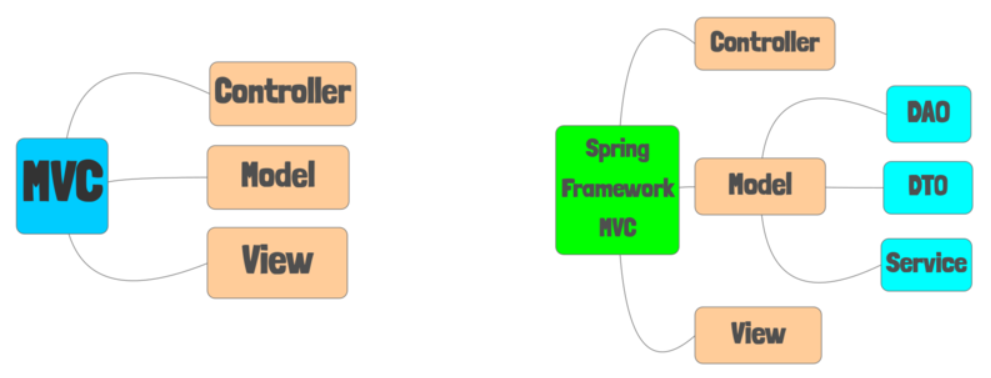
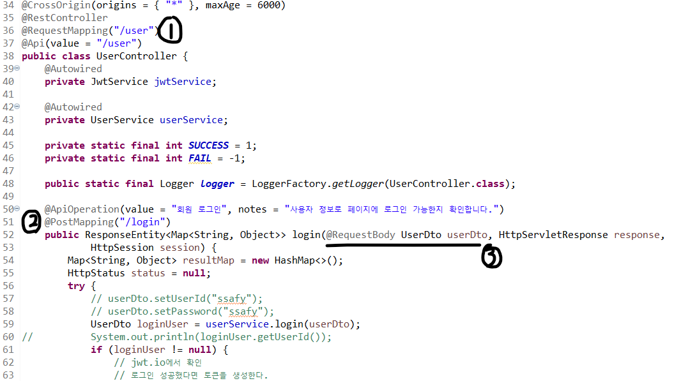

# Spring 개요

---

[TOC]

---


## 개념

> `Spring Framework`는 엔터프라이즈 급 어플리케이션 개발을 위한 모든 기능을 종합적으로 제공하는 경량화 된 솔루션으로 `JEE(Java Enterprise Edition)`의 다수 기능을 지원한다.

### 특징

- 경량컨테이너
- DI(Dependency Injection, 의존성 주입) 패턴 지원
- AOP(Aspect Oriented Programming, 관점 지향 프로그래밍) 지원
- POJO(Plain Old Java Object) 지원
- IoC(inversion of Control, 제어의 반전)
- transaction 처리를 위한 일관된 방법 제공
- 영속성과 관련된 다양한 API 지원
- 다양한 API에 대한 연동 지원


### Spring 삼각형

Spring의 **구조**를 나타내는 모델로 Enterprise Application 개발 시 복잡함을 해결하는 Spring의 핵심이다.

- `POJO(Plain Old Java Object)`: 특정 환경이나 기술에 종속적이지 않은 객체지향 원리에 충실한 자바객체
  - 테스트 용이, 자유로운 객체지향 설계 적용
- `PSA(Portable Service Abstraction)`: 환경/세부기술 변경과 관계없이 일관된 방식으로 기술에 접근할 수 있게 해주는 설계 원칙
- `IoC/DI(Dependency Injection)`: 유연하게 확장 가능한 객체를 만들어 두고 객체 간의 의존관계는 외부에서 다이나믹하게 설정
- `AOP(Aspect Oriented Programming)`: 관심사 분리를 통해 소프트웨어 모듈성 향상
  - 공통 모듈을 여러 코드에 쉽게 적용 가능


### MVC 구조

- Spring Framework의 MVC는 아래와 오른쪽 그림과 같다.
  - Model = Service, DAO, DTO(=VO)로 구분할 수 있다.



1. **Controller**
   - 클라이언트에서 요청이 들어올 때, 해당 요청을 수행할 비즈니스 로직을 제어하는 객체
2. **Service**
   - 서비스 레이어 단에서 세분화된 비즈니스 로직을 처리하는 객체
3. **DAO**: Data Access Object
   	- DB를 사용해 데이터를 조회하거나 조작하는 기능을 전담하도록 만든 객체
4. **DTO**: Data Trnsfer Object (VO: Value Object)
   - 각 계층간 데이터 교환을 위한 자바 객체


## 시작하기

**설치하기**

> 스프링에 필요한 아래의 프로그램도 설치되어 있는지 확인한다.
>
> - JDK
> - (Tomcat)
> - Database (MySQL, Oracle 등)

- Eclipse 설치 후 Spring Tool Suite Plug in 추가
  - Eclipse 실행 후 `Help > Eclipse Marketplace > STS 검색`
- Spring Tool Suite(STS, AllInOne version)
  - [STS4](https://spring.io/tools)

**환경설정**

- STS를 실행한다.
- 인코딩을 설정한다.
  - `Window > Preferences` 탭을 클릭한다.
  - 검색창에 `encoding`이라는 단어를 입력한다.
  - `General > Workspace`, `Web >` CSS, HTML, JSP Files, `XML > XML Files`에서 인코딩 값을 `UTF-8` 혹은 `ISO 10646/Unicode(UTF-8)`로 설정해준다.

**프로젝트 가져오기**

- `File > Open Projects from File Systems`에서 프로젝트를 가져온다.
- `Window > Show View > Project Explorer`을 클릭하면 가져온 프로젝트 디렉토리가 왼쪽에 표시된다.
- 이후 해당 프로젝트의 `src/main/java >` 폴더에서 backend로 사용한 스크립트를 확인할 수 있다.

**서비실행**

- 프로젝트 폴더에서 우클릭을 하여 `Run As > Spring Boot App`으로 서버를 실행한다.

**Vue와 연결하기**

- Vue와 Spring을 연결하기 위해서는 먼저 Vue의 최상위 폴더에서 `vue.config.js`라는 파일을 생성한다.

- 생성한 파일에 Spring `static` 폴더의 경로를 입력해준다.

  ```javascript
  // vue.config.js 예시
  module.exports = {
      outputDir: "C:/project/gongtong_project/Seoul_A404_Udong_BackEnd/src/main/resources/static",
    };
  ```

- 다음으로 vue 터미널에서 아래의 명령어를 입력한다.

  ```bash
  npm run build
  ```

- Spring 프로젝트 폴더에서 `src > main > resources`에 `static `이라는 폴더가 생성되었는지 `F5`로 새로고침하여 확인한다.
- 이후 위의 단계를 반복하며 front에서 back과의 연결을 확인한다.


## Spring as Backend



- 요청방식: 2번에서 요청방식이 `POST`라는 것을 확인할 수 있다.
- URL: 1번에서 클래스가 있으므로 url은 `1번 + 3번`, 즉 `/user/login`이 된다.
  - :ballot_box_with_check: URL은 기존에 작성한 Swagger를 활용한다!
- 받을 데이터: 3번에서는 프론트에서 받을 데이터를 정의한다.
  - `@RequestBody`는 여러 개의 데이터가 담겨있는 객체를 가져올 때 사용한다.
  - `@PathVariable`은 하나의 데이터를 가져올 때 사용한다.


***Copyright* © 2021 Song_Artish**

