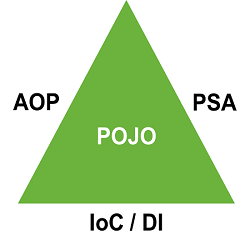

# Spring 개요

2021.01.13

---

[TOC]

---

## 개념

> `Spring Framework`는 엔터프라이즈 급 어플리케이션 개발을 위한 모든 기능을 종합적으로 제공하는 경량화 된 솔루션이다.

- `JEE(Java Enterprise Edition)`의 다수 기능 지원
- `DI(Dependency Injection, 의존성 주입)`, `AOP(Aspect Oriented Programming)` 등의 기능도 지원

### 구조

**Spring 삼각형**

Enterprise Application 개발 시 복잡함을 해결하는 Spring의 핵심

- `POJO(Plain Old Java Object)`: 특정 환경이나 기술에 종속적이지 않은 객체지향 원리에 충실한 자바객체
  - 테스트 용이, 자유로운 객체지향 설계 적용
- `PSA(Portable Service Abstraction)`: 환경/세부기술 변경과 관계없이 일관된 방식으로 기술에 접근할 수 있게 해주는 설계 원칙
- `IoC/DI(Dependency Injection)`: 유연하게 확장 가능한 객체를 만들어 두고 객체 간의 의존관계는 외부에서 다이나믹하게 설정
- `AOP(Aspect Oriented Programming)`: 관심사 분리를 통해 소프트웨어 모듈성 향상
  - 공통 모듈을 여러 코드에 쉽게 적용 가능

### 특징

- 경량컨테이너
- DI(Dependency Injection, 의존성 지원) 패턴 지원
- AOP(Aspect Oriented Programming, 관점 지향 프로그래밍) 지원
- POJO(Plain Old Java Object) 지원
- IoC(inversion of Control, 제어의 반전)
- transaction 처리를 위한 일관된 방법 제공
- 영속성과 관련된 다양한 API 지원
- 다양한 API에 대한 연동 지원

## 개발환경

**시작하기 전**

- JDK 설치
- (Tomcat 설치)
- Database 설치(MySQL, Oracle 등)

**설치하기**

- Eclipse 설치 후 Spring Tool Suite Plug in 추가
  - Eclipse 실행 후 `Help > Eclipse Marketplace > STS 검색`
- Spring Tool Suite(STS, AllInOne version)
  - [STS4](https://spring.io/tools)

***Copyright* © 2021 Song_Artish**