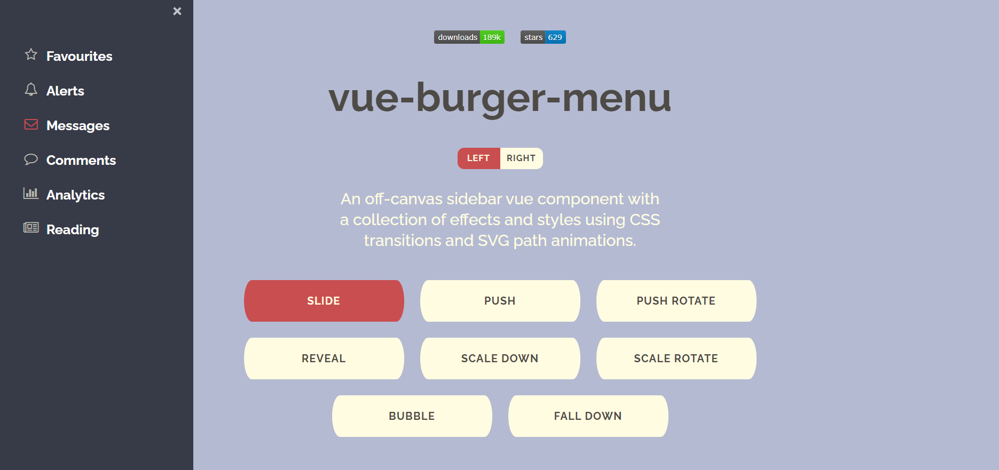
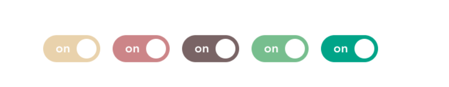
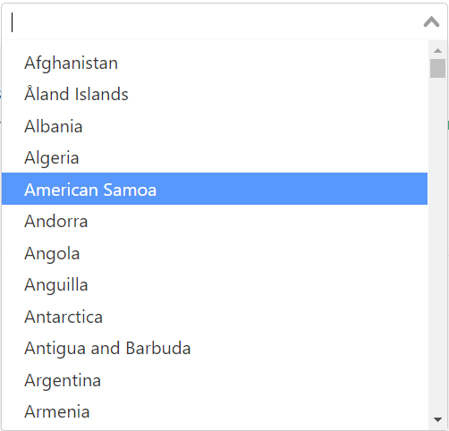
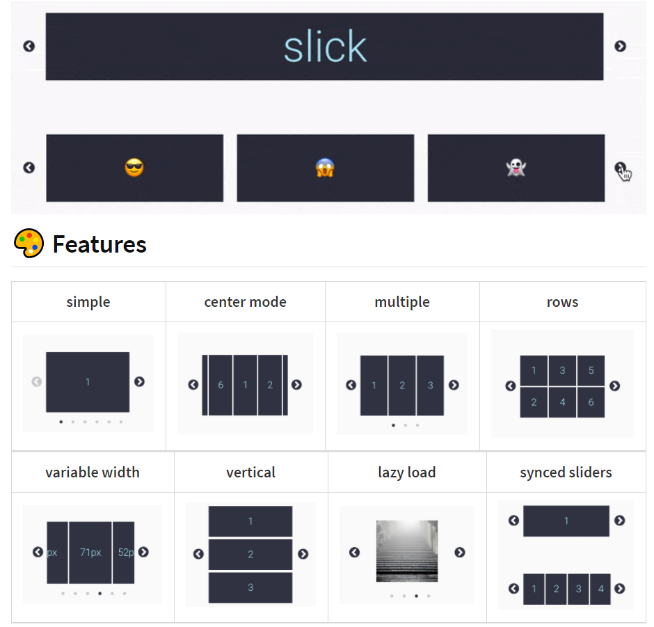
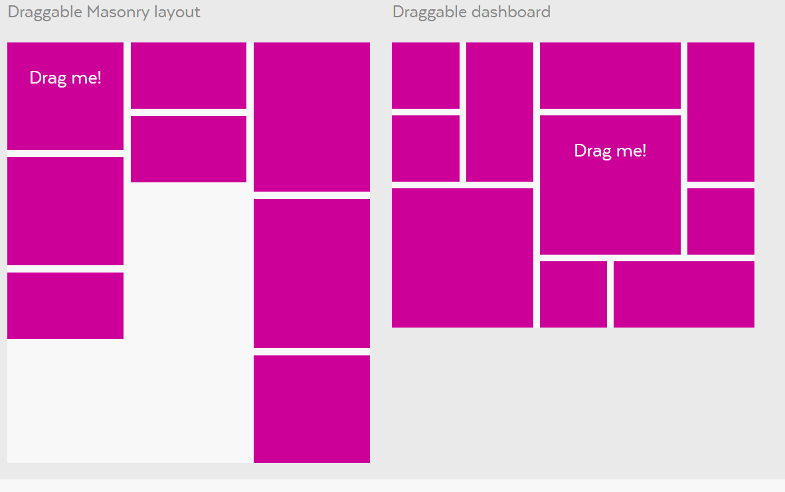

# Plugins

---

[TOC]

---


## 사용법

> [vue-js-toggle-button](https://www.npmjs.com/package/vue-js-toggle-button)을 등록하고 사용하는 법을 다룬다.

### npm 설치

- 먼저 Node 패키지를 설치한다.

```bash
npm install vue-js-toggle-button --save
```

### 플러그인 등록

- :ballot_box_with_check: 플러그인은 `src > main.js`에서 등록해준다!!

```javascript
// main.js

import ToggleButton from 'vue-js-toggle-button'
Vue.use(ToggleButton)
```


## vue-burger-menu

> 좌/우에 햄버거 메뉴바를 만든다.
>
> [github](https://github.com/mbj36/vue-burger-menu)




## vue-js-toggle-button

> 심미적인 토글 버튼을 가져올 수 있다.
>
> [github](https://github.com/euvl/vue-js-toggle-button#readme)




## vue-select

> 깔끔한 드랍다운 선택창을 가져올 수 있다.
>
> [github](https://github.com/sagalbot/vue-select)




## vue-slick-carousel

> `이미지 넘기기` 등에 사용할 수 있는 슬라이드 기능을 가져올 수 있다.
>
> [github](https://github.com/gs-shop/vue-slick-carousel)




## packery

> draggable한 레이아웃을 디자인할 수 있다.
>
> [github](https://github.com/metafizzy/packery)




***Copyright* © 2021 Song_Artish**